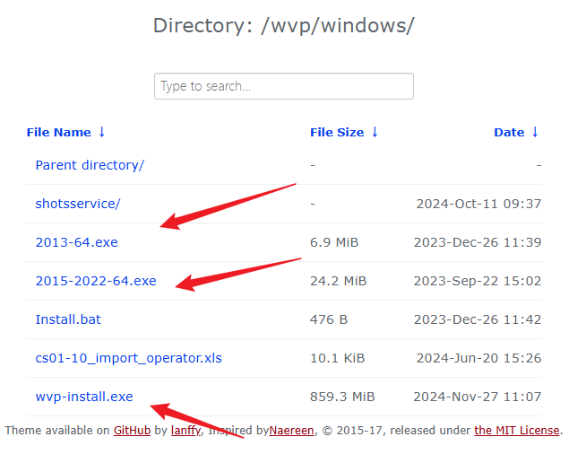
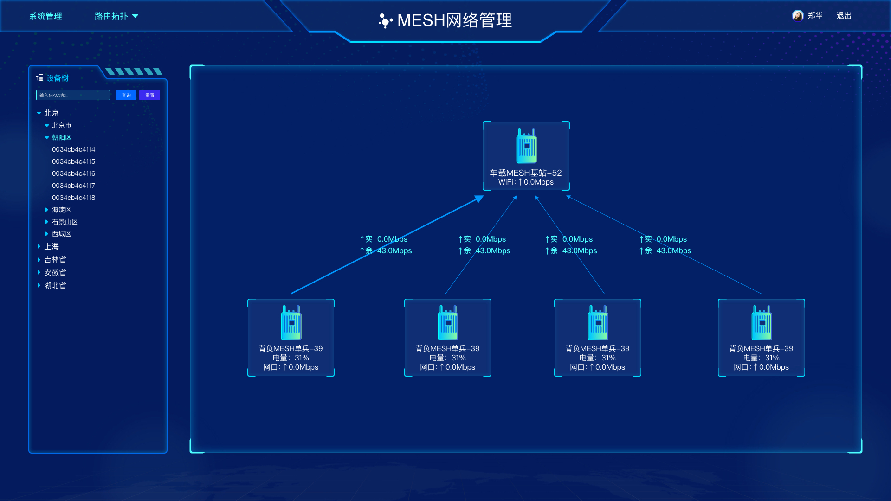
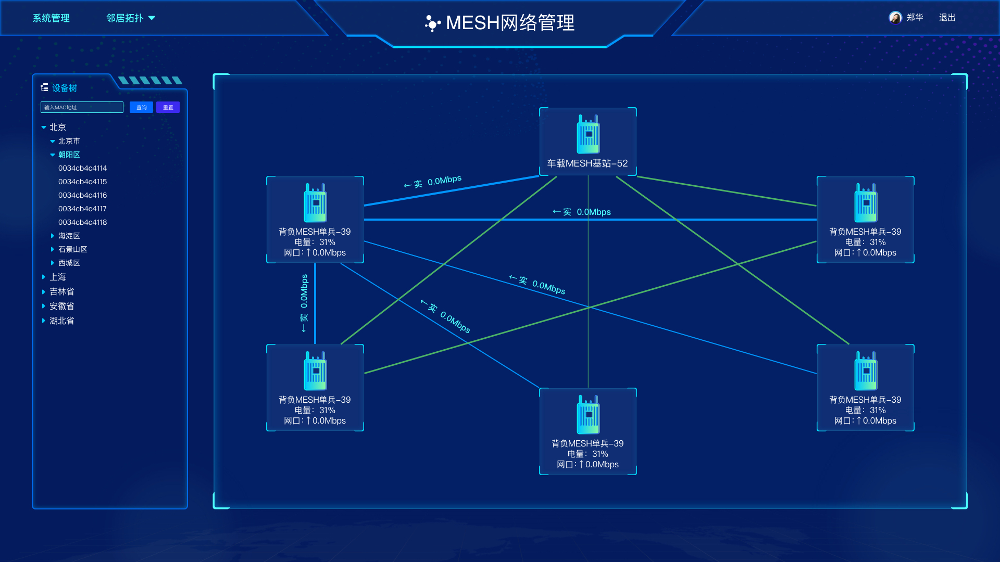
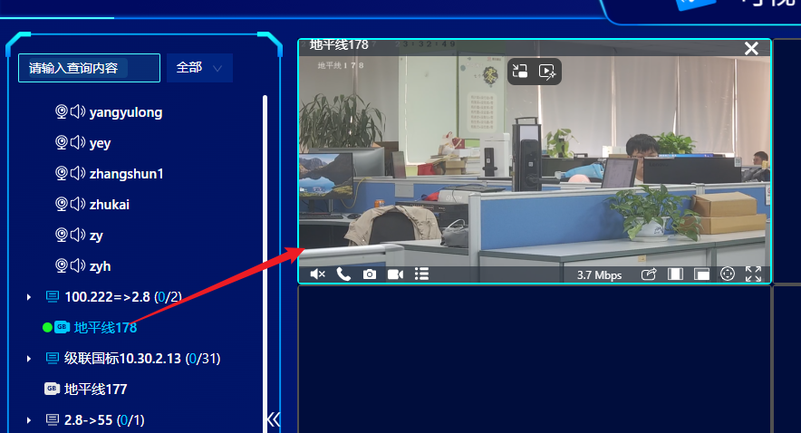
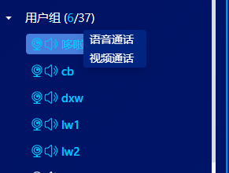

# wvb

## 一、整体描述

### 1.项目安装

**地址：**

```
http://10.30.40.10:88/wvp/windows/
```



### 2.项目的配置和重启

**如何修改本地wvp的ip**

```
D:\sw\wvp-windows\wvp\config\application.yml
D:\sw\wvp-windows\zlm\config.ini
```

```
D:\web-video-platform\wvplicense  //记得保存这个重装
```

**如何重启wvp**

```
在windows服务中
wvp-mysql
wvp-redis
wvp-server

zftp-server
zlm-server(媒体服务器)
assist-server(文件服务器)
```

目前这个项目，有三个端，后端、web前端、安卓客户端，分别对应以下三个git项目

```
wvb-server
wvb-ui
MyRtc-app
```

## Q&A疑问
### 零、通用

#### 1.咱们的10.30.2.8:8970这个地址的数据库对应的是什么呀？

这个最好不要修改数据库

#### 2.相关的文档看哪里的比较好？

svn内部的文档

#### 3.拓扑信息

拓扑信息分为路由拓扑和邻居拓扑。展示的信息不一样，前者只展示主从关系，后者会展示所有设备之间的信息交互。





### 一、GIS服务

#### 1.主站是什么概念？

简单理解就是中枢，其他的非主站设备，靠这个联系起来。

#### 2.mesh设备是什么？

可以理解为就是一个设备，这个设备可以单独存在，也可以是绑定为一个单兵设备。

#### 3.播发组件一直在加载怎么回事？

#### 4.如何添加设备？进一步绑定GB国标摄像头呢？

利用META后台系统来进行相应的添加，账号admin，密码123456

```
https://10.60.2.175:8930/
```

### 二、拓扑信息

#### 1.安卓app有两个：Gi视讯通、GiMESH助手，分别是干什么的？

#### 2.GiMESH助手可以看见信息，但是Gi视讯通链接不上，而且手机一点击配置就开始闪退

### 三、视频调度

#### 1.点播设备，是什么概念？

GIS页面就是播放的按钮，视频调度这里其实就是相当于音频/视频通话

#### 2.语音通话就是电话图标“开启双向对讲”？

一键喊话，和一键对讲是不一样的功能。前者只是单方向的，后者是双向的。

#### 3.这两个有什么区别？





### 四、设备管理

不太清楚怎么造数据，这个可能得看一下

### 五、网源类型


