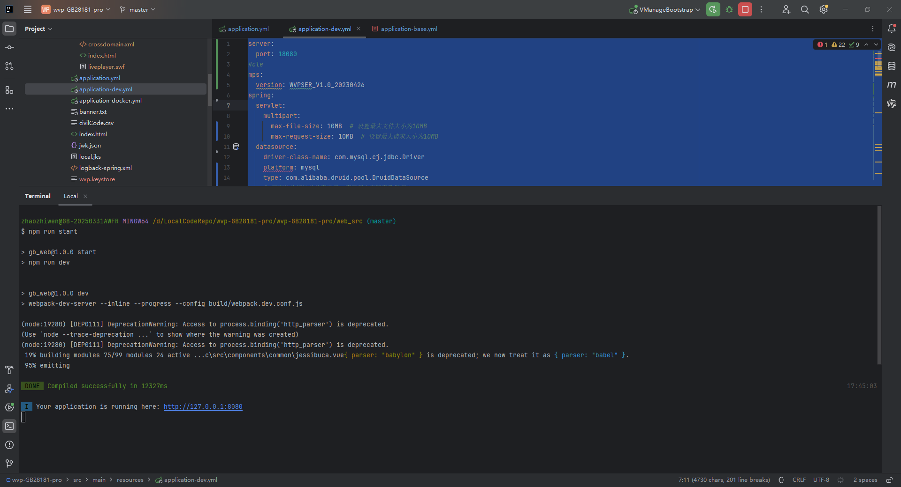
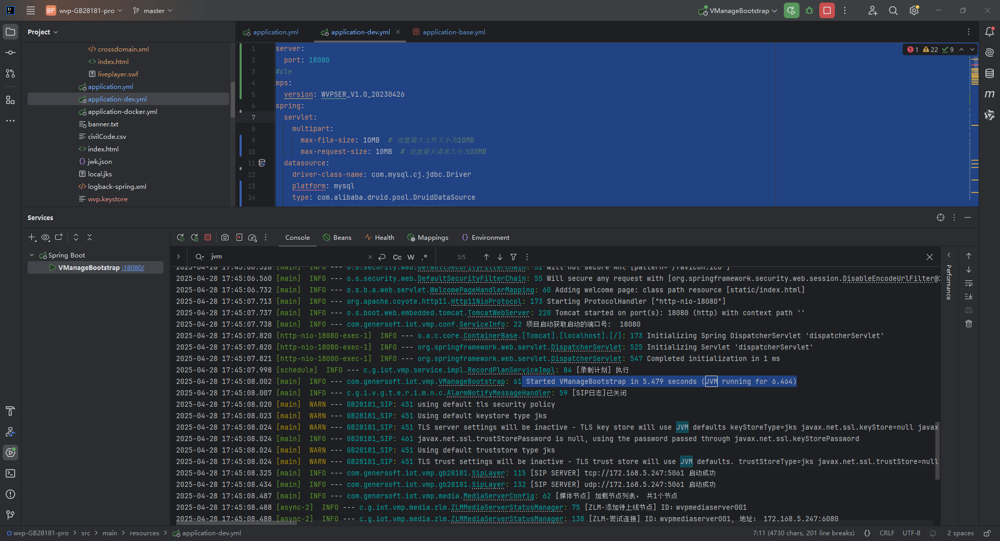
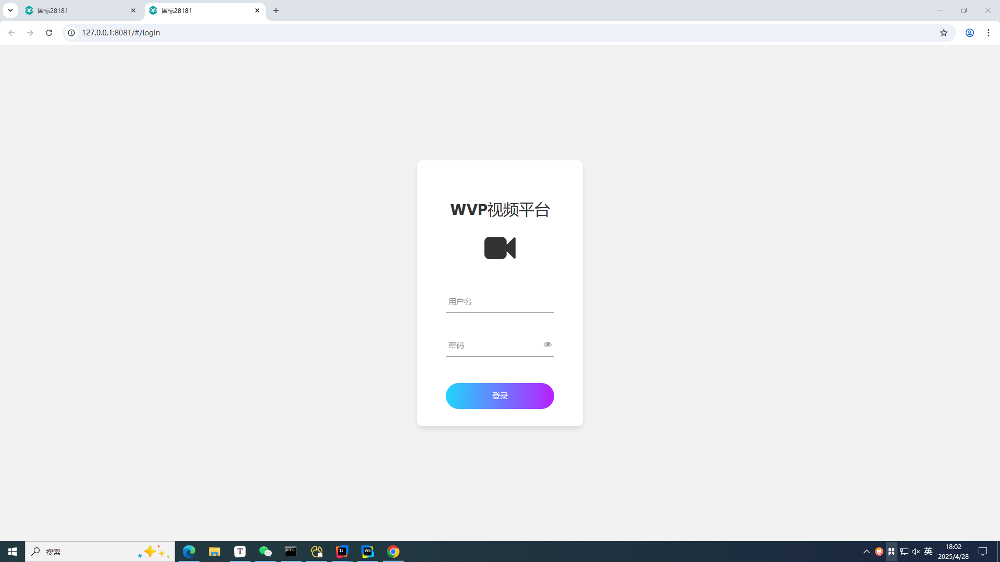
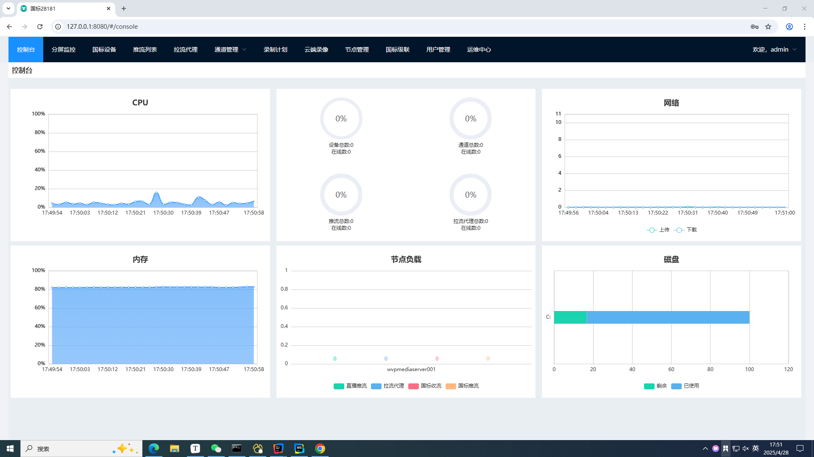
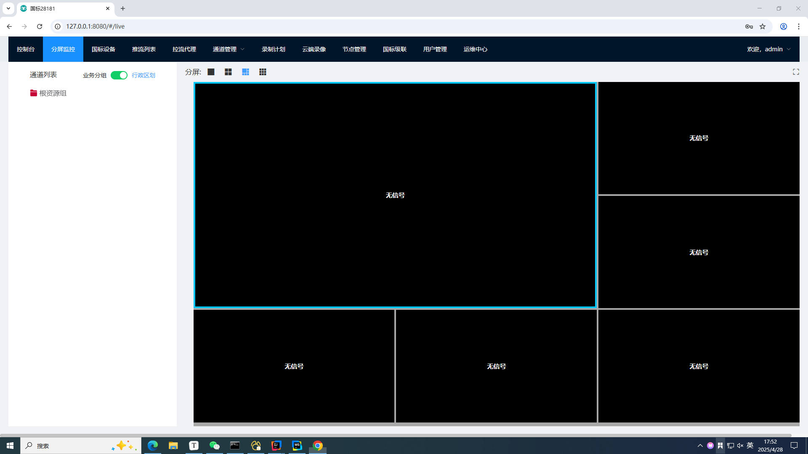
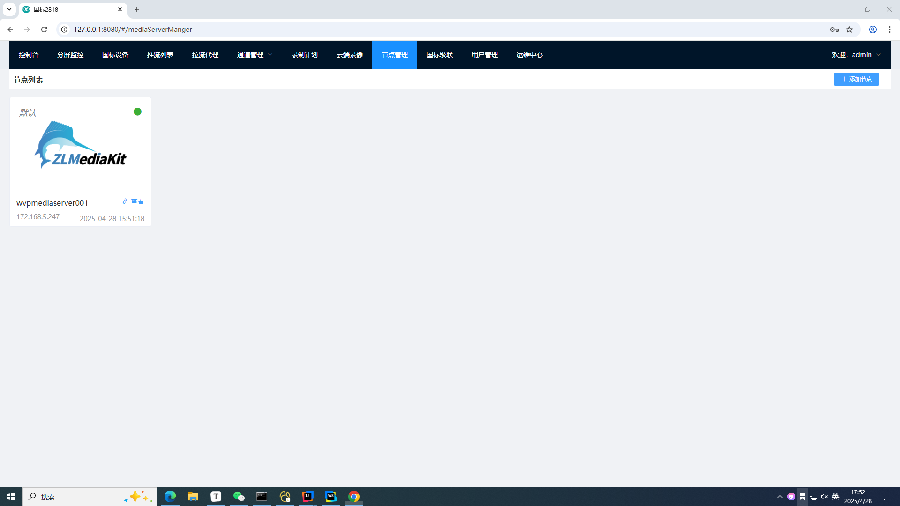

# WVP-PRO文档

## 一、Git代码仓库

```
https://github.com/Cnjszzw/wvp-GB28181-pro_001
```

## 二、项目配置和启动教程

**`src/main/resources/application.yml`**

```yaml
server:
  port: 18080
#  ssl:
#    key-store: classpath:wvp.keystore  #类路径下的自签证书
#    key-store-password: gbcom.123456 #证书密码
#    enabled: true
mps:
  version: WVPSER_V1.0_20230426
spring:
  servlet:
    multipart:
      max-file-size: 10MB  # 设置最大文件大小为10MB
      max-request-size: 10MB  # 设置最大请求大小为10MB
  datasource:
    driver-class-name: com.mysql.cj.jdbc.Driver
    platform: mysql
    type: com.alibaba.druid.pool.DruidDataSource
    # 下面为连接池的补充设置，应用到上面所有数据源中
    # 初始化大小，最小，最大
    # druid 配置: https://github.com/alibaba/druid/wiki/
    initialSize: 1
    minIdle: 1
    maxActive: 20
    # 配置获取连接等待超时的时间
    maxWait: 60000
    # 配置间隔多久才进行一次检测，检测需要关闭的空闲连接，单位是毫秒
    timeBetweenEvictionRunsMillis: 60000
    # 配置一个连接在池中最小生存的时间，单位是毫秒
    minEvictableIdleTimeMillis: 300000
    validationQuery: select 1
    testWhileIdle: true
    testOnBorrow: false
    testOnReturn: false
    # 打开PSCache，并且指定每个连接上PSCache的大小
    poolPreparedStatements: true
    maxPoolPreparedStatementPerConnectionSize: 20
    # 配置监控统计拦截的filters，stat用于监控界面，'wall'用于防火墙防御sql注入, slf4j用于druid记录sql日志
    filters: stat,slf4j
    # 通过connectProperties属性来打开mergeSql功能；慢SQL记录
    connectionProperties: druid.stat.mergeSql=true;druid.stat.slowSqlMillis=5000
    # 合并多个DruidDataSource的监控数据
    useGlobalDataSourceStat: false
  # redis
  redis:
    # 数据库索引，默认0
    database: 5
    #    # 服务器IP地址
    host: 127.0.0.1
    #    # 连接端口
    port: 5700
    #    # Redis服务器连接密码（默认为空）
    password: gbcom@gidata@123

    jedis:
      pool:
        # 连接池最大连接数（使用负值表示没有限制）
        max-active: 800
        # 连接池最大阻塞等待时间（使用负值表示没有限制）
        max-wait: 10000
        # 连接池中的最大空闲连接
        max-idle: 20
        # 连接池中的最小空闲连接
        min-idle: 2
    # 连接超时时间（毫秒）
    timeout: 30000

  # 默认的profile为dev，其他环境通过指定启动参数使用不同的profile，比如：
  #   测试环境：java -jar bootshiro.jar --spring.profiles.active=test
  #   生产环境：java -jar bootshiro.jar --spring.profiles.active=prod
  profiles:
    active: dev
# [可选] 日志配置, 一般不需要改
# 作为28181服务器的配置
sip:
  # [必须修改] 本机的IP
  ip: 172.168.5.247
  # [可选] 28181服务监听的端口
  port: 5060
  # 根据国标6.1.2中规定，domain宜采用ID统一编码的前十位编码。国标附录D中定义前8位为中心编码（由省级、市级、区级、基层编号组成，参照GB/T 2260-2007）
  # 后两位为行业编码，定义参照附录D.3
  # 3701020049标识山东济南历下区 信息行业接入
  # [可选]
  domain: 4401020049
  # [可选]
  id: 44010200492000000001
  # [可选] 默认设备认证密码，后续扩展使用设备单独密码, 移除密码将不进行校验
  password: admin123

#zlm 默认服务器配置
media:
  id: wvpmediaserver001
  # [必须修改] zlm服务器的内网IP

  ip: 172.168.5.247
  hook-ip: 172.168.5.247
  stream-ip: 172.168.5.247
  sdp-ip: 172.168.5.247
  #[必须修改] zlm服务器的http.webrtc.port
  webrtc-port: 10443
  http-ssl-port: 10443
  # [必须修改] zlm服务器的http.port
  http-port: 6080
  # [可选] zlm服务器的hook.admin_params=secret
  secret: tzaaghfRyvwtQ7STrA1ag8K1xtThSk9v
  # 启用多端口模式, 多端口模式使用端口区分每路流，兼容性更好。 单端口使用流的ssrc区分， 点播超时建议使用多端口测试
  rtp:
    # [可选] 是否启用多端口模式, 开启后会在portRange范围内选择端口用于媒体流传输
    enable: true
    # [可选] 在此范围内选择端口用于媒体流传输,
    port-range: 30000,30500 # 端口范围
    # [可选] 国标级联在此范围内选择端口发送媒体流,
    send-port-range: 30000,30500 # 端口范围
  # 录像辅助服务， 部署此服务可以实现zlm录像的管理与下载， 0 表示不使用
  record-assist-port: 18081
# [可选] 日志配置, 一般不需要改

# [根据业务需求配置]
user-settings:
  # 推流直播是否录制
  record-push-live: false
  auto-apply-play: false
  record-sip: false

mybatis:
  # 指向实体类包路径
  type-aliases-package: com.gbcom.wvp.domain.bo
  # mapper xml 文件地址
  mapper-locations: classpath:mapper/*.xml
  # 检查 mybatis 配置是否存在，一般命名为 mybatis-config.xml
  check-config-location: true
  # 执行模式。默认是 SIMPLE
  executor-type: simple
  configuration:
    map-underscore-to-camel-case: true


#pagehelper分页插件
pagehelper:

  helperDialect: mysql
  reasonable: false
  supportMethodsArguments: true
  params: count=countSql


bootshiro:
  enableEncryptPassword: true
logging:
  config: classpath:logback-spring.xml
# 在线文档： swagger-ui（生产环境建议关闭）
swagger-ui:
  enabled: true

---
# 开发环境配置(配置项只包括环境不同项)
spring:
  profiles: dev
  datasource:
    url: jdbc:mysql://127.0.0.1:3380/wvp?useUnicode=true&characterEncoding=utf-8&allowMultiQueries=true&useSSL=false&serverTimezone=Asia/Shanghai
    username: root
    password: wvp.123456
  redis:
    # 服务器IP地址
    host: 127.0.0.1
    # 连接端口
    port: 5700
    # Redis服务器连接密码（默认为空）
    password: gbcom@gidata@123

---
# 测试环境配置(配置项只包括不同项)

spring:
  profiles: test
  datasource:
    url: jdbc:mysql://127.0.0.1:3380/wvp?useUnicode=true&characterEncoding=utf-8&useSSL=false&serverTimezone=Asia/Shanghai
    username: root
    password: 123456
  redis:
    # 服务器IP地址
    host: 10.60.2.175
    # 连接端口
    port: 6380
    # Redis服务器连接密码（默认为空）
    password:

---
# 生产环境配置(配置项只包括不同项)

spring:
  profiles: prod
  datasource:
    url: jdbc:mysql://172.16.215.193:3380/wvp?useUnicode=true&characterEncoding=utf-8&useSSL=false&serverTimezone=Asia/Shanghai
    username: root
    password: 123456
  redis:
    # 服务器IP地址
    host: 10.60.2.175
    # 连接端口
    port: 6380
    # Redis服务器连接密码（默认为空）
    password: gbcom@gidata@123
```

**`src/main/resources/application-dev.yml`**

```yaml
server:
  port: 18080
#cle
mps:
  version: WVPSER_V1.0_20230426
spring:
  servlet:
    multipart:
      max-file-size: 10MB  # 设置最大文件大小为10MB
      max-request-size: 10MB  # 设置最大请求大小为10MB
  datasource:
    driver-class-name: com.mysql.cj.jdbc.Driver
    platform: mysql
    type: com.alibaba.druid.pool.DruidDataSource
    # 下面为连接池的补充设置，应用到上面所有数据源中
    # 初始化大小，最小，最大
    # druid 配置: https://github.com/alibaba/druid/wiki/
    initialSize: 1
    minIdle: 1
    maxActive: 20
    # 配置获取连接等待超时的时间
    maxWait: 60000
    # 配置间隔多久才进行一次检测，检测需要关闭的空闲连接，单位是毫秒
    timeBetweenEvictionRunsMillis: 60000
    # 配置一个连接在池中最小生存的时间，单位是毫秒
    minEvictableIdleTimeMillis: 300000
    validationQuery: select 1
    testWhileIdle: true
    testOnBorrow: false
    testOnReturn: false
    # 打开PSCache，并且指定每个连接上PSCache的大小
    poolPreparedStatements: true
    maxPoolPreparedStatementPerConnectionSize: 20
    # 配置监控统计拦截的filters，stat用于监控界面，'wall'用于防火墙防御sql注入, slf4j用于druid记录sql日志
    filters: stat,slf4j
    # 通过connectProperties属性来打开mergeSql功能；慢SQL记录
    connectionProperties: druid.stat.mergeSql=true;druid.stat.slowSqlMillis=5000
    # 合并多个DruidDataSource的监控数据
    useGlobalDataSourceStat: false
  # redis
  redis:
    # 数据库索引，默认0
    database: 5
    #    # 服务器IP地址
    host: 127.0.0.1
    #    # 连接端口
    port: 5700
    #    # Redis服务器连接密码（默认为空）
    password: gbcom@gidata@123

    jedis:
      pool:
        # 连接池最大连接数（使用负值表示没有限制）
        max-active: 800
        # 连接池最大阻塞等待时间（使用负值表示没有限制）
        max-wait: 10000
        # 连接池中的最大空闲连接
        max-idle: 20
        # 连接池中的最小空闲连接
        min-idle: 2
    # 连接超时时间（毫秒）
    timeout: 30000

  # 默认的profile为dev，其他环境通过指定启动参数使用不同的profile，比如：
  #   测试环境：java -jar bootshiro.jar --spring.profiles.active=test
  #   生产环境：java -jar bootshiro.jar --spring.profiles.active=prod
#  profiles:
#    active: dev
# [可选] 日志配置, 一般不需要改
# 作为28181服务器的配置
sip:
  # [必须修改] 本机的IP
  ip: 172.168.5.247
  # [可选] 28181服务监听的端口
  port: 5061
  # 根据国标6.1.2中规定，domain宜采用ID统一编码的前十位编码。国标附录D中定义前8位为中心编码（由省级、市级、区级、基层编号组成，参照GB/T 2260-2007）
  # 后两位为行业编码，定义参照附录D.3
  # 3701020049标识山东济南历下区 信息行业接入
  # [可选]
  domain: 4401020049
  # [可选]
  id: 44010200492000000001
  # [可选] 默认设备认证密码，后续扩展使用设备单独密码, 移除密码将不进行校验
  password: admin123

#zlm 默认服务器配置
media:
  id: wvpmediaserver001
  # [必须修改] zlm服务器的内网IP

  ip: 172.168.5.247
  hook-ip: 172.168.5.247
  stream-ip: 172.168.5.247
  sdp-ip: 172.168.5.247
  #[必须修改] zlm服务器的http.webrtc.port
  webrtc-port: 10443
  http-ssl-port: 10443
  # [必须修改] zlm服务器的http.port
  http-port: 6080
  # [可选] zlm服务器的hook.admin_params=secret
  secret: tzaaghfRyvwtQ7STrA1ag8K1xtThSk9v
  # 启用多端口模式, 多端口模式使用端口区分每路流，兼容性更好。 单端口使用流的ssrc区分， 点播超时建议使用多端口测试
  rtp:
    # [可选] 是否启用多端口模式, 开启后会在portRange范围内选择端口用于媒体流传输
    enable: true
    # [可选] 在此范围内选择端口用于媒体流传输,
    port-range: 30000,30500 # 端口范围
    # [可选] 国标级联在此范围内选择端口发送媒体流,
    send-port-range: 30000,30500 # 端口范围
  # 录像辅助服务， 部署此服务可以实现zlm录像的管理与下载， 0 表示不使用
  record-assist-port: 18081
# [可选] 日志配置, 一般不需要改

# [根据业务需求配置]
user-settings:
  # 推流直播是否录制
  record-push-live: false
  auto-apply-play: false
  record-sip: false

mybatis:
  # 指向实体类包路径
  type-aliases-package: com.gbcom.wvp.domain.bo
  # mapper xml 文件地址
  mapper-locations: classpath:mapper/*.xml
  # 检查 mybatis 配置是否存在，一般命名为 mybatis-config.xml
  check-config-location: true
  # 执行模式。默认是 SIMPLE
  executor-type: simple
  configuration:
    map-underscore-to-camel-case: true


#pagehelper分页插件
pagehelper:

  helperDialect: mysql
  reasonable: false
  supportMethodsArguments: true
  params: count=countSql


bootshiro:
  enableEncryptPassword: true
logging:
  config: classpath:logback-spring.xml
# 在线文档： swagger-ui（生产环境建议关闭）
swagger-ui:
  enabled: true

---
# 开发环境配置(配置项只包括环境不同项)
spring:
  profiles: dev
  datasource:
    url: jdbc:mysql://127.0.0.1:3380/wvp?useUnicode=true&characterEncoding=utf-8&allowMultiQueries=true&useSSL=false&serverTimezone=Asia/Shanghai
    username: root
    password: wvp.123456
  redis:
    # 服务器IP地址
    host: 127.0.0.1
    # 连接端口
    port: 5700
    # Redis服务器连接密码（默认为空）
    password: gbcom@gidata@123

---
# 测试环境配置(配置项只包括不同项)

spring:
  profiles: test
  datasource:
    url: jdbc:mysql://127.0.0.1:3380/wvp?useUnicode=true&characterEncoding=utf-8&useSSL=false&serverTimezone=Asia/Shanghai
    username: root
    password: 123456
  redis:
    # 服务器IP地址
    host: 10.60.2.175
    # 连接端口
    port: 6380
    # Redis服务器连接密码（默认为空）
    password:

---
# 生产环境配置(配置项只包括不同项)

spring:
  profiles: prod
  datasource:
    url: jdbc:mysql://172.16.215.193:3380/wvp?useUnicode=true&characterEncoding=utf-8&useSSL=false&serverTimezone=Asia/Shanghai
    username: root
    password: 123456
  redis:
    # 服务器IP地址
    host: 10.60.2.175
    # 连接端口
    port: 6380
    # Redis服务器连接密码（默认为空）
    password: gbcom@gidata@123


```

**`docker/wvp/wvp/application-base.yml`**

```yml
spring:
  # 设置接口超时时间
  mvc:
    async:
      request-timeout: 20000
  thymeleaf:
    cache: false
  # [可选]上传文件大小限制
  servlet:
    multipart:
      max-file-size: 10MB
      max-request-size: 100MB
  # REDIS数据库配置
  redis:
    # [必须修改] Redis服务器IP, REDIS安装在本机的,使用127.0.0.1
    host: 127.0.0.1
    # [必须修改] 端口号
    port: 6379
    # [可选] 数据库 DB
    database: 1
    # [可选] 访问密码,若你的redis服务器没有设置密码，就不需要用密码去连接
    password: 
    # [可选] 超时时间
    timeout: 30000
  # mysql数据源
  datasource:
    dynamic:
      type: com.zaxxer.hikari.HikariDataSource
      driver-class-name: com.mysql.cj.jdbc.Driver
      url: jdbc:mysql://127.0.0.1:3380/wvp?useUnicode=true&characterEncoding=UTF8&rewriteBatchedStatements=true&serverTimezone=PRC&useSSL=false&allowMultiQueries=true
      username: root
      password: root
#[可选] 监听的HTTP端口, 网页和接口调用都是这个端口
server:
  port: 18978
  ssl:
    # [可选] 是否开启HTTPS访问
    enabled: false
# 作为28181服务器的配置
sip:
  # [必须修改] 本机的IP
  ip: 127.0.0.1
  # [可选]
  port: 8116
  # [可选]
  domain: 3402000000
  # [可选]
  id: 34020000002000000001
  password:
  alarm: true

# 默认服务器配置
media:
  id: polaris
  # [必须修改]内网IP
  ip: 127.0.0.1
  http-port: 6080
  # [可选] 返回流地址时的ip，置空使用 media.ip
  stream-ip: 127.0.0.1
  # [可选] wvp在国标信令中使用的ip，此ip为摄像机可以访问到的ip， 置空使用 media.ip
  sdp-ip: 127.0.0.1
  # [可选] Hook IP, 默认使用sip.ip
  hook-ip: 127.0.0.1
  # [可选] sslport
  http-ssl-port: 4443
  rtp-proxy-port: 10000
  rtmp-port: 10935
  rtmp-ssl-port: 41935
  rtsp-port: 5540
  rtsp-ssl-port: 45540
  # [可选] 
  secret: su6TiedN2rVAmBbIDX0aa0QTiBJLBdcf
  # 启用多端口模式, 多端口模式使用端口区分每路流，兼容性更好。 单端口使用流的ssrc区分， 点播超时建议使用多端口测试
  rtp:
    # [可选] 是否启用多端口模式, 开启后会在portRange范围内选择端口用于媒体流传输
    enable: false
    # [可选] 
    port-range: 30000,30500 
    # [可选] 
    send-port-range: 50502,50506 

  record-path: /opt/media/record
  record-day: 7
  record-assist-port: 0
user-settings:
    auto-apply-play: true
    play-timeout: 30000
    wait-track: false
    record-push-live: false
    record-sip: false
    stream-on-demand: true
    interface-authentication: false
    broadcast-for-platform: TCP-PASSIVE
    push-stream-after-ack: true
    send-to-platforms-when-id-lost: true
    interface-authentication-excludes:
      - /api/**
    push-authority: false
    allowed-origins:
      - http://localhost:8080
      - http://127.0.0.1:8080
      - http://0.0.0.0:8080
logging:
  config: classpath:logback-spring.xml


```


## 附：运行成功的截图














