# 信息

**wvp地址：**

本地：https://127.0.0.1:8970/#/gis/leaflet

测试：https://10.30.2.8:8970/#/gis/leaflet

**账号**：admin

**密码**：123456

**我的账号**

```
账号：zhaozhiwen

密码：123456
```

**允许权限SQL**

```sql
grant all PRIVILEGES on *.* to 'root'@'%' IDENTIFIED by 'wvp.123456' with GRANT OPTION;


flush PRIVILEGES;
```

**查看wireshark的广播影响**

```txt
eth.addr == ff:ff:ff:ff:ff:ff
```

**如何修改本地wvp的ip**

```
D:\sw\wvp-windows\wvp\config\application.yml
D:\sw\wvp-windows\zlm\config.ini
```

**关于重新安装后的License**

记得备份一下这个目录

```
D:\web-video-platform\wvplicense
```

**如何重启wvp**

```
在windows服务中
wvp-mysql
wvp-redis
wvp-server

zftp-server
zlm-server
assist-server(直播？)
```

**如何绑定摄像头？**

```
先添加mesh设备，然后再添加国标，之后把这个国标给绑定到mesh设备上
```

**META系统**

账号：admin

密码：123456

**本地ip**

```
172.168.5.247
```

**trac平台**

```
http://trac.gbcom.com.cn/wvp/report
```

账号：zhaozhiwen

密码：zzw.2025

**2.8测试账号**

```
账号：zzw003
密码：123456
类型：安卓
账号：zzw004
密码：123456
类型：安卓
账号：zhaozhiwen
密码：123456
类型：web
账号：zhaozhiwen2
密码：123456
类型：web
账号：zhaozhiwen3
密码：123456
类型：web
```

**数据库MySQL**

端口：3380

账号：root

密码：wvp.123456

**数据库Redis**

端口：5700

账号：127.0.0.1

密码：gbcom@gidata@123

**ZLM**

端口：6080

**接口文档地址**

```url
https://127.0.0.1:8970/swagger-ui/index.html#/
```

**业务分类：**

1.陈彬、飞哥：

web端 即时通讯

2.罗伟：

视频调度、会商调度语音调度

3.许志强（强哥）：

app端的，视频会议、接打电话、GIS等等，都是他做的

**地平线/摄像头**

**账号：**admin

**密码：**admin123

> 注意要用ie浏览器或者edge中兼容ie的模式去打开，还有必须装一个插件

**摄像头资源**

```
Horizon Robotics
172.168.5.177:5060
设备Id：44010200492000000002
```

**如何添加构造设备？**

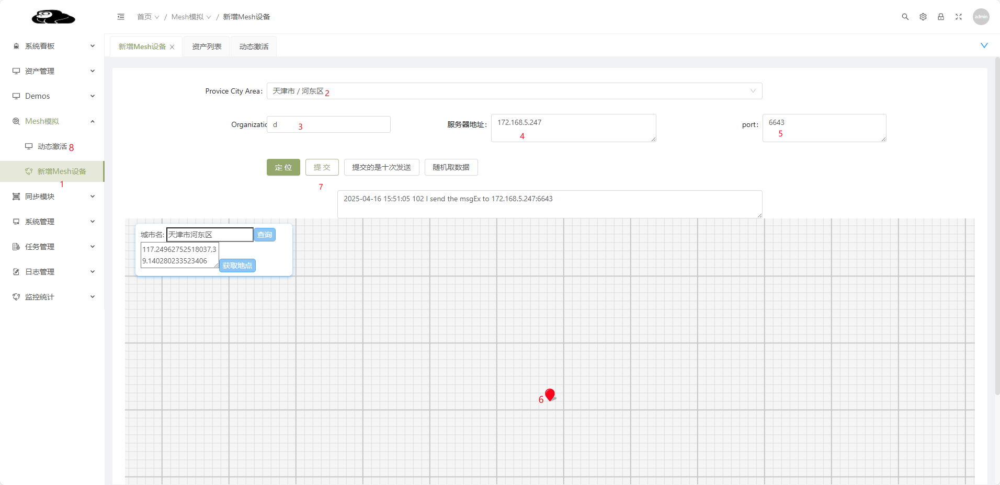

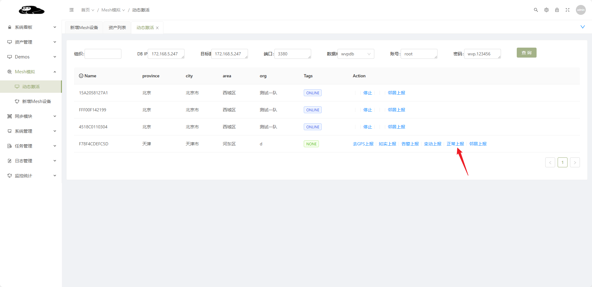

##  Q&A**绑定视频设备(比如说国标)**

首先要开放权限

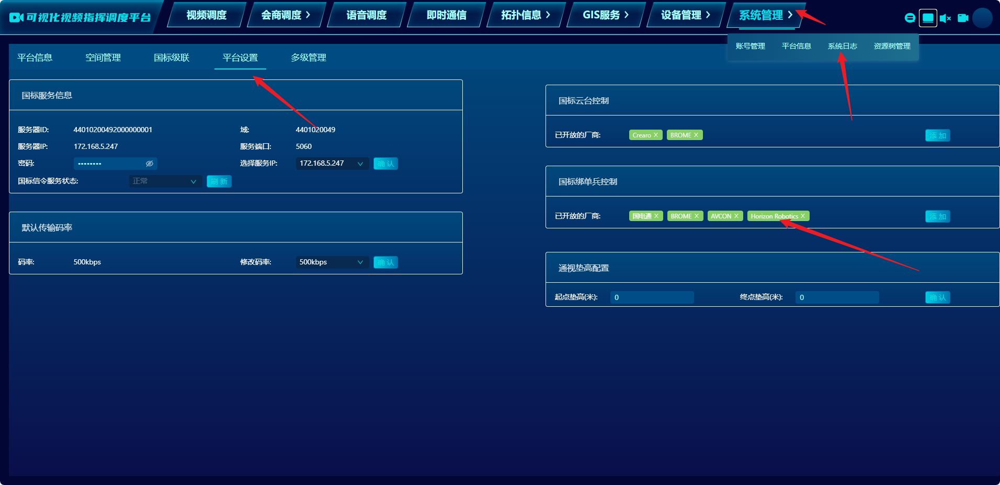

其次才可以进行绑定和解绑

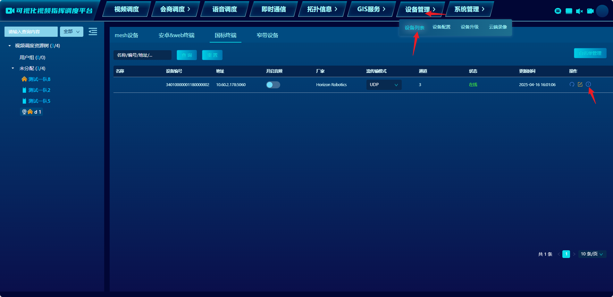

**对应的表** mesh_device

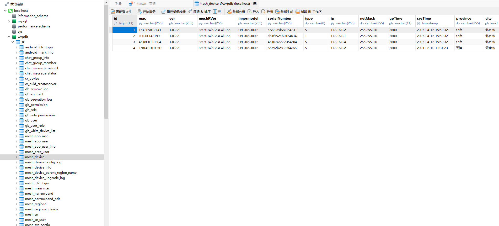

**安卓手机mate20**

**账号：**152***************78

**密码：**abc12345

## Q&A**如何更新？**

第一种方式：

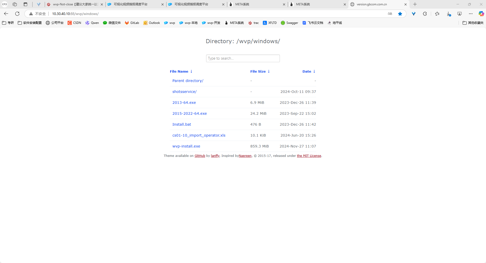

第二种方式

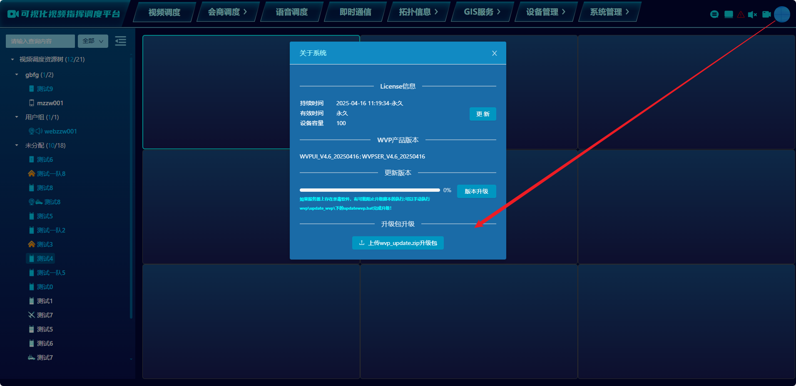

**未分配设备不允许查看**

记住，这个创建用户的时候，不要选管理员，否则就是这样

**安卓的端口，连接的是后端的端口，不是前端的端口**

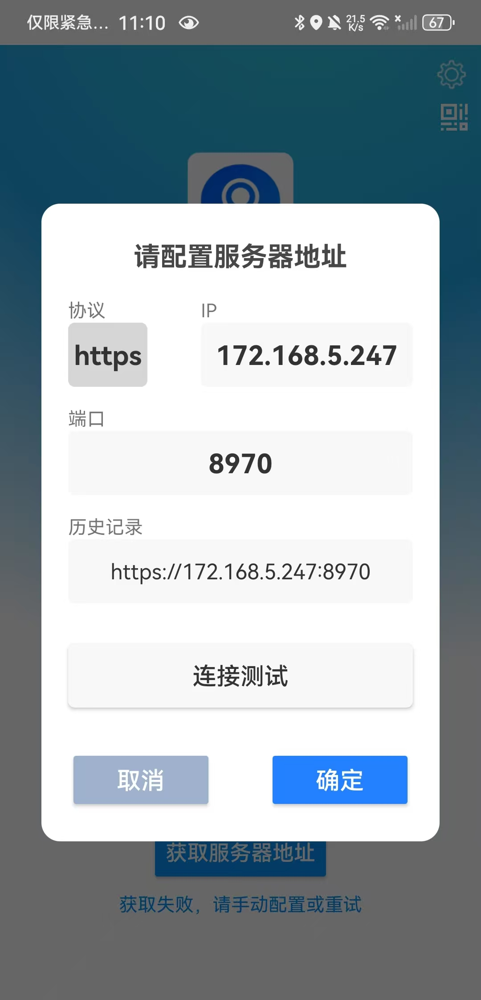

 180.168.191.195:8970账号

```
账号：super
密码：super.gbcom.com

web
zhaozhiwen
123456
```

电脑开机密码：（本地账户）

```
1999
```


## Q&A如何添加国标设备？

第一步，配置本机的ip地址

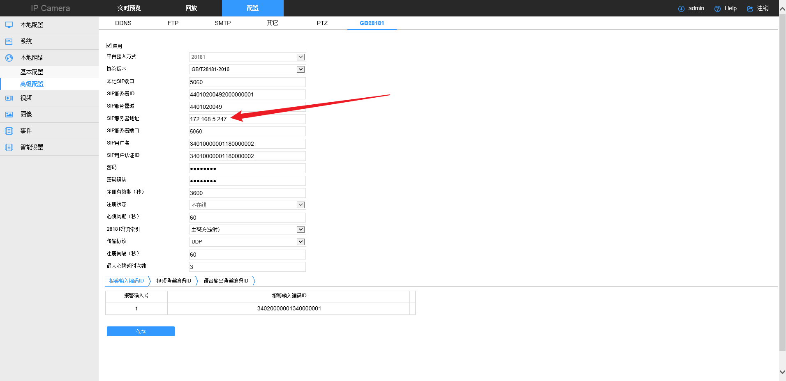

第二步，添加白名单，注意设备ID填写**`SIP用户名`**

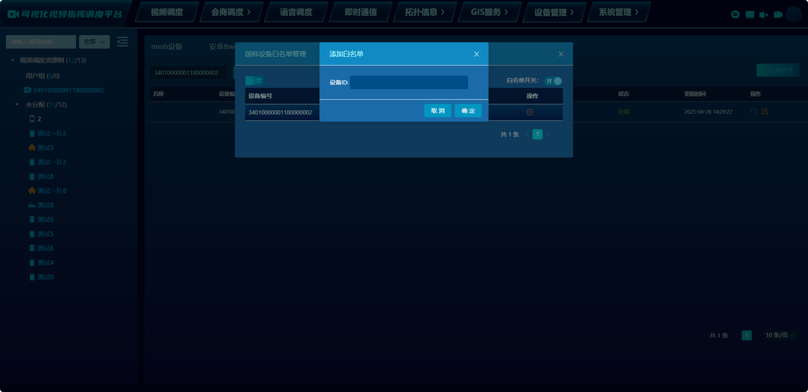

第三步，等待上线

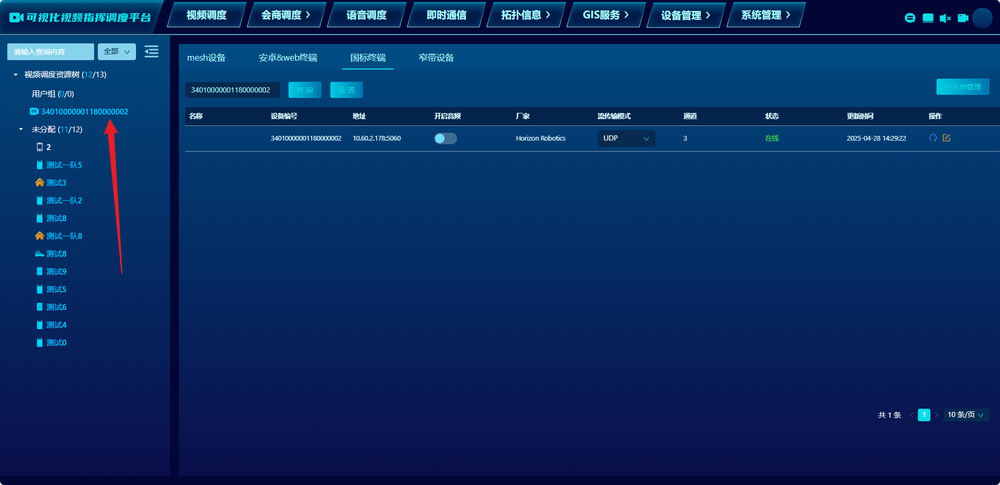
