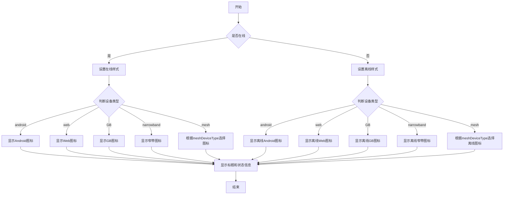

# 前端项目结构总结

## 1. `api`
- **功能**: 存放与后端交互的接口文件。
- **子目录**:
  - 按模块划分，例如 `system`、`device`、`log` 等，每个模块包含对应的 API 文件。
  - 示例：`system/account` 提供账户管理相关接口，`device` 提供设备管理相关接口。

## 2. `assets`
- **功能**: 存放静态资源文件。
- **子目录**:
  - `icons`: 图标资源。
  - `images`: 图片资源。
  - `lmap/icons`: 地图相关的图标资源。
  - 其他资源如音频 (`music`) 和 UI 资源 (`newUI`)。

## 3. `components`
- **功能**: 存放可复用的 Vue 组件。
- **特点**:
  - 按组件功能命名，例如 `a-account-upload`、`a-live-jessibuca`。
  - 部分复杂组件有独立的子目录（如 `components` 或 `utils`）。
  - 示例：`a-play-video` 用于视频播放，`dynamic-table` 提供动态表格功能。

## 4. `directives`
- **功能**: 自定义 Vue 指令存放目录。

## 5. `enums`
- **功能**: 定义枚举类型，集中管理项目中的常量。

## 6. `hooks`
- **功能**: 存放自定义 Hook，封装逻辑复用。
- **示例**: `useFormModal` 封装表单模态框逻辑，`useVolume` 处理音量控制。

## 7. `layout`
- **功能**: 页面布局相关组件。
- **特点**:
  - 存放页面级别的布局组件，例如 `header`、`footer`、`menu` 等。
  - 这些组件通常被多个页面复用，用于构建页面的整体结构。
  - 示例：`header` 提供顶部导航栏，`footer` 提供底部信息栏。
- **与 `views` 的区别**:
  - `layout` 是页面布局的基础组件，而 `views` 是具体的页面内容组件。
  - `layout` 更关注页面的整体结构，`views` 更关注页面的具体功能实现。
- **与 `components` 的区别**:
  - `layout` 是页面级别的布局组件，而 `components` 是可复用的功能组件。
  - `layout` 的复用范围更广，通常服务于多个页面；`components` 的复用范围较小，通常服务于特定的功能模块。

## 8. `lib`
- **功能**: 第三方库或自定义工具库。
- **示例**: `eventbus` 事件总线，`jessibuca` 视频播放库。

## 9. `plugins`
- **功能**: Vue 插件存放目录。

## 10. `router`
- **功能**: 路由配置。
- **子目录**:
  - `modules`: 按模块划分路由配置。

## 11. `store`
- **功能**: Vuex 状态管理。
- **子目录**:
  - `modules`: 按模块划分状态管理，例如 `user`、`system`。

## 12. `styles`
- **功能**: 全局样式文件存放目录。

## 13. `types`
- **功能**: TypeScript 类型定义。
- **子目录**:
  - `shims`: 存放全局声明文件。

## 14. `utils`
- **功能**: 工具函数存放目录。
- **子目录**:
  - `http`: 封装 HTTP 请求相关工具（如 `axios`）。
  - 其他工具如 `lnglatUtil`（经纬度处理）、`permission`（权限校验）。

## 15. `views`
- **功能**: 页面视图组件。
- **子目录**:
  - 按功能模块划分，例如 `auth`、`monitor`、`shared`。
  - 示例：`auth/system/account` 提供账户管理页面，`shared/dashboard` 提供仪表盘页面。

## 16. Q&A: `components` 和 `views` 的区别

- **`components`**:
  - **功能**: 存放可复用的 Vue 组件。
  - **特点**:
    - 通常为小型、独立的功能模块。
    - 可被多个页面或组件引用，具有较高的复用性。
    - 示例：`a-account-upload`（账户上传组件）、`dynamic-table`（动态表格组件）。
  - **适用场景**: 需要在不同页面或模块中重复使用的功能块。

- **`views`**:
  - **功能**: 存放页面级别的视图组件。
  - **特点**:
    - 通常对应路由中的一个页面。
    - 复杂度较高，可能包含多个子组件。
    - 示例：`auth/system/account`（账户管理页面）、`shared/dashboard`（仪表盘页面）。
  - **适用场景**: 页面级别的完整视图，通常与路由配置相关联。

## 17. Q&A: `layout` 和 `views` 的区别

- **`layout`**:
  - **功能**: 页面布局相关组件。
  - **特点**:
    - 存放页面级别的布局组件，例如 `header`、`footer`、`menu` 等。
    - 这些组件通常被多个页面复用，用于构建页面的整体结构。
  - **与 `views` 的区别**:
    - `layout` 是页面布局的基础组件，而 `views` 是具体的页面内容组件。
    - `layout` 更关注页面的整体结构，`views` 更关注页面的具体功能实现。

## 18. Q&A: `index.vue` 文件结构总结

- **功能**: `index.vue` 是一个典型的 Vue 组件文件，通常包含模板、脚本和样式三大部分。
- **模板部分**:
  - 定义了组件的 HTML 结构。
  - 包含了输入框、下拉选择框、树形组件等 UI 元素。
  - 实现了搜索功能、设备状态显示、右键菜单等功能。
  - 模板部分使用 `<template>` 标签包裹，包含以下主要标签：
    - `<div>`: 用于布局和样式控制。
    - `<a-input>`: Ant Design Vue 的输入框组件，绑定 `v-model:value` 属性以实现双向绑定。
    - `<a-select>`: Ant Design Vue 的下拉选择框组件，支持动态选项切换，通过 `@change` 事件触发状态更新。
    - `<a-tree>`: Ant Design Vue 的树形组件，支持节点展开、选中和右键菜单操作，数据通过 `tree-data` 属性动态绑定。
    - `<a-dropdown>`: Ant Design Vue 的下拉菜单组件，结合右键菜单实现上下文操作。
    - `<a-modal>`: Ant Design Vue 的模态框组件，用于修改系统名称等操作。
    - `<a-button>`: Ant Design Vue 的按钮组件，支持点击事件绑定。
  - 模板部分还使用了插槽（slot）和事件绑定（如 `@click`、`@select` 等）来实现交互功能。

- **脚本部分**:
  - 使用 TypeScript 编写，实现了组件的逻辑控制。
  - 包含了数据初始化、树形数据处理、事件处理、定时任务等功能。
  - 使用了 Vue 的组合式 API（Composition API），例如 `reactive`、`ref`、`onMounted` 等。
  - 主要逻辑包括：
    - **数据初始化**: 在 `onMounted` 生命周期钩子中初始化树形数据。
    - **树形数据处理**: 包括树形数据的排序、过滤、展开/折叠等功能。
    - **事件处理**: 包括点击事件、右键菜单事件、拖拽事件等。
    - **定时任务**: 定期刷新树形数据，保持数据的实时性。
    - **设备状态管理**: 管理设备的在线状态、播放状态、会议状态等。
    - **权限控制**: 根据用户角色（如超级管理员）显示不同的功能。
    - **窄带设备支持**: 特殊处理窄带设备的图标显示和语音通话功能。
    - **路由适配**: 根据不同的路由路径，调整树形数据的加载和显示逻辑。

- **样式部分**:
  - 定义了组件的外观样式。
  - 包含了树形组件、输入框、按钮等元素的样式。
  - 使用了 scoped 样式，确保样式仅作用于当前组件。

- **功能模块**:
  - **数据初始化**: 在 `onMounted` 生命周期钩子中初始化树形数据。
  - **树形数据处理**: 包括树形数据的排序、过滤、展开/折叠等功能。
  - **事件处理**: 包括点击事件、右键菜单事件、拖拽事件等。
  - **定时任务**: 定期刷新树形数据，保持数据的实时性。
  - **设备状态管理**: 管理设备的在线状态、播放状态、会议状态等。
  - **权限控制**: 根据用户角色（如超级管理员）显示不同的功能。
  - **窄带设备支持**: 特殊处理窄带设备的图标显示和语音通话功能。
  - **路由适配**: 根据不同的路由路径，调整树形数据的加载和显示逻辑。

- **总结**: `index.vue` 文件是一个功能丰富的 Vue 组件，集成了多种功能模块，适用于复杂的树形数据展示和交互场景。

## 19. `index.vue` 脚本部分功能模块解析

- **数据初始化**:
  - 在 `onMounted` 生命周期钩子中初始化树形数据。
  - 根据路由名称调用 `initDifferent` 方法加载不同类型的设备树。

- **树形数据处理**:
  - 包括树形数据的排序、过滤、展开/折叠等功能。
  - 使用 `list2tree` 方法将列表数据转换为树形结构。
  - 使用 `sortByStatus` 方法对树节点进行排序，优先显示在线设备。

- **事件处理**:
  - 包括点击事件、右键菜单事件、拖拽事件等。
  - 点击设备节点时，根据设备类型和路由路径触发不同的逻辑。
  - 右键菜单支持修改系统名称、删除设备、点播全组等功能。

- **定时任务**:
  - 定期刷新树形数据，保持数据的实时性。
  - 使用 `setInterval` 每隔 5 秒调用 `TimerFun` 方法更新数据。

- **设备状态管理**:
  - 管理设备的在线状态、播放状态、会议状态等。
  - 使用 `refTree` 方法更新设备状态，支持动态刷新树节点。

- **权限控制**:
  - 根据用户角色（如超级管理员）显示不同的功能。
  - 非管理员用户无法查看未分配设备。

- **窄带设备支持**:
  - 特殊处理窄带设备的图标显示和语音通话功能。
  - 使用 `narrowBandAudio` 方法处理窄带设备的说话图标显示和隐藏。

- **路由适配**:
  - 根据不同的路由路径，调整树形数据的加载和显示逻辑。
  - 支持 `/wvp/audio`、`/gis/leaflet`、`/gis/amap` 等多种路由场景。

## 20. Q&A: `index.vue` 文件中 `export default defineComponent` 的作用

- **问题**: 在 `index.vue` 文件的 `<script>` 部分中，为什么使用 `export default defineComponent`？
  
- **回答**:
  - **`defineComponent` 的作用**:
    - `defineComponent` 是 Vue 3 提供的一个函数，用于定义 Vue 组件。
    - 它的主要目的是提供更好的 TypeScript 类型推断支持，确保在开发过程中能够获得更准确的类型检查和代码提示。
    - 使用 `defineComponent` 可以让开发者在定义组件时，明确地声明组件的属性、方法、生命周期钩子等内容，并获得完整的类型安全。
  - **`export default` 的作用**:
    - `export default` 是 ES6 模块系统中的语法，用于导出模块的默认内容。
    - 在 Vue 单文件组件中，`export default` 通常用于导出组件的配置对象，使得该组件可以在其他地方被引入和使用。
  - **结合使用的原因**:
    - `export default defineComponent` 的组合是 Vue 3 中推荐的标准写法，尤其是在使用 TypeScript 时。
    - 这种写法不仅提供了类型安全，还保持了代码的可读性和一致性。
    - 示例：
      ```typescript
      export default defineComponent({
        name: "MyComponent",
        setup() {
          // 组件逻辑
        }
      });


## 21.template案例分析

```typescript
<div class="m-input">
      <div style="width:55%; float:left;line-height: 40px;">
        <a-input v-model:value="searchValue" class="m-in" placeholder="请输入查询内容" allowClear />
      </div>
      <div style="width:15%; float:left;margin-left: 7px;margin-top:4px">
        <a-select ref="select" v-model:value="isOnlineValue"
          style="width: 73px;background-color: #0c1d80;margin-left: 14px" @change="handleChange" class="changeSelect">
          <a-select-option value="all">全部</a-select-option>
          <a-select-option value="on">在线</a-select-option>
          <a-select-option value="off">离线</a-select-option>
        </a-select>
      </div>
    </div>
```

### 1. 布局与功能

该代码片段定义了一个输入框与下拉选择框组合的布局，主要功能如下：
- **输入框部分**:
  - 使用 Ant Design Vue 的 `<a-input>` 组件实现。
  - 通过 `v-model:value="searchValue"` 实现双向绑定，用于实时获取用户输入的查询内容。
  - 设置了 `placeholder="请输入查询内容"` 提示用户输入，并启用 `allowClear` 属性支持一键清除输入内容。
  - 样式上设置了宽度为父容器的 55%，并使用 `float: left` 实现左浮动布局。

- **下拉选择框部分**:
  - 使用 Ant Design Vue 的 `<a-select>` 组件实现。
  - 通过 `v-model:value="isOnlineValue"` 实现双向绑定，用于动态获取用户选择的状态值（全部、在线或离线）。
  - 下拉选项包括三个值：`全部`、`在线` 和 `离线`，分别对应 `value` 属性的 `all`、`on` 和 `off`。
  - 设置了固定宽度 `73px` 和背景颜色 `#0c1d80`，并通过 `@change="handleChange"` 绑定状态切换事件。
  - 样式上设置了宽度为父容器的 15%，并使用 `float: left` 和 `margin-left` 实现左浮动布局。

### 2. 功能交互逻辑
- **输入框交互**:
  - 用户输入内容时，`searchValue` 的值会实时更新，触发相关逻辑（如搜索过滤）。
  
- **下拉选择框交互**:
  - 用户选择不同的状态值时，`isOnlineValue` 的值会更新，并触发 `handleChange` 方法，执行状态切换逻辑（如刷新设备树数据）。

### 3. 样式说明
- **整体布局**:
  - 外层容器 `.m-input` 设置了固定高度 `40px` 和底部外边距 `8px`，并通过 `overflow: hidden` 隐藏溢出内容。
  - 内部子元素通过 `float: left` 实现水平排列，并设置适当的 `margin` 和 `line-height` 确保对齐效果。

- **组件样式**:
  - 输入框 `.m-in` 设置了自定义边框颜色和圆角样式。
  - 下拉选择框 `.changeSelect` 设置了背景颜色和左侧外边距，确保与输入框的视觉一致性。

### 4. 总结
该代码片段展示了如何通过 Ant Design Vue 组件库快速构建一个具备搜索和状态筛选功能的 UI 布局。其设计注重用户体验和视觉一致性，适用于需要动态过滤和状态管理的场景。

## 22. `<a-tree>` 组件案例分析

```ts
<a-tree class="m-tree" v-if="!showTree" :selectable="true" :tree-data="treeData" :replace-fields="replaceFields"
      :expandedKeys="expandedKeys" :selectedKeys="selectedKeys" :auto-expand-parent="autoExpandParent"
      @expand="onExpand" @select="onClickDevice" @rightClick="rightClick" :show-icon="true" :class="'treeClass'"
      color="rgba(255, 255, 255, 0.65)">
      <template #title="{
        title, online, level, id, type, idv, bePlayStatus, isVideoAudio, isPlaying, playStatus, mettingStatus, onLineTotal, allTotal,
        meshDeviceType, hoverTitle, isCamera, cameraIsOnline, parentId, isDevice, meshTbindOnlyAudio,fromPlatformCatalog,meshTDeviceMemberId,isMark
      }">
        <a-dropdown :trigger="['contextmenu']">
          <span draggable="true" @dragover.prevent @dragstart="drag($event,online, level, id, type,isCamera,cameraIsOnline,parentId)"
            @dragend="dragEnd($event)">
            <span v-if="level == 0">
              <span style="font-weight: 500;display: inline-block;height: 26px;">{{ title }}</span>
              (<span style="color:#00C8FF">{{ onLineTotal }}</span>/{{ allTotal }})
            </span>
            <span v-else>
              <span :title=hoverTitle v-if="online" style="color:#00C8FF;">
                <svg-icon v-if="isPlaying == '1'" icon-class="greenCamera" style="left:-2px;font-size: 9px;top: -2px;" />
                <span v-if="isVideoAudio == 0 && type == 'android'">
                  <svg-icon class="android iconClass" icon-class="android" />
                </span>
                <span v-if="isVideoAudio == 0 && type == 'web'">
                  <svg-icon style="color:#00C8FF" class="iconClass" icon-class="camera" />
                  <svg-icon style="color:#00C8FF" class="iconClass" icon-class="audio" />
                </span>
                <span v-if="isVideoAudio == 1 && type == 'web'">
                  <svg-icon style="color:#FFFFFF" class="iconClass" icon-class="camera" />
                  <svg-icon style="color:#FFFFFF" class="iconClass" icon-class="audio" />
                </span>
                <span v-if="isVideoAudio == 2 && type == 'web'">
                  <svg-icon style="color:#00C8FF" class="iconClass" icon-class="camera" />
                  <svg-icon style="color:#FFFFFF" class="iconClass" icon-class="audio" />
                </span>
                <span v-if="isVideoAudio == 3 && type == 'web'">
                  <svg-icon style="color:#FFFFFF" class="iconClass" icon-class="camera" />
                  <svg-icon style="color:#00C8FF" class="iconClass" icon-class="audio" />
                </span>
                <span v-if="type == 'GB' && isDevice == '1'">
                  <svg-icon style="color:#00C8FF" class="iconClass" icon-class="gb" />
                </span>
                <span v-if="type == 'GB' && isDevice == '0'">
                  <svg-icon style="color:#00C8FF" class="iconClass" icon-class="GBPlatform" />
                </span>
                <!---新增一种窄带设备图标-->
                <span v-if="type == 'narrowband'">
                  <svg-icon class="iconClass" icon-class="narrowband" style="color:#00C8FF;" />
                </span>
                <span v-if="type == 'meshT'">
                  <svg-icon style="color:#00C8FF" class="iconClass" icon-class="meshT" />
                </span>

                <span v-if="type == 'mesh' && isCamera == '1' && !meshTbindOnlyAudio">
                  <svg-icon v-if="cameraIsOnline" class="iconClass" icon-class="camera" style="color:#00C8FF;" />
                  <svg-icon v-else class="iconClass" icon-class="camera" style="color:#FFFFFF"/>
                </span>

                <span v-if="type == 'mesh' && meshDeviceType == '0'">
                  <svg-icon class="iconClass" icon-class="danbing" style="color:#00C8FF" />
                </span>
                <span v-else-if="type == 'mesh' && meshDeviceType == '2'">
                  <svg-icon class="iconClass" icon-class="zhongduan" style="color:#00C8FF" />
                </span>
                <span v-else-if="type == 'mesh' && (meshDeviceType == '1' || meshDeviceType == '3' || meshDeviceType == '5')">
                  <svg-icon class="iconClass" icon-class="xinzhongji" style="color:#00C8FF" />
                </span>
                <span v-else-if="type == 'mesh' && meshDeviceType == '4'">
                  <svg-icon class="iconClass" icon-class="jizaimeshjizhan" style="color:#00C8FF" />
                </span>
                <span v-else-if="type == 'mesh' && meshDeviceType == '6'">
                  <svg-icon class="iconClass" icon-class="chezaimeshjizhan" style="color:#00C8FF" />
                </span>
                <span v-else-if="type == 'mesh' && meshDeviceType == '7'">
                  <svg-icon class="iconClass" icon-class="1typemeshmodule" style="color:#00C8FF" />
                </span>
                <span v-else-if="type == 'mesh' && meshDeviceType == '8'">
                  <svg-icon class="iconClass" icon-class="2typemeshmodule" style="color:#00C8FF" />
                </span>
                <span v-else-if="type == 'mesh' && meshDeviceType == '9'">
                  <svg-icon class="iconClass" icon-class="3typemeshmodule" style="color:#00C8FF" />
                </span>
                <span v-else-if="type == 'mesh' && meshDeviceType == '10'">
                  <svg-icon class="iconClass" icon-class="unknowmesh" style="color:#ffffff" />
                </span>
                <span v-else-if="type == 'mesh' && meshDeviceType == '30'">
                  <svg-icon class="iconClass" icon-class="zhifayi" style="color:#00C8FF" />
                </span>
                <span v-else-if="type == 'mesh' && meshDeviceType == '31'">
                  <svg-icon class="iconClass" icon-class="4Gdanbing" style="color:#00C8FF" />
                </span>
                <span v-else-if="type == 'mesh' && meshDeviceType == '32'">
                  <svg-icon class="mainwan" icon-class="mainwan" />
                </span>

                <span v-if="type == 'GB' && isDevice == '0'" style="font-weight: 500;line-height: 26px;color: #ffffff">&nbsp;{{ title }}</span>
                <span v-else style="font-weight: 500;line-height: 26px;">&nbsp;{{ title }}</span>
                <span v-if="isDevice == '0'" style="color:#ffffff;">&nbsp;(<span style="color:#00C8FF">{{onLineTotal}}</span>/{{ allTotal }})</span>
                
                <span  style="float: right;" v-if="(type == 'android' || type == 'meshT' || type == 'mesh' ) && isMark && isAdmin ">
                  
                </span>
                <!-- 添加一个窄带的说话组件-->
                <span v-if="type == 'narrowband'" style="position: relative;left: 2px;top:2px">
                   <a-speak-icon v-show="isSpeak"/>
                </span>

                <div v-if="bePlayStatus || playStatus || mettingStatus" style="margin-top: -5px;">
                  <span v-if="(type == 'meshT' || type == 'android' || type == 'web') && online"
                    style="font-size: 9px;color: rgb(1, 255, 1);">
                    <span v-if="bePlayStatus && !playStatus" style="margin-right: 4px;margin-left: 4px">
                      点播中
                    </span>
                    <span v-if="bePlayStatus && playStatus" style="margin-right: 4px;margin-left: 4px">
                      通话中
                    </span>
                    <span v-if="mettingStatus" style="margin-right: 4px;margin-left: 4px">
                      会议中
                    </span>
                  </span>
                </div>
              </span>
              <span :title=hoverTitle v-else style="color: #ffffff">
                <span v-if="type == 'android'">
                  <svg-icon class="android iconClass" icon-class="android" />
                </span>
                <span v-if="type == 'web'">
                  <svg-icon style="color:#FFFFFF" class="iconClass" icon-class="camera" />
                  <svg-icon style="color:#FFFFFF" class="iconClass" icon-class="audio" />
                </span>
                <span v-if="type == 'GB' && isDevice == '1'">
                  <svg-icon style="color:#FFFFFF" class="iconClass" icon-class="gboff" />
                </span>
                <span v-if="type == 'GB' && isDevice == '0'">
                  <svg-icon style="color:#FFFFFF" class="iconClass" icon-class="GBPlatformOffline" />
                </span>
                <!---新增一种窄带设备图标-->
                <span v-if="type == 'narrowband'">
                  <svg-icon class="iconClass" icon-class="narrowband" style="color:#FFFFFF" />
                </span>
                <span v-if="type == 'meshT'">
                  <svg-icon style="color:#FFFFFF" class="iconClass" icon-class="off_meshT" />
                </span>

                <span v-if="type == 'mesh' && isCamera == '1' && !meshTbindOnlyAudio">
                  <svg-icon class="iconClass" icon-class="camera" style="color:#FFFFFF" />
                </span>

                <span v-if="type == 'mesh' && meshDeviceType == '0'">
                  <svg-icon class="iconClass" icon-class="off_danbing" style="color:#FFFFFF" />
                </span>
                <span v-else-if="type == 'mesh' && meshDeviceType == '2'">
                  <svg-icon class="iconClass" icon-class="zhongduan" style="color:#FFFFFF" />
                </span>
                <span v-else-if="type == 'mesh' && (meshDeviceType == '1' || meshDeviceType == '3' || meshDeviceType == '5')">
                  <svg-icon class="iconClass" icon-class="xinzhongji" style="color:#FFFFFF" />
                </span>
                <span v-else-if="type == 'mesh' && meshDeviceType == '4'">
                  <svg-icon class="iconClass" icon-class="jizaimeshjizhan" style="color:#FFFFFF" />
                </span>
                <span v-else-if="type == 'mesh' && meshDeviceType == '6'">
                  <svg-icon class="iconClass" icon-class="chezaimeshjizhan" style="color:#FFFFFF" />
                </span>
                <span v-else-if="type == 'mesh' && meshDeviceType == '7'">
                  <svg-icon class="iconClass" icon-class="1typemeshmodule" style="color:#FFFFFF" />
                </span>
                <span v-else-if="type == 'mesh' && meshDeviceType == '8'">
                  <svg-icon class="iconClass" icon-class="2typemeshmodule" style="color:#FFFFFF" />
                </span>
                <span v-else-if="type == 'mesh' && meshDeviceType == '9'">
                  <svg-icon class="iconClass" icon-class="3typemeshmodule" style="color:#FFFFFF" />
                </span>
                <span v-else-if="type == 'mesh' && meshDeviceType == '10'">
                  <svg-icon class="iconClass" icon-class="off_unknowmesh" style="color:#FFFFFF" />
                </span>
                <span v-else-if="type == 'mesh' && meshDeviceType == '30'">
                  <svg-icon class="iconClass" icon-class="zhifayi" style="color:#FFFFFF" />
                </span>
                <span v-else-if="type == 'mesh' && meshDeviceType == '31'">
                  <svg-icon class="iconClass" icon-class="4Gdanbing" style="color:#FFFFFF" />
                </span>
                <span v-else-if="type == 'mesh' && meshDeviceType == '32'">
                  <svg-icon class="mainwan" icon-class="mainwan" />
                </span>

                <span style="font-weight: 500;line-height: 26px;">&nbsp;{{ title }}</span>
                <span v-if="isDevice=='0'">&nbsp;(<span style="color:#00C8FF">{{onLineTotal}}</span>/{{ allTotal }})</span>
              </span>
            </span>
          </span>
          <template #overlay>
            <a-menu @click="({ key: menuKey }) => onContextMenuClick(menuKey, title, level, idv, type, id, parentId,fromPlatformCatalog)">
              <a-menu-item key="updateSystemName" v-if="level == 0">修改系统名称</a-menu-item>
              <a-menu-item key="delDevice" v-if="level == 1 && !online && type == 'GB'">删除</a-menu-item>
              <a-menu-item key="delDevice" v-if="level == 2 && !online && (type == 'meshT' || type == 'android' || type == 'web')">删除</a-menu-item>
              <a-menu-item key="playMeshDevice" v-if='routerUrl == "/wvp/live" && parentId != "-1" && type == "mesh"
                && isDevice == "0" && id != "9"'>点播全组</a-menu-item>
            </a-menu>
          </template>
        </a-dropdown>
      </template>
    </a-tree>
```


### 1. 功能概述

该代码片段中的 `<a-tree>` 是 Ant Design Vue 提供的树形组件，用于展示设备层级结构，并支持多种交互功能。以下是其主要功能点：
- **数据绑定**: 使用 `tree-data` 属性动态绑定树形数据，支持节点展开、选中和右键菜单操作。
- **状态显示**: 根据设备的在线状态（`online`）、播放状态（`bePlayStatus`、`playStatus`）、会议状态（`mettingStatus`）等动态调整图标和文字样式。
- **拖拽支持**: 节点支持拖拽操作，通过 `@dragstart` 和 `@dragend` 事件实现设备的拖拽逻辑。
- **右键菜单**: 每个节点支持右键菜单操作，提供修改系统名称、删除设备、点播全组等功能。
- **动态图标**: 根据设备类型（如 `android`、`web`、`GB` 等）和状态动态显示不同的 SVG 图标。

### 2. 主要属性与事件
- **`tree-data`**: 绑定树形数据源，数据结构为嵌套对象数组。
- **`replace-fields`**: 定义字段映射规则，例如将 `dataId` 映射为节点的唯一标识。
- **`expandedKeys`**: 控制展开的节点集合。
- **`selectedKeys`**: 控制选中的节点集合。
- **`auto-expand-parent`**: 是否自动展开父节点。
- **`@expand`**: 节点展开时触发的事件。
- **`@select`**: 节点被选中时触发的事件。
- **`@rightClick`**: 节点右键点击时触发的事件。

### 3. 自定义标题模板
通过 `<template #title>` 自定义每个节点的标题内容，支持以下功能：
- **设备状态图标**: 根据设备类型和状态动态显示不同的 SVG 图标。例如：
  - 在线设备显示蓝色图标（`#00C8FF`），离线设备显示白色图标（`#FFFFFF`）。
  - 不同类型的设备（如 `android`、`web`、`GB` 等）显示对应的专属图标。
- **设备信息显示**: 包括设备名称（`title`）、在线总数（`onLineTotal`）、总设备数（`allTotal`）等。
- **特殊状态提示**: 显示设备的播放状态（如“点播中”、“通话中”、“会议中”）和预警标志。

### 4. 右键菜单功能
右键菜单通过 `<a-dropdown>` 实现，支持以下操作：
- **修改系统名称**: 当节点层级为 0 时，允许修改系统名称。
- **删除设备**: 当设备离线且符合特定条件时，允许删除设备。
- **点播全组**: 针对特定路由（如 `/wvp/live`），允许点播整个设备组。

### 5. 样式与布局
- **整体样式**: 树形组件的外层容器 `.tree` 设置了固定高度和滚动条样式，确保内容超出时可滚动。
- **节点样式**: 使用 `::v-deep` 修改 Ant Design Vue 默认样式，例如调整节点高度、图标间距等。
- **动态样式**: 根据设备状态动态调整文字颜色和图标颜色，提升用户体验。

### 6. 总结
该 `<a-tree>` 组件展示了如何通过 Ant Design Vue 快速构建一个功能丰富的树形结构，适用于复杂的设备管理场景。其设计注重用户体验和交互细节，能够满足动态数据展示和多状态管理的需求.



