# 一、系统架构流程

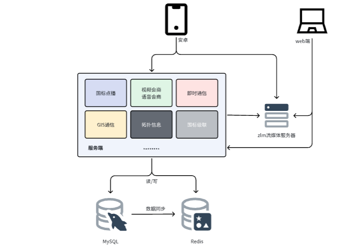


# 二、国标点播业务

**入口**：首页视频点播点击带有视频的设备

**备注**：GB国标可以作为视频设备单独存在，也可以绑定在单兵设备上

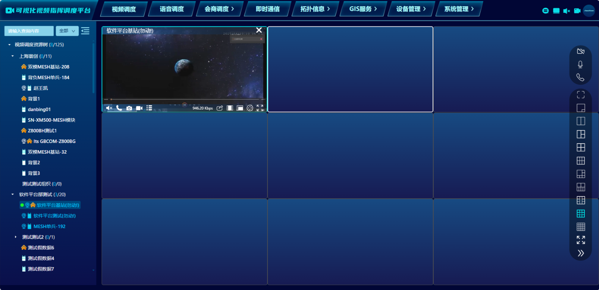

# 三、流程图

## 1.前端(web)向后端发起请求

`<a-tree>` 是 Ant Design Vue 提供的树形组件，也是本项目所使用的，绑定了点击事件`@select="onClickDevice"`

`src/layout/sider-tree/index.vue`

```typescript
<template>
    <div id="treeDiv"  class="tree" style="margin-left: 4px;">
        <a-spin class="loading" :spinning="spinning" style="height:100vh;position: relative; left: 40%;margin-top: 20px;" />
        <a-tree class="m-tree" v-if="!showTree" :selectable="true" :tree-data="treeData" :replace-fields="replaceFields"
          :expandedKeys="expandedKeys" :selectedKeys="selectedKeys" :auto-expand-parent="autoExpandParent"
          @expand="onExpand" @select="onClickDevice" @rightClick="rightClick" :show-icon="true" :class="'treeClass'"
          color="rgba(255, 255, 255, 0.65)">
          .......
        </a-tree>
    </div>
</template>
```

`@select="onClickDevice"`方法主要写在了`script`中的一个函数

`src/layout/sider-tree/index.vue`

```typescript
<script>
    .....
    const onClickDevice = (item, e) => {
      storage.remove('device')
      selectedKeys.value = []
      let routerUrl :any = router.currentRoute.value.name
      state.routerUrl = router.currentRoute.value.path
      if (e.selected) {
        expandedKeys.value.push(item[0])
        findTreeNode(item[0])
        expandedKeys.value = expandedKeys.value.filter((item, i, self) => item && self.indexOf(item) === i);
        autoExpandParent.value = false;
        const selectedNode =  e.selectedNodes[0].props.dataRef
    
        if (selectedNode.level == 0 || (selectedNode.isFromPlatformCatalog && selectedNode.children.length > 0)) return
        if (state.userName != 'admin' && (selectedNode.parentId == '9' || selectedNode.id == '9')) {
          //只有用户admin 账号才能查看未分配数据
          message.warn('未分配设备不允许查看')
          return;
        }
    
        if (selectedNode.isDevice == '0') {
          if (routerUrl == "/wvp/device") {
            bus.emit('sendData', { selectedNodes: selectedNode })
          } else if (selectedNode.type == 'mesh' && ['/gis/leaflet','/gis/amap','/topo/router','/topo/neighbor','/wvp/meshDevice/config','/wvp/meshDevice/upgrade'].includes(routerUrl)) {
            meshDevId = selectedNode.idv
            const leafDevice: any = findLeafDevice(meshDevId, [])[0]
            selectedKeys.value = []
            selectedKeys.value.push(leafDevice.idv)
            lastSelect = leafDevice
            storage.set('selectData', leafDevice, 60 * 60 * 1000)
            bus.emit('sendData', { selectedNodes: leafDevice, device: meshDevId });
            currentSelectedNodes(lastSelect);
            return;
          }
        } else {
          lastSelect = selectedNode
          selectedKeys.value.push(lastSelect.dataId)
          currentSelectedNodes(lastSelect);
          handleClick(lastSelect,e,routerUrl)
        }
      } else {
        if (lastSelect != null) {
          handleClick(lastSelect,e,routerUrl)
        }
      }
    }
    .....
</script>
```

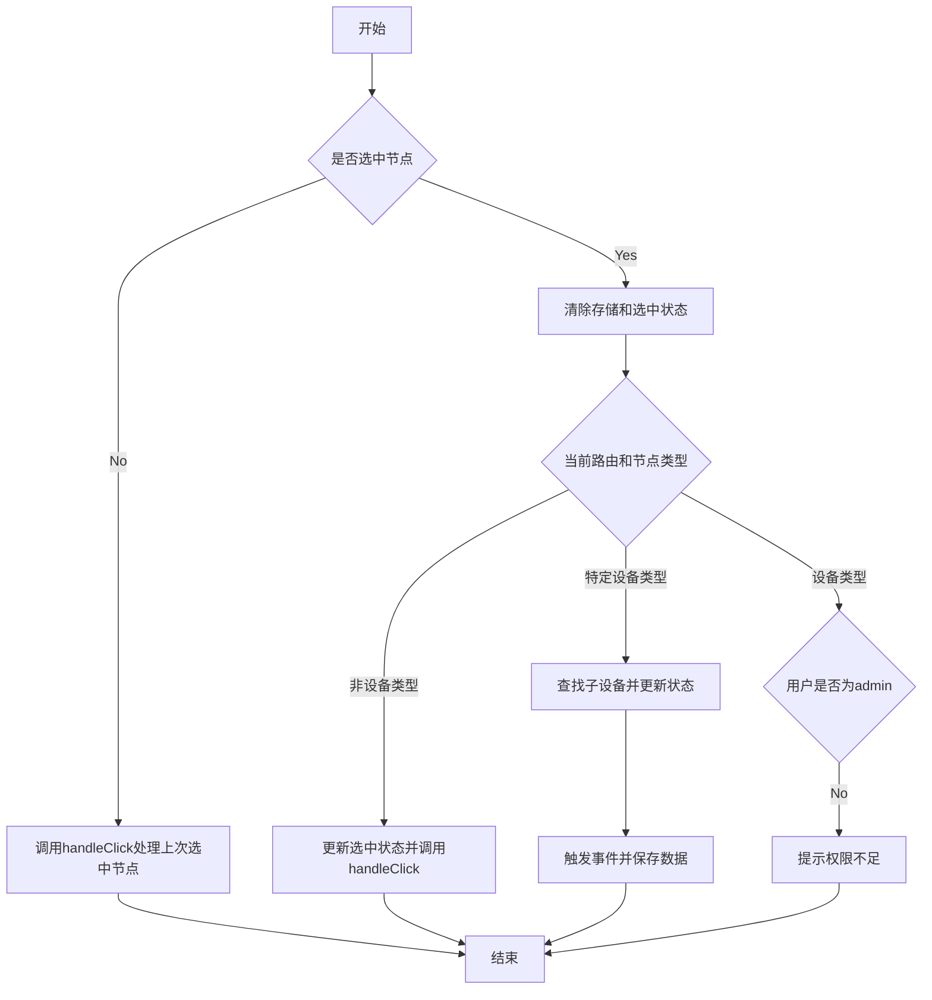


根据流程，如果顺利在首页（路由是/wvp/live），并且节点是一个设备，最终调用`handleClick`方法

`src/layout/sider-tree/index.vue`

```ts
const handleClick =(device,e,routerUrl)=>{
  switch (device.type){
    case 'mesh':
      handleClickForMesh(device,routerUrl)
      break;
    case 'GB':
      handleClickForOther(device,routerUrl)
      break;
    case 'web':
      handleClickForWeb(device,routerUrl,e)
      break;
    case 'meshT':
      handleClickForOther(device,routerUrl)
      break;
    case 'android':
      handleClickForOther(device,routerUrl)
      break;
    case 'narrowband':
      handleClickForNarrowband(device,routerUrl)
      break;
    default:
      break;
  }

}
```

继续调用`handleClickForOther `方法

```ts
// 处理meshT/GB/android的点击事件
const handleClickForOther =(device,routerUrl)=>{
  if(['/wvp/live','/gis/leaflet','/gis/amap'].includes(routerUrl)){
    bus.emit('clickTree', device)
  }else if(routerUrl == '/wvp/device' || routerUrl == '/wvp/record'){//设备列表&录像页面
    bus.emit('sendData', {selectedNodes: device})
  }else {
    message.warn('不支持此设备')
    bus.emit('noSupport')
  }
}
```

最终调用`clickTree`方法，其中，bus.emit 是一种基于事件总线（Event Bus）的通信方式，通常用于在 Vue 组件之间进行解耦通信。它允许组件通过事件名称触发事件，并传递相关数据。关于bus.emit 的写法：在代码中，bus.emit('clickTree', device) 的含义是：事件名称：'clickTree' 是事件的标识符。参数：device 是传递给订阅者的数据。具体实现上，bus 通常是一个全局事件总线对象，基于 Vue 实例创建，本项目中为`src/lib/eventbus/bus.ts`

目前有六个地方对该事件进行了监听

```ts
//src/views/auth/system/audio/index.vue
//src/views/auth/system/live/index.vue
//src/views/auth/system/onlineMap/index.vue
//src/views/auth/system/leafletMap/index.vue
//src/components/a-offline-map/a-offline-map.vue
//src/components/a-android-off-map/a-android-off-map.vue
<script>
    ...
    bus.on('clickTree', clickTree);
    onUnmounted(()=>{
        bus.off('clickTree',clickTree)
    })
    ...
</script>
```

```ts

//audio
const clickTree=(item)=>{
  console.log(123)
  //根据item.id 和 isNarrowband  找到对应的设备组 并显示选择状态
  let index = 0
  if(item.isNarrowband){
    index = deviceGroups.value.findIndex(group => group.deviceId === item.parentId)
  }else{
    index = deviceGroups.value.findIndex(group => group.deviceId === item.id)
  }
  //拿到下标
  selectCard(index)
}

//live
//点击事件
const clickTree =(item)=>{
  debugger
  if(clickTreeItem && clickTreeItem==item){
    return;
  }
  clickTreeItem=item
  //互拆操作
  for (let j = 0; j <state.itemObject.length ; j++) {
    if(state.itemObject[j] && item.idv == state.itemObject[j].idv){
      playerIdx.value=j
      selectDiv(j+1)
      message.warn('该资源正在播放!');
      clickTreeItem=null
      return
    }
    //判断当前选择中的框是否在播放，再播放就自动选下一个空的格子
    if(!isBlank(state.itemObject[playerIdx.value])){
      const indexLists = getEmptyIndex(state.itemObject)
      if(indexLists.length!=0){
        playerIdx.value = indexLists[0]
      }
    }
  }
  if(item.type && (item.type == 'web' || item.type == 'mesh')){
    clickTreeItem=null
    return;
  }
  playVideo(item,playerIdx.value)
}

//onlineMap
//点击事件
const clickTree =(item)=>{
  debugger
  if(Date.now() - lastClickTreeTime < 1680
      //clickTreeItem && clickTreeItem==item
  ){
    return;
  }
  lastClickTreeTime = Date.now();
  clickTreeItem=item
  //根据点击的类型判断
  if(item.type=='android'){
    initAndroidMemberLnglatDataMap()
    const androidMemberLnglatData = androidMemberLnglatDataMap.get(item.id);
    if(androidMemberLnglatData == null) {
      message.info("暂无此设备近期定位信息")
    }else{
      selectDevice(androidMemberLnglatData.longitudeLatitude,androidMemberLnglatData.member.id,androidMemberLnglatData.member.online)
    }
  }else if(item.type=='narrowband'){
    debugger
    const element: any = getMeshNarrowbandDevice(item.id,item.type)
    if(isBlank(element.longitudeLatitude)) {
      message.info("暂无此设备近期定位信息")
    }else{
      selectDevice(element.longitudeLatitude,element.meshNarrowband.deviceId,element.meshNarrowband.onLine)
    }
  }else{
    message.info("暂无此设备近期定位信息")
  }


  //互拆操作
  //playVideo(item,playerIdx.value)
}

//leafletMap
const clickTree =(item)=> {
  debugger
  if (Date.now() - lastClickTreeTime < 1680
      //clickTreeItem && clickTreeItem==item
  ) {
    return;
  }
  lastClickTreeTime = Date.now();
  clickTreeItem = item
  if (item.type == "android") {
    const androidMemberLnglatData = androidMemberLnglatDataMap.get(item.id);
    if (androidMemberLnglatData == null) {
      message.info("暂无此设备近期定位信息")
    } else {
      selectAndroidDevice(androidMemberLnglatData.longitudeLatitude, item.id)
    }
  }else if(item.type == "narrowband"){
    const element= narrowbandMemberLnglatDataMap.get(item.id)
    if(isBlank(element.longitudeLatitude)){
      message.info("暂无此设备近期定位信息")
    }else{
      selectAndroidDevice(element.longitudeLatitude, item.id)
    }
  }else{
    message.info("暂无此设备近期定位信息")
  }
  //互拆操作
  //playVideo(item,playerIdx.value)
}

//a-offline-map
const clickTree =(item)=>{
  if(Date.now() - lastClickTreeTime < 1680
      //clickTreeItem && clickTreeItem==item
  ){
    return;
  }
  lastClickTreeTime = Date.now();
  clickTreeItem=item
  const androidMemberLnglatData = androidMemberLnglatDataMap.get(item.id);
  if(androidMemberLnglatData == null) {
    message.info("暂无此设备近期定位信息")
  }else{
    selectAndroidDevice(androidMemberLnglatData.longitudeLatitude,item.id)
  }
  //互拆操作
  //playVideo(item,playerIdx.value)
}

//a-android-off-map
const clickTree =(item)=>{
  if(Date.now() - lastClickTreeTime < 1680
      //clickTreeItem && clickTreeItem==item
  ){
    return;
  }
  lastClickTreeTime = Date.now();
  clickTreeItem=item
  const androidMemberLnglatData = androidMemberLnglatDataMap.get(item.id);
  if(androidMemberLnglatData == null) {
    message.info("暂无此设备近期定位信息")
  }else{
    selectAndroidDevice(androidMemberLnglatData.longitudeLatitude,item.id)
  }
  //互拆操作
  //playVideo(item,playerIdx.value)
}
```

这六个 clickTree 方法都会执行，因为它们都通过 bus.on('clickTree', clickTree) 注册到了同一个事件 'clickTree' 上。这意味着当 'clickTree' 事件被触发时，所有注册的监听器（即这六个方法）都会被调用。

**Q & A 为什么这六个都会执行？**

```
事件总线机制：
bus.on 是一个典型的事件总线模式，允许多个监听器绑定到同一个事件。
当 bus.emit('clickTree', item) 被调用时，所有通过 bus.on('clickTree', ...) 注册的回调函数都会依次执行。

代码上下文：
每个文件中的 clickTree 方法逻辑不同，但它们都被设计为响应 'clickTree' 事件。
这些方法在各自的模块中处理不同的业务逻辑，例如播放视频、选择设备、显示地图位置等。

潜在问题：
如果多个 clickTree 方法同时执行，可能会导致性能问题或逻辑冲突。
某些场景下，可能只需要特定模块的 clickTree 执行，而不是全部。
```

因为我们是点播的流程，我们主要来看看这个播放视频的流程

`src/views/auth/system/live/index.vue`

```ts
//总线监听到，执行clickTree----------------------------------------------------------------
const clickTree =(item)=>{
  debugger
  if(clickTreeItem && clickTreeItem==item){
    return;
  }
  clickTreeItem=item
  //互拆操作
  for (let j = 0; j <state.itemObject.length ; j++) {
    if(state.itemObject[j] && item.idv == state.itemObject[j].idv){
      playerIdx.value=j
      selectDiv(j+1)
      message.warn('该资源正在播放!');
      clickTreeItem=null
      return
    }
    //判断当前选择中的框是否在播放，再播放就自动选下一个空的格子
    if(!isBlank(state.itemObject[playerIdx.value])){
      const indexLists = getEmptyIndex(state.itemObject)
      if(indexLists.length!=0){
        playerIdx.value = indexLists[0]
      }
    }
  }
  if(item.type && (item.type == 'web' || item.type == 'mesh')){
    clickTreeItem=null
    return;
  }
  playVideo(item,playerIdx.value)
}

//进一步执行playVideo方法----------------------------------------------------------------
const playVideo=(item,i)=>{
  if(!item.online){
    clickTreeItem = null
    message.error('设备离线!');
    return
  }
  selectDiv(i+1)
  //先关闭
  if(isNotBlank(state.jessibuca[i]) || state.itemObject[i]){
    destroy(i+1)
    setTimeout(()=>{
      if(isNotBlank(item.type)&& item.type == 'narrowband'){
        if(isCallNarrowband){
          message.warn("正在呼叫设备,线路占用。。")
          return
        }
        handlePlayVideoForNarrowband(item,i)
      }else{
        handlePlayVideo(item,i)
      }
    },618)
  }else {
    if(isNotBlank(item.type)&& item.type == 'narrowband'){
      if(isCallNarrowband){
        message.warn("正在呼叫设备,线路占用。。")
        return
      }
      handlePlayVideoForNarrowband(item,i)
    }else{
      handlePlayVideo(item,i)
    }
  }
}

//进一步执行handlePlayVideo ----------------------------------------------------------------
const handlePlayVideo =(item,i)=>{
  //显示加载图标
  showSpin.value[i] = "loading"
  //隐藏数字
  state.showNum[i] ="hide"
  //判断是否可以云台控制
  item.isControl?state.showPtx[i] = true:state.showPtx[i] = false
  //每次都是初始化一下云台显示隐藏
  state.showControl[i]= false

  //判断设备类型
  if(item.type && (item.type == 'android' || item.type == 'meshT')){
    if(item.mettingStatus || (item.playStatus && item.bePlayStatus)){
      message.info(item.mettingStatus?'设备正在会议中，请稍后':'设备正在通话中，请稍后')
      clickTreeItem = null
      showSpin.value[i] = ""
      refTree(false,i+1)
      videoUrl.value[i]=""
      state.title[i]=""
      state.itemObject[i]=""
      state.showNum[i]=""
      state.allOperation[i]=""
      return;
    }
    //android设备/meshT
    console.log("通知设备推流：" + item.id )
    state.itemObject[i]=item
    webrtcPlayVideo(storage.get(CURRENT_USER).id,item.id).then(res=>{
      clickTreeItem = null
      if(res.code==0){
        if(res.data.code==0){
          protocol = getProtocolStr()
          if(state.itemObject[i] != "") addDemand(storage.get(CURRENT_USER).id,item.id)
          // 添加主屏点播记录
          addScreenPlayCount(storage.get(CURRENT_USER).id,item.id)
          // 存储流信息
          state.streamInfo[i] ={app:res.data.data.streamInfos[0].app, stream:res.data.data.streamInfos[0].stream}
          if(protocol=='https:'){
            state.title[i] = item.name
            state.playUrl[i]=res.data.data.streamInfos[0].playUrls
            //判断是否已经被关闭 否则播放
            if(state.itemObject[i] != "") {
              play(res.data.data.streamInfos[0].playUrls,i+1)
              //过5秒检查设备是否处于点播中状态，若否就关闭它
              setTimeout(()=>{
                checkDevIsBePlayStatus(item.id,i)
              },5000)
            }
          }else{
            state.title[i] = item.name
            state.playUrl[i]=res.data.data.streamInfos[0].playUrl
            //判断是否已经被关闭 否则播放
            if(state.itemObject[i] != "") {
              play(res.data.data.streamInfos[0].playUrl,i+1)
              //过5秒检查设备是否处于点播中状态，若否就关闭它
              setTimeout(()=>{
                checkDevIsBePlayStatus(item.id,i)
              },5000)
            }
          }
        }else {
          if(res.data.code == 333){
            // message.info('点播已取消')
            return
          }
          if(isBlank(res.data.data.msg)){
            message.error(res.data.message)
          }else{
            message.error(res.data.data.msg)
          }
          refTree(false,i+1)
          destroy(i+1)
        }
      }else{
        message.error(res.msg)
        refTree(false,i+1)
        destroy(i+1)
      }
    }).catch(res=>{
      clickTreeItem = null
      message.error(res.msg)
      showSpin.value[i] = ""
      state.itemObject[i]=""
    })
  }else {
    //摄像头
    const deviceId = item.parentId
    const channelId = item.id
    console.log("通知设备推流1：" + deviceId + " : " + channelId )
    //新增一个点播是否是国标的设备标识 以及点播的用户id 仅在级联中的国标设备使用到
    const mdata = reactive({
      deviceId:deviceId,
      channelId:channelId,
      isSubStream:item.fromPlatformCatalog,
      userId:state.userId
    })
    state.itemObject[i]=item
    PlayVideo(mdata).then(res=>{
      clickTreeItem = null
      if(res.code==0){
        // 存储流信息
        state.streamInfo[i] ={app:res.data.app, stream:res.data.stream}
        // 添加流信息统计订阅
        addSubscribeStat(res.data.app,res.data.stream)
        protocol = getProtocolStr()
        if(protocol=='https:'){
          state.title[i] = item.name
          state.playUrl[i]=res.data.rtcs
          //create(i+1)
          play(res.data.rtcs,i+1)
        }else {
          state.title[i] = item.name
          state.playUrl[i]=res.data.rtc
          //create(i+1)
          play(res.data.rtc,i+1)
        }
      }else{
        message.error(res.msg)
        showSpin.value[i] = ""
        refTree(false,i+1)
        videoUrl.value[i]=""
        state.title[i]=""
        state.itemObject[i]=""
        state.showNum[i]=""
      }
    }).catch(res=>{
      clickTreeItem = null
      message.error(res.msg)
      showSpin.value[i] = ""
      state.itemObject[i]=""
    })
  }
}
```

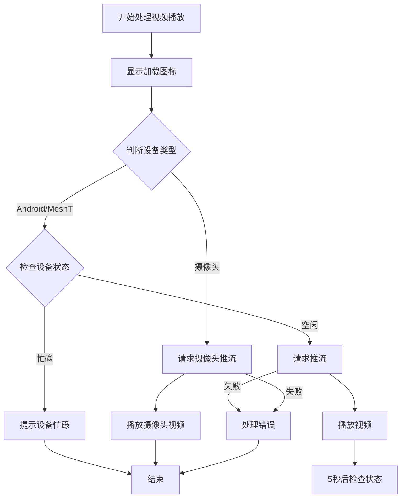


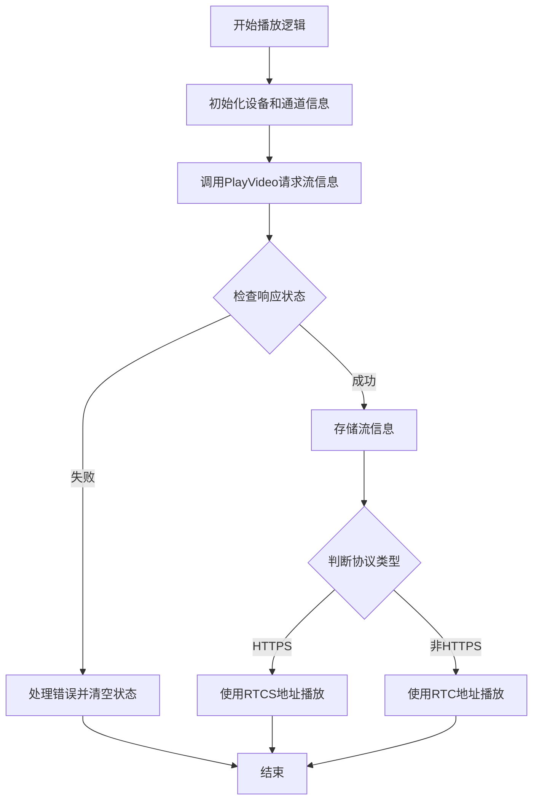

以下为后端的点播接口的前端定义的api,前端发送http 请求，携带设备ID 和通道ID

`src/api/system/playVideo/index.ts`

```ts
enum Api {
  playVideo = '/api/play/start',
  playVideoStop = '/api/play/stop',
  playVideoStopRea = '/api/play/stopRea',
  getMediaInfo ='/wvp/play/getStreamInfo'
}

export function PlayVideo(params) {
  return http.request({
    url: [Api.playVideo,params.deviceId,params.channelId].join('/')+ "?isSubStream=" + params.isSubStream+ "&userId=" + params.userId,
    method: RequestEnum.GET,
  }, {
    isShowErrorMessage: true
  });
}
```

**附前端抓包请求：**

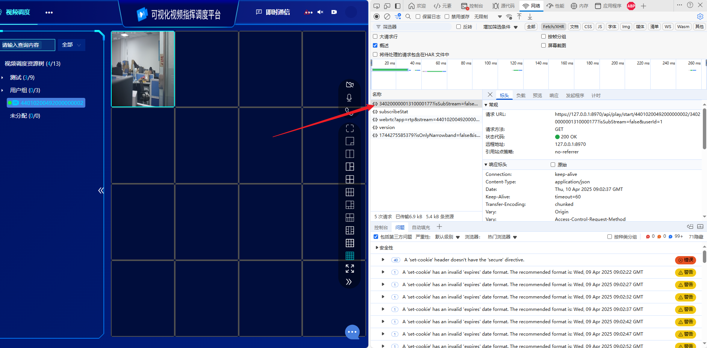

```url
https://127.0.0.1:8970/api/play/start/44010200492000000002/34020000001310000177?isSubStream=false&userId=1
```

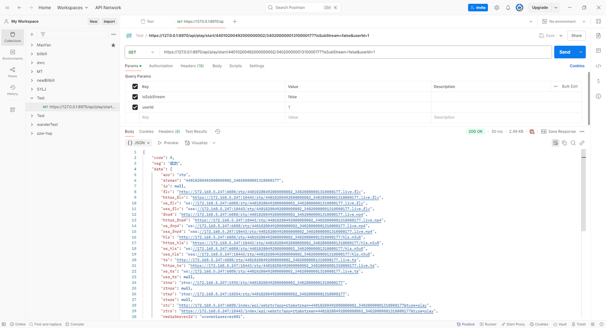

```json
{
    "code": 0,
    "msg": "成功",
    "data": {
        "app": "rtp",
        "stream": "44010200492000000002_34020000001310000177",
        "ip": null,
        "flv": "http://172.168.5.247:6080/rtp/44010200492000000002_34020000001310000177.live.flv",
        "https_flv": "https://172.168.5.247:10443/rtp/44010200492000000002_34020000001310000177.live.flv",
        "ws_flv": "ws://172.168.5.247:6080/rtp/44010200492000000002_34020000001310000177.live.flv",
        "wss_flv": "wss://172.168.5.247:10443/rtp/44010200492000000002_34020000001310000177.live.flv",
        "fmp4": "http://172.168.5.247:6080/rtp/44010200492000000002_34020000001310000177.live.mp4",
        "https_fmp4": "https://172.168.5.247:10443/rtp/44010200492000000002_34020000001310000177.live.mp4",
        "ws_fmp4": "ws://172.168.5.247:6080/rtp/44010200492000000002_34020000001310000177.live.mp4",
        "wss_fmp4": "wss://172.168.5.247:10443/rtp/44010200492000000002_34020000001310000177.live.mp4",
        "hls": "http://172.168.5.247:6080/rtp/44010200492000000002_34020000001310000177/hls.m3u8",
        "https_hls": "https://172.168.5.247:10443/rtp/44010200492000000002_34020000001310000177/hls.m3u8",
        "ws_hls": "ws://172.168.5.247:6080/rtp/44010200492000000002_34020000001310000177/hls.m3u8",
        "wss_hls": "wss://172.168.5.247:10443/rtp/44010200492000000002_34020000001310000177/hls.m3u8",
        "ts": "http://172.168.5.247:6080/rtp/44010200492000000002_34020000001310000177.live.ts",
        "https_ts": "https://172.168.5.247:10443/rtp/44010200492000000002_34020000001310000177.live.ts",
        "ws_ts": "ws://172.168.5.247:6080/rtp/44010200492000000002_34020000001310000177.live.ts",
        "wss_ts": null,
        "rtmp": "rtmp://172.168.5.247:1935/rtp/44010200492000000002_34020000001310000177",
        "rtmps": null,
        "rtsp": "rtsp://172.168.5.247:10554/rtp/44010200492000000002_34020000001310000177",
        "rtsps": null,
        "rtc": "http://172.168.5.247:6080/index/api/webrtc?app=rtp&stream=44010200492000000002_34020000001310000177&type=play",
        "rtcs": "https://172.168.5.247:10443/index/api/webrtc?app=rtp&stream=44010200492000000002_34020000001310000177&type=play",
        "mediaServerId": "wvpmediaserver001",
        "tracks": [
            {
                "channels": 1,
                "codecId": 0,
                "codecIdName": null,
                "codecType": 0,
                "ready": true,
                "sampleBit": 0,
                "sampleRate": 0,
                "fps": 0,
                "height": 0,
                "width": 0
            },
            {
                "channels": 0,
                "codecId": 0,
                "codecIdName": null,
                "codecType": 0,
                "ready": true,
                "sampleBit": 0,
                "sampleRate": 0,
                "fps": 0,
                "height": 1080,
                "width": 1920
            }
        ],
        "startTime": null,
        "endTime": null,
        "progress": 0.0
    }
}
```

## 2.后端(SIP信令服务器)：处理请求

### (1)  首先，`添加通信记录`,底层会从JWT查询User(`gb_user`)和设备Device(`wvp_device`)信息，然后添加到通信记录表中`sys_communication_record`

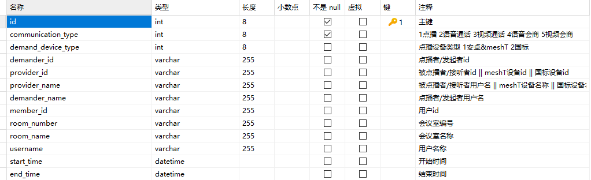

`src/main/java/com/gbcom/wvp/vmp/vmanager/gb28181/play/PlayController.java`

```java
@Operation(summary = "开始点播")
@Parameter(name = "deviceId", description = "设备国标编号", required = true)
@Parameter(name = "channelId", description = "通道国标编号", required = true)
@GetMapping("/start/{deviceId}/{channelId}")
public DeferredResult<WVPResult<StreamContent>> play(HttpServletRequest request, @PathVariable String deviceId,
                                         @PathVariable String channelId,Boolean isSubStream,String userId) {

    logger.info("[开始点播] deviceId：{}, channelId：{}, ", deviceId, channelId);

    // 添加通信记录
    sysCommunicationRecordService.insertSysCommunicationRecord(request,deviceId);
    ...
}
```

### (2)  其次，获取一个zlm多媒体服务器.`src/main/java/com/gbcom/wvp/vmp/vmanager/gb28181/play/PlayController.java`

```java
Device device = storager.queryVideoDevice(deviceId);
MediaServerItem newMediaServerItem = playService.getNewMediaServerItem(device);
```

其中的底层调用如下，其中借助了redis中的有序列表,该zset存储了所有的媒体服务器id，zset中按照分值从小到大，排序了所有的节点，会去取最小的节点，之后再从redis获取这个id的媒体服务器zlm的信息

`src/main/java/com/gbcom/wvp/vmp/service/impl/MediaServerServiceImpl.java`

```java
/**
 * 获取负载最低的节点
 * @return MediaServerItem
 */
@Override
public MediaServerItem getMediaServerForMinimumLoad(Boolean hasAssist) {
    String key = VideoManagerConstants.MEDIA_SERVERS_ONLINE_PREFIX + userSetting.getServerId();
    Long size = redisTemplate.opsForZSet().zCard(key);
    if (size  == null || size == 0) {
        logger.info("获取负载最低的节点时无在线节点");
        return null;
    }

    // 获取分数最低的，及并发最低的
    Set<Object> objects = redisTemplate.opsForZSet().range(key, 0, -1);
    ArrayList<Object> mediaServerObjectS = new ArrayList<>(objects);
    MediaServerItem mediaServerItem = null;
    if (hasAssist == null) {
        String mediaServerId = (String)mediaServerObjectS.get(0);
        mediaServerItem = getOne(mediaServerId);
    }else if (hasAssist) {
        for (Object mediaServerObject : mediaServerObjectS) {
            String mediaServerId = (String)mediaServerObject;
            MediaServerItem serverItem = getOne(mediaServerId);
            if (serverItem.getRecordAssistPort() > 0) {
                mediaServerItem = serverItem;
                break;
            }
        }
    }else if (!hasAssist) {
        for (Object mediaServerObject : mediaServerObjectS) {
            String mediaServerId = (String)mediaServerObject;
            MediaServerItem serverItem = getOne(mediaServerId);
            if (serverItem.getRecordAssistPort() == 0) {
                mediaServerItem = serverItem;
                break;
            }
        }
    }

    return mediaServerItem;
}
```

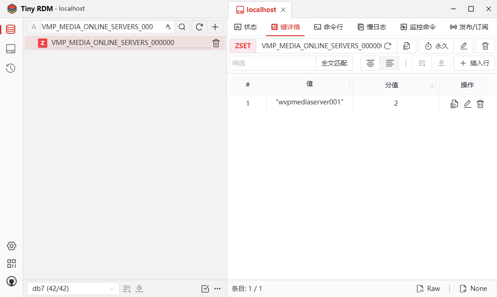

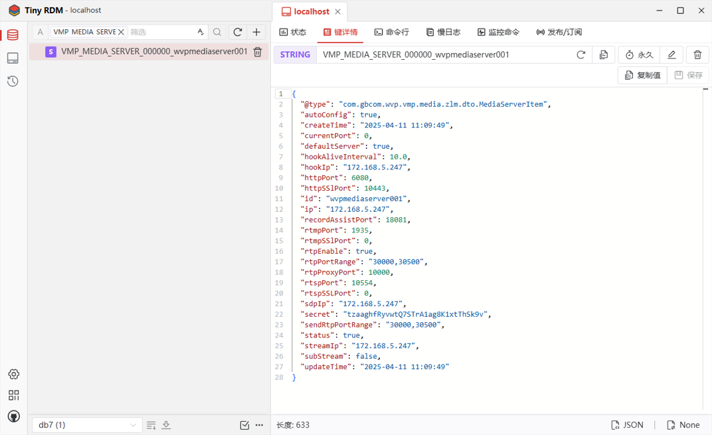

### (3) 紧接着，设置好超时的函数和未超时的处理函数，调用`playService.play()`

`src/main/java/com/gbcom/wvp/vmp/vmanager/gb28181/play/PlayController.java`

```java
RequestMessage requestMessage = new RequestMessage()
String key = DeferredResultHolder.CALLBACK_CMD_PLAY + deviceId + channelId;
requestMessage.setKey(key);
String uuid = UUID.randomUUID().toString();
requestMessage.setId(uuid);
DeferredResult<WVPResult<StreamContent>> result = new DeferredResult<>(userSetting.getPlayTimeout().longValue());

result.onTimeout(()->{
    logger.info("[点播等待超时] deviceId：{}, channelId：{}, ", deviceId, channelId);
    // 释放rtpserver
    WVPResult<StreamInfo> wvpResult = new WVPResult<>();
    wvpResult.setCode(ErrorCode.ERROR100.getCode());
    wvpResult.setMsg("点播超时");
    requestMessage.setData(wvpResult);
    resultHolder.invokeAllResult(requestMessage);
    inviteStreamService.removeInviteInfoByDeviceAndChannel(InviteSessionType.PLAY, deviceId, channelId);
    storager.stopPlay(deviceId, channelId);
});

// 录像查询以channelId作为deviceId查询
resultHolder.put(key, uuid, result);

playService.play(newMediaServerItem, deviceId, channelId, null, (code, msg, data) -> {
    WVPResult<StreamContent> wvpResult = new WVPResult<>();
    if (code == InviteErrorCode.SUCCESS.getCode()) {
       wvpResult.setCode(ErrorCode.SUCCESS.getCode());
       wvpResult.setMsg(ErrorCode.SUCCESS.getMsg());

       if (data != null) {
          StreamInfo streamInfo = (StreamInfo)data;
          if (userSetting.getUseSourceIpAsStreamIp()) {
             streamInfo=streamInfo.clone();//深拷贝
             String host;
             try {
                URL url=new URL(request.getRequestURL().toString());
                host=url.getHost();
             } catch (MalformedURLException e) {
                host=request.getLocalAddr();
             }
             streamInfo.channgeStreamIp(host);
          }
          wvpResult.setData(new StreamContent(streamInfo));
       }
    }else {
       wvpResult.setCode(code);
       wvpResult.setMsg(msg);
    }
    requestMessage.setData(wvpResult);
    resultHolder.invokeResult(requestMessage);
});
return result;
```

### (4)  进一步调用底层的`src/main/java/com/gbcom/wvp/vmp/service/impl/PlayServiceImpl.java`中的play方法，开启openRTPServer ，拿到SSRCInfo

`ssrc` 是 "Synchronization Source Identifier" 的缩写，通常用于 RTP（实时传输协议）中标识数据流的来源。在视频流媒体场景中，`ssrc` 是一个唯一的数值，用于区分不同的音视频流。

`src/main/java/com/gbcom/wvp/vmp/service/impl/PlayServiceImpl.java`

```java
@Override
    public SSRCInfo play(MediaServerItem mediaServerItem, String deviceId, String channelId, String ssrc, ErrorCallback<Object> callback) {
        if (mediaServerItem == null) {
            logger.warn("[点播] 未找到可用的zlm deviceId: {},channelId:{}", deviceId, channelId);
            throw new ControllerException(ErrorCode.ERROR100.getCode(), "未找到可用的zlm");
        }

        Device device = redisCatchStorage.getDevice(deviceId);
        if (device.getStreamMode().equalsIgnoreCase("TCP-ACTIVE") && !mediaServerItem.isRtpEnable()) {
            logger.warn("[点播] 单端口收流时不支持TCP主动方式收流 deviceId: {},channelId:{}", deviceId, channelId);
            throw new ControllerException(ErrorCode.ERROR100.getCode(), "单端口收流时不支持TCP主动方式收流");
        }
        InviteInfo inviteInfo = inviteStreamService.getInviteInfoByDeviceAndChannel(InviteSessionType.PLAY, deviceId, channelId);
        if (inviteInfo != null ) {
            if (inviteInfo.getStreamInfo() == null) {
                // 点播发起了但是尚未成功, 仅注册回调等待结果即可
                inviteStreamService.once(InviteSessionType.PLAY, deviceId, channelId, null, callback);
                logger.info("[点播开始] 已经请求中，等待结果， deviceId: {}, channelId: {}", device.getDeviceId(), channelId);
                return inviteInfo.getSsrcInfo();
            }else {
                StreamInfo streamInfo = inviteInfo.getStreamInfo();
                String streamId = streamInfo.getStream();
                if (streamId == null) {
                    callback.run(InviteErrorCode.ERROR_FOR_CATCH_DATA.getCode(), "点播失败， redis缓存streamId等于null", null);
                    inviteStreamService.call(InviteSessionType.PLAY, device.getDeviceId(), channelId, null,
                            InviteErrorCode.ERROR_FOR_CATCH_DATA.getCode(),
                            "点播失败， redis缓存streamId等于null",
                            null);
                    return inviteInfo.getSsrcInfo();
                }
                String mediaServerId = streamInfo.getMediaServerId();
                MediaServerItem mediaInfo = mediaServerService.getOne(mediaServerId);

                Boolean ready = zlmServerFactory.isStreamReady(mediaInfo, "rtp", streamId);
                if (ready != null && ready) {
                    callback.run(InviteErrorCode.SUCCESS.getCode(), InviteErrorCode.SUCCESS.getMsg(), streamInfo);
                    inviteStreamService.call(InviteSessionType.PLAY, device.getDeviceId(), channelId, null,
                            InviteErrorCode.SUCCESS.getCode(),
                            InviteErrorCode.SUCCESS.getMsg(),
                            streamInfo);
                    logger.info("[点播已存在] 直接返回， deviceId: {}, channelId: {}", device.getDeviceId(), channelId);
                    //在返回的时候需要通知一下下级存一下userId
                    //这个也不需要
//                    if(mediaServerItem.isSubStream()){
//                        //只针对级联用户
//                        //新增通知上级平台刷新
//                        //再根据channelId 判断是正经国标级联还是直播流级联 但是按照我们的规则取34010000004560000003  456代表我们自定义的
//                        //截取34010000004560000003的456
//                        String substring = channelId.substring(10, 13);
//                        if("456".equals(substring)) {
//                            logger.info("若发现下级平台存在点播者 自研设备点播通知下级记录点播者通知");
//                            platformChannelService.sendPlayUserIdToPlatform(mediaServerItem.getUserId(), deviceId,channelId);
//                        }
//                    }
                    return inviteInfo.getSsrcInfo();
                }else {
                    // 点播发起了但是尚未成功, 仅注册回调等待结果即可
                    inviteStreamService.once(InviteSessionType.PLAY, deviceId, channelId, null, callback);
                    storager.stopPlay(streamInfo.getDeviceID(), streamInfo.getChannelId());
                    inviteStreamService.removeInviteInfoByDeviceAndChannel(InviteSessionType.PLAY, deviceId, channelId);
                }
            }
        }
        String streamId = String.format("%s_%s", device.getDeviceId(), channelId);;
        SSRCInfo ssrcInfo = mediaServerService.openRTPServer(mediaServerItem, streamId, ssrc, device.isSsrcCheck(),  false, 0, false, device.getStreamModeForParam());
        if (ssrcInfo == null) {
            callback.run(InviteErrorCode.ERROR_FOR_RESOURCE_EXHAUSTION.getCode(), InviteErrorCode.ERROR_FOR_RESOURCE_EXHAUSTION.getMsg(), null);
            inviteStreamService.call(InviteSessionType.PLAY, device.getDeviceId(), channelId, null,
                    InviteErrorCode.ERROR_FOR_RESOURCE_EXHAUSTION.getCode(),
                    InviteErrorCode.ERROR_FOR_RESOURCE_EXHAUSTION.getMsg(),
                    null);
            return null;
        }
        play(mediaServerItem, ssrcInfo, device, channelId, callback);
        return ssrcInfo;
    }
```

`src/main/java/com/gbcom/wvp/vmp/service/impl/MediaServerServiceImpl.java`中的`openRTPServer`方法如下

`src/main/java/com/gbcom/wvp/vmp/service/impl/MediaServerServiceImpl.java`

```java
@Override
public SSRCInfo openRTPServer(MediaServerItem mediaServerItem, String streamId, String presetSsrc, boolean ssrcCheck,
                              boolean isPlayback, Integer port, Boolean reUsePort, Integer tcpMode) {
    if (mediaServerItem == null || mediaServerItem.getId() == null) {
        logger.info("[openRTPServer] 失败, mediaServerItem == null || mediaServerItem.getId() == null");
        return null;
    }
    // 获取mediaServer可用的ssrc
    String ssrc;
    if (presetSsrc != null) {
        ssrc = presetSsrc;
    }else {
        if (isPlayback) {
            ssrc = ssrcFactory.getPlayBackSsrc(mediaServerItem.getId());
        }else {
            ssrc = ssrcFactory.getPlaySsrc(mediaServerItem.getId());
        }
    }

    if (streamId == null) {
        streamId = String.format("%08x", Long.parseLong(ssrc)).toUpperCase();
    }
    int ssrcCheckParam = 0;
    if (ssrcCheck && tcpMode > 1) {
        // 目前zlm不支持 tcp模式更新ssrc，暂时关闭ssrc校验
        logger.warn("[openRTPServer] TCP被动/TCP主动收流时，默认关闭ssrc检验");
    }
    int rtpServerPort;
    if (mediaServerItem.isRtpEnable()) {
        rtpServerPort = zlmServerFactory.createRTPServer(mediaServerItem, streamId, (ssrcCheck && tcpMode == 0) ? Long.parseLong(ssrc) : 0, port, reUsePort, tcpMode);
    } else {
        rtpServerPort = mediaServerItem.getRtpProxyPort();
    }
    return new SSRCInfo(rtpServerPort, ssrc, streamId);
}
```

其中核心代码如下：

`src/main/java/com/gbcom/wvp/vmp/service/impl/MediaServerServiceImpl.java`

```java
rtpServerPort = zlmServerFactory.createRTPServer(mediaServerItem, streamId, (ssrcCheck && tcpMode == 0) ? Long.parseLong(ssrc) : 0, port, reUsePort, tcpMode);
```

`src/main/java/com/gbcom/wvp/vmp/media/zlm/ZLMServerFactory.java`

```java
/**
 * 开启rtpServer
 * @param mediaServerItem zlm服务实例
 * @param streamId 流Id
 * @param ssrc ssrc
 * @param port 端口， 0/null为使用随机
 * @param reUsePort 是否重用端口
 * @param tcpMode 0/null udp 模式，1 tcp 被动模式, 2 tcp 主动模式。
 * @return
 */
public int createRTPServer(MediaServerItem mediaServerItem, String streamId, long ssrc, Integer port, Boolean reUsePort, Integer tcpMode) {
    int result = -1;
    // 查询此rtp server 是否已经存在
    JSONObject rtpInfo = zlmresTfulUtils.getRtpInfo(mediaServerItem, streamId);
    logger.info(JSONObject.toJSONString(rtpInfo));
    
    ...
}
```

`src/main/java/com/gbcom/wvp/vmp/media/zlm/ZLMRESTfulUtils.java`

```java
public JSONObject getRtpInfo(MediaServerItem mediaServerItem, String stream_id){
    Map<String, Object> param = new HashMap<>();
    param.put("stream_id",stream_id);
    return sendPost(mediaServerItem, "getRtpInfo",param, null);
}
```

这里主要是通过sendPost向zlm流媒体服务器发一个请求，看看能否正常链接zlm流媒体服务器

`src/main/java/com/gbcom/wvp/vmp/media/zlm/ZLMRESTfulUtils.java`

```java
public JSONObject sendPost(MediaServerItem mediaServerItem, String api, Map<String, Object> param, RequestCallback callback) {
    OkHttpClient client = getClient();

    if (mediaServerItem == null) {
        return null;
    }
    String url = String.format("http://%s:%s/index/api/%s",  mediaServerItem.getIp(), mediaServerItem.getHttpPort(), api);
    logger.info("访问ZLM接口: " + url);
    JSONObject responseJSON = new JSONObject();
    //-2自定义流媒体 调用错误码
    responseJSON.put("code",-2);
    responseJSON.put("msg","流媒体调用失败");

    FormBody.Builder builder = new FormBody.Builder();
    builder.add("secret",mediaServerItem.getSecret());
    if (param != null && param.keySet().size() > 0) {
        for (String key : param.keySet()){
            if (param.get(key) != null) {
                builder.add(key, param.get(key).toString());
            }
        }
    }

    FormBody body = builder.build();

    Request request = new Request.Builder()
            .post(body)
            .url(url)
            .build();
        if (callback == null) {
            try {
                Response response = client.newCall(request).execute();
                if (response.isSuccessful()) {
                    ResponseBody responseBody = response.body();
                    if (responseBody != null) {
                        String responseStr = responseBody.string();
                        responseJSON = JSON.parseObject(responseStr);
                    }
                }else {
                    response.close();
                    Objects.requireNonNull(response.body()).close();
                }
            }catch (IOException e) {
                logger.error(String.format("[ %s ]请求失败: %s", url, e.getMessage()));

                if(e instanceof SocketTimeoutException){
                    //读取超时超时异常
                    logger.error(String.format("读取ZLM数据失败: %s, %s", url, e.getMessage()));
                }
                if(e instanceof ConnectException){
                    //判断连接异常，我这里是报Failed to connect to 10.7.5.144
                    logger.error(String.format("连接ZLM失败: %s, %s", url, e.getMessage()));
                }

            }catch (Exception e){
                logger.error(String.format("访问ZLM失败: %s, %s", url, e.getMessage()));
            }
        }else {
            client.newCall(request).enqueue(new Callback(){
                @Override
                public void onResponse(@NotNull Call call, @NotNull Response response){
                    if (response.isSuccessful()) {
                        try {
                            String responseStr = Objects.requireNonNull(response.body()).string();
                            callback.run(JSON.parseObject(responseStr));
                        } catch (IOException e) {
                            logger.error(String.format("[ %s ]请求失败: %s", url, e.getMessage()));
                        }

                    }else {
                        response.close();
                        Objects.requireNonNull(response.body()).close();
                    }
                }
                @Override
                public void onFailure(@NotNull Call call, @NotNull IOException e) {
                    logger.error(String.format("连接ZLM失败: %s, %s", call.request().toString(), e.getMessage()));

                    if(e instanceof SocketTimeoutException){
                        //读取超时超时异常
                        logger.error(String.format("读取ZLM数据失败: %s, %s", call.request().toString(), e.getMessage()));
                    }
                    if(e instanceof ConnectException){
                        //判断连接异常，我这里是报Failed to connect to 10.7.5.144
                        logger.error(String.format("连接ZLM失败: %s, %s", call.request().toString(), e.getMessage()));
                    }
                }
            });
        }

    if(Objects.equals(responseJSON.getString("msg"),"流媒体调用失败")){
        logger.error("sendPost返回错误信息："+responseJSON+",api为===>"+api);
    }
    return responseJSON;
}
```

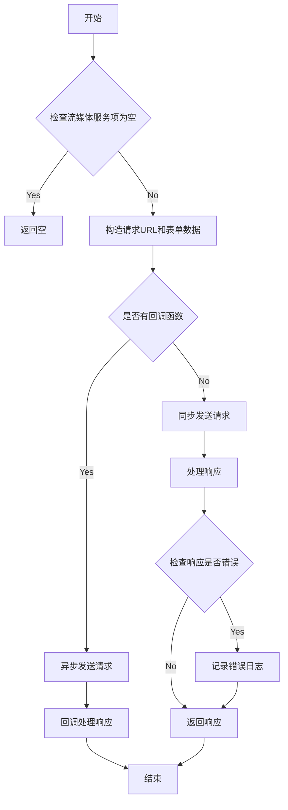

### (5) 再回到`src/main/java/com/gbcom/wvp/vmp/media/zlm/ZLMServerFactory.java`,这个时候已经确认了`rtp server`是存在并且是可以正常调用的了，紧接着就去执行调用这个RTP服务器建立连接的逻辑，底层也是调用`sendPost`这个方法，过程中如果出现异常，就报错，或者重启RtpSever

`src/main/java/com/gbcom/wvp/vmp/media/zlm/ZLMServerFactory.java`

```java
/**
 * 开启rtpServer
 * @param mediaServerItem zlm服务实例
 * @param streamId 流Id
 * @param ssrc ssrc
 * @param port 端口， 0/null为使用随机
 * @param reUsePort 是否重用端口
 * @param tcpMode 0/null udp 模式，1 tcp 被动模式, 2 tcp 主动模式。
 * @return
 */
public int createRTPServer(MediaServerItem mediaServerItem, String streamId, long ssrc, Integer port, Boolean reUsePort, Integer tcpMode) {
    int result = -1;
    // 查询此rtp server 是否已经存在
    JSONObject rtpInfo = zlmresTfulUtils.getRtpInfo(mediaServerItem, streamId);
    logger.info(JSONObject.toJSONString(rtpInfo));
    if(rtpInfo.getInteger("code") == 0){
        if (rtpInfo.getBoolean("exist")) {
            result = rtpInfo.getInteger("local_port");
            if (result == 0) {
                // 此时说明rtpServer已经创建但是流还没有推上来
                // 此时重新打开rtpServer
                Map<String, Object> param = new HashMap<>();
                param.put("stream_id", streamId);
                JSONObject jsonObject = zlmresTfulUtils.closeRtpServer(mediaServerItem, param);
                if (jsonObject != null ) {
                    if (jsonObject.getInteger("code") == 0) {
                        return createRTPServer(mediaServerItem, streamId, ssrc, port, reUsePort, tcpMode);
                    }else {
                        logger.warn("[开启rtpServer], 重启RtpServer错误");
                    }
                }
            }
            return result;
        }
    }else if(rtpInfo.getInteger("code") == -2){
        return result;
    }

    Map<String, Object> param = new HashMap<>();

    if (tcpMode == null) {
        tcpMode = 0;
    }
    param.put("tcp_mode", tcpMode);
    param.put("stream_id", streamId);
    if (reUsePort != null) {
        param.put("re_use_port", reUsePort?"1":"0");
    }
    // 推流端口设置0则使用随机端口
    if (port == null) {
        param.put("port", 0);
    }else {
        param.put("port", port);
    }
    if (ssrc != 0) {
        param.put("ssrc", ssrc);
    }

    JSONObject openRtpServerResultJson = zlmresTfulUtils.openRtpServer(mediaServerItem, param);
    logger.info("创建RTP Server 参数：{}", JSON.toJSONString(openRtpServerResultJson));
    if (openRtpServerResultJson != null) {
        if (openRtpServerResultJson.getInteger("code") == 0) {
            result= openRtpServerResultJson.getInteger("port");
        }else {
            logger.error("创建RTP Server 失败 {}: ", openRtpServerResultJson.getString("msg"));
        }
    }else {
        //  检查ZLM状态
        logger.error("创建RTP Server 失败 {}: 请检查ZLM服务", param.get("port"));
    }
    return result;
}
```

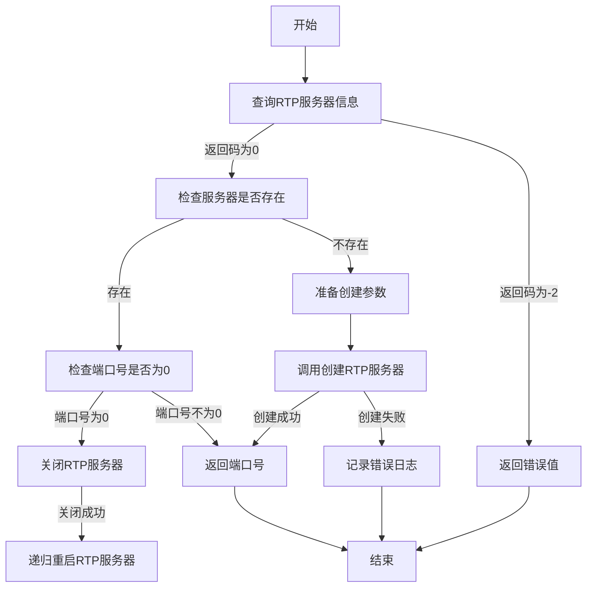


### (6)  再回到`src/main/java/com/gbcom/wvp/vmp/service/impl/PlayServiceImpl.java`

`src/main/java/com/gbcom/wvp/vmp/service/impl/PlayServiceImpl.java`

```
play(mediaServerItem, ssrcInfo, device, channelId, callback);
```

再调用同文件中的play方法，其中核心是`cmder.playStreamCmd`这个方法，里面

`src/main/java/com/gbcom/wvp/vmp/service/impl/PlayServiceImpl.java`

```java
@Override
public void play(MediaServerItem mediaServerItem, SSRCInfo ssrcInfo, Device device, String channelId,
                 ErrorCallback<Object> callback) {

    if (mediaServerItem == null || ssrcInfo == null) {
        callback.run(InviteErrorCode.ERROR_FOR_PARAMETER_ERROR.getCode(),
                InviteErrorCode.ERROR_FOR_PARAMETER_ERROR.getMsg(),
                null);
        return;
    }
    logger.info("[点播开始] deviceId: {}, channelId: {},码流类型：{}, 收流端口： {}, STREAM：{}, 收流模式：{}, SSRC: {}, SSRC校验：{}",
            device.getDeviceId(), channelId, device.isSwitchPrimarySubStream() ? "辅码流" : "主码流", ssrcInfo.getPort(), ssrcInfo.getStream(),
            device.getStreamMode(), ssrcInfo.getSsrc(), device.isSsrcCheck());
    //端口获取失败的ssrcInfo 没有必要发送点播指令
    if (ssrcInfo.getPort() <= 0) {
        logger.info("[点播端口分配异常]，deviceId={},channelId={},ssrcInfo={}", device.getDeviceId(), channelId, ssrcInfo);
        // 释放ssrc
        mediaServerService.releaseSsrc(mediaServerItem.getId(), ssrcInfo.getSsrc());
        streamSession.remove(device.getDeviceId(), channelId, ssrcInfo.getStream());

        callback.run(InviteErrorCode.ERROR_FOR_RESOURCE_EXHAUSTION.getCode(), "点播端口分配异常", null);
        inviteStreamService.call(InviteSessionType.PLAY, device.getDeviceId(), channelId, null,
                InviteErrorCode.ERROR_FOR_RESOURCE_EXHAUSTION.getCode(), "点播端口分配异常", null);
        return;
    }

    // 初始化redis中的invite消息状态
    InviteInfo inviteInfo = InviteInfo.getInviteInfo(device.getDeviceId(), channelId, ssrcInfo.getStream(), ssrcInfo,
            mediaServerItem.getSdpIp(), ssrcInfo.getPort(), device.getStreamMode(), InviteSessionType.PLAY,
            InviteSessionStatus.ready);
    inviteInfo.setSubStream(device.isSwitchPrimarySubStream());
    inviteStreamService.updateInviteInfo(inviteInfo);
    // 超时处理
    String timeOutTaskKey = UUID.randomUUID().toString();
    dynamicTask.startDelay(timeOutTaskKey, () -> {
        // 执行超时任务时查询是否已经成功，成功了则不执行超时任务，防止超时任务取消失败的情况
        InviteInfo inviteInfoForTimeOut = inviteStreamService.getInviteInfoByDeviceAndChannel(InviteSessionType.PLAY, device.getDeviceId(), channelId);
        if (inviteInfoForTimeOut == null || inviteInfoForTimeOut.getStreamInfo() == null) {
            logger.info("[点播超时] 收流超时 deviceId: {}, channelId: {},码流类型：{}，端口：{}, SSRC: {}",
                    device.getDeviceId(), channelId, device.isSwitchPrimarySubStream() ? "辅码流" : "主码流",
                    ssrcInfo.getPort(), ssrcInfo.getSsrc());

            callback.run(InviteErrorCode.ERROR_FOR_STREAM_TIMEOUT.getCode(), InviteErrorCode.ERROR_FOR_STREAM_TIMEOUT.getMsg(), null);
            inviteStreamService.call(InviteSessionType.PLAY, device.getDeviceId(), channelId, null,
                    InviteErrorCode.ERROR_FOR_STREAM_TIMEOUT.getCode(), InviteErrorCode.ERROR_FOR_STREAM_TIMEOUT.getMsg(), null);
            inviteStreamService.removeInviteInfoByDeviceAndChannel(InviteSessionType.PLAY, device.getDeviceId(), channelId);

            try {
                cmder.streamByeCmd(device, channelId, ssrcInfo.getStream(), null);
            } catch (InvalidArgumentException | ParseException | SipException | SsrcTransactionNotFoundException e) {
                logger.error("[点播超时]， 发送BYE失败 {}", e.getMessage());
            } finally {
                mediaServerService.releaseSsrc(mediaServerItem.getId(), ssrcInfo.getSsrc());
                mediaServerService.closeRTPServer(mediaServerItem, ssrcInfo.getStream());
                streamSession.remove(device.getDeviceId(), channelId, ssrcInfo.getStream());
                mediaServerService.closeRTPServer(mediaServerItem, ssrcInfo.getStream());
                // 取消订阅消息监听
                HookSubscribeForStreamChange hookSubscribe = HookSubscribeFactory.on_stream_changed("rtp", ssrcInfo.getStream(), true, "rtsp", mediaServerItem.getId());
                subscribe.removeSubscribe(hookSubscribe);
            }
        }
    }, userSetting.getPlayTimeout());

    try {
        cmder.playStreamCmd(mediaServerItem, ssrcInfo, device, channelId, (mediaServerItemInuse, hookParam ) -> {
            logger.info("收到订阅消息： " + hookParam);
            dynamicTask.stop(timeOutTaskKey);
            // hook响应
            StreamInfo streamInfo = onPublishHandlerForPlay(mediaServerItemInuse, hookParam, device.getDeviceId(), channelId);
            if (streamInfo == null){
                callback.run(InviteErrorCode.ERROR_FOR_STREAM_PARSING_EXCEPTIONS.getCode(),
                        InviteErrorCode.ERROR_FOR_STREAM_PARSING_EXCEPTIONS.getMsg(), null);
                inviteStreamService.call(InviteSessionType.PLAY, device.getDeviceId(), channelId, null,
                        InviteErrorCode.ERROR_FOR_STREAM_PARSING_EXCEPTIONS.getCode(),
                        InviteErrorCode.ERROR_FOR_STREAM_PARSING_EXCEPTIONS.getMsg(), null);
                return;
            }
            callback.run(InviteErrorCode.SUCCESS.getCode(), InviteErrorCode.SUCCESS.getMsg(), streamInfo);
            inviteStreamService.call(InviteSessionType.PLAY, device.getDeviceId(), channelId, null,
                    InviteErrorCode.SUCCESS.getCode(),
                    InviteErrorCode.SUCCESS.getMsg(),
                    streamInfo);
            logger.info("[点播成功] deviceId: {}, channelId:{}, 码流类型：{}", device.getDeviceId(), channelId,
                    device.isSwitchPrimarySubStream() ? "辅码流" : "主码流");
            snapOnPlay(mediaServerItemInuse, device.getDeviceId(), channelId, ssrcInfo.getStream());

        }, (eventResult) -> {
            // 处理收到200ok后的TCP主动连接以及SSRC不一致的问题
            InviteOKHandler(eventResult, ssrcInfo, mediaServerItem, device, channelId,
                    timeOutTaskKey, callback, inviteInfo, InviteSessionType.PLAY);
        }, (event) -> {
            dynamicTask.stop(timeOutTaskKey);
            mediaServerService.closeRTPServer(mediaServerItem, ssrcInfo.getStream());
            // 释放ssrc
            mediaServerService.releaseSsrc(mediaServerItem.getId(), ssrcInfo.getSsrc());

            streamSession.remove(device.getDeviceId(), channelId, ssrcInfo.getStream());

            callback.run(InviteErrorCode.ERROR_FOR_SIGNALLING_ERROR.getCode(),
                    String.format("点播失败， 错误码： %s, %s", event.statusCode, event.msg), null);
            inviteStreamService.call(InviteSessionType.PLAY, device.getDeviceId(), channelId, null,
                    InviteErrorCode.ERROR_FOR_RESET_SSRC.getCode(),
                    String.format("点播失败， 错误码： %s, %s", event.statusCode, event.msg), null);

            inviteStreamService.removeInviteInfoByDeviceAndChannel(InviteSessionType.PLAY, device.getDeviceId(), channelId);
        });
    } catch (InvalidArgumentException | SipException | ParseException e) {

        logger.error("[命令发送失败] 点播消息: {}", e.getMessage());
        dynamicTask.stop(timeOutTaskKey);
        mediaServerService.closeRTPServer(mediaServerItem, ssrcInfo.getStream());
        // 释放ssrc
        mediaServerService.releaseSsrc(mediaServerItem.getId(), ssrcInfo.getSsrc());

        streamSession.remove(device.getDeviceId(), channelId, ssrcInfo.getStream());

        callback.run(InviteErrorCode.ERROR_FOR_SIP_SENDING_FAILED.getCode(),
                InviteErrorCode.ERROR_FOR_SIP_SENDING_FAILED.getMsg(), null);
        inviteStreamService.call(InviteSessionType.PLAY, device.getDeviceId(), channelId, null,
                InviteErrorCode.ERROR_FOR_SIP_SENDING_FAILED.getCode(),
                InviteErrorCode.ERROR_FOR_SIP_SENDING_FAILED.getMsg(), null);

        inviteStreamService.removeInviteInfoByDeviceAndChannel(InviteSessionType.PLAY, device.getDeviceId(), channelId);
    }
}
```

以上的核心代码如下：底层调用了playStreamCmd这个函数，这个函数传入的最后三个参数对应了三种回调函数：成功、收到200OK响应、失败。

`src/main/java/com/gbcom/wvp/vmp/service/impl/PlayServiceImpl.java`

```java
cmder.playStreamCmd(mediaServerItem, ssrcInfo, device, channelId, (mediaServerItemInuse, hookParam ) -> {
            logger.info("收到订阅消息： " + hookParam);
            dynamicTask.stop(timeOutTaskKey);
            // hook响应
            StreamInfo streamInfo = onPublishHandlerForPlay(mediaServerItemInuse, hookParam, device.getDeviceId(), channelId);
            if (streamInfo == null){
                callback.run(InviteErrorCode.ERROR_FOR_STREAM_PARSING_EXCEPTIONS.getCode(),
                        InviteErrorCode.ERROR_FOR_STREAM_PARSING_EXCEPTIONS.getMsg(), null);
                inviteStreamService.call(InviteSessionType.PLAY, device.getDeviceId(), channelId, null,
                        InviteErrorCode.ERROR_FOR_STREAM_PARSING_EXCEPTIONS.getCode(),
                        InviteErrorCode.ERROR_FOR_STREAM_PARSING_EXCEPTIONS.getMsg(), null);
                return;
            }
            callback.run(InviteErrorCode.SUCCESS.getCode(), InviteErrorCode.SUCCESS.getMsg(), streamInfo);
            inviteStreamService.call(InviteSessionType.PLAY, device.getDeviceId(), channelId, null,
                    InviteErrorCode.SUCCESS.getCode(),
                    InviteErrorCode.SUCCESS.getMsg(),
                    streamInfo);
            logger.info("[点播成功] deviceId: {}, channelId:{}, 码流类型：{}", device.getDeviceId(), channelId,
                    device.isSwitchPrimarySubStream() ? "辅码流" : "主码流");
            snapOnPlay(mediaServerItemInuse, device.getDeviceId(), channelId, ssrcInfo.getStream());

        }, (eventResult) -> {
            // 处理收到200ok后的TCP主动连接以及SSRC不一致的问题
            InviteOKHandler(eventResult, ssrcInfo, mediaServerItem, device, channelId,
                    timeOutTaskKey, callback, inviteInfo, InviteSessionType.PLAY);
        }, (event) -> {
            dynamicTask.stop(timeOutTaskKey);
            mediaServerService.closeRTPServer(mediaServerItem, ssrcInfo.getStream());
            // 释放ssrc
            mediaServerService.releaseSsrc(mediaServerItem.getId(), ssrcInfo.getSsrc());

            streamSession.remove(device.getDeviceId(), channelId, ssrcInfo.getStream());

            callback.run(InviteErrorCode.ERROR_FOR_SIGNALLING_ERROR.getCode(),
                    String.format("点播失败， 错误码： %s, %s", event.statusCode, event.msg), null);
            inviteStreamService.call(InviteSessionType.PLAY, device.getDeviceId(), channelId, null,
                    InviteErrorCode.ERROR_FOR_RESET_SSRC.getCode(),
                    String.format("点播失败， 错误码： %s, %s", event.statusCode, event.msg), null);

            inviteStreamService.removeInviteInfoByDeviceAndChannel(InviteSessionType.PLAY, device.getDeviceId(), channelId);
        });
```

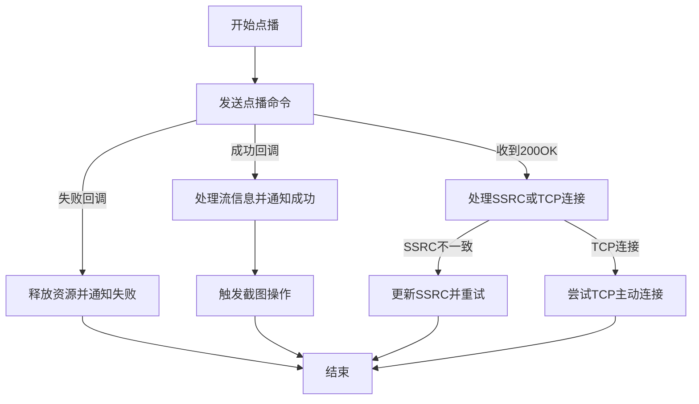

以下为上面调用函数的代码：**`sipSender.transmitRequest`**这一行代码，去执行了发送sip请求的函数,，并且执行成功的回调函数，okEvent

`src/main/java/com/gbcom/wvp/vmp/gb28181/transmit/cmd/impl/SIPCommander.java`

```java
sipSender.transmitRequest(sipLayer.getLocalIp(device.getLocalIp()), request, (e -> {
            streamSession.remove(device.getDeviceId(), channelId, ssrcInfo.getStream());
            mediaServerService.releaseSsrc(mediaServerItem.getId(), ssrcInfo.getSsrc());
            errorEvent.response(e);
        }), e -> {
            ResponseEvent responseEvent = (ResponseEvent) e.event;
            SIPResponse response = (SIPResponse) responseEvent.getResponse();
            streamSession.put(device.getDeviceId(), channelId, "play", stream, ssrcInfo.getSsrc(), mediaServerItem.getId(), response,
                    InviteSessionType.PLAY);
            okEvent.response(e);
        });
```

```java
/**
     * 请求预览视频流
     *
     * @param device     视频设备
     * @param channelId  预览通道
     * @param event      hook订阅
     * @param errorEvent sip错误订阅
     */
    @Override
    public void playStreamCmd(MediaServerItem mediaServerItem, SSRCInfo ssrcInfo, Device device, String channelId,
                              ZlmHttpHookSubscribe.Event event, SipSubscribe.Event okEvent, SipSubscribe.Event errorEvent) throws InvalidArgumentException, SipException, ParseException {
        String stream = ssrcInfo.getStream();

        if (device == null) {
            return;
        }

        logger.info("{} 分配的ZLM为: {} [{}:{}]", stream, mediaServerItem.getId(), mediaServerItem.getSdpIp(), ssrcInfo.getPort());
        HookSubscribeForStreamChange hookSubscribe = HookSubscribeFactory.on_stream_changed("rtp", stream, true, "rtsp", mediaServerItem.getId());
        subscribe.addSubscribe(hookSubscribe, (MediaServerItem mediaServerItemInUse, HookParam hookParam) -> {
            if (event != null) {
                event.response(mediaServerItemInUse, hookParam);
                subscribe.removeSubscribe(hookSubscribe);
            }
        });
        String sdpIp;
        if (!ObjectUtils.isEmpty(device.getSdpIp())) {
            sdpIp = device.getSdpIp();
        }else {
            sdpIp = mediaServerItem.getSdpIp();
        }
        StringBuffer content = new StringBuffer(200);
        content.append("v=0\r\n");
        content.append("o=" + channelId + " 0 0 IN IP4 " + sdpIp + "\r\n");
        content.append("s=Play\r\n");
        content.append("c=IN IP4 " + sdpIp + "\r\n");
        content.append("t=0 0\r\n");

        if (userSetting.isSeniorSdp()) {
            if ("TCP-PASSIVE".equalsIgnoreCase(device.getStreamMode())) {
                content.append("m=video " + ssrcInfo.getPort() + " TCP/RTP/AVP 96 126 125 99 34 98 97\r\n");
            } else if ("TCP-ACTIVE".equalsIgnoreCase(device.getStreamMode())) {
                content.append("m=video " + ssrcInfo.getPort() + " TCP/RTP/AVP 96 126 125 99 34 98 97\r\n");
            } else if ("UDP".equalsIgnoreCase(device.getStreamMode())) {
                content.append("m=video " + ssrcInfo.getPort() + " RTP/AVP 96 126 125 99 34 98 97\r\n");
            }
            content.append("a=recvonly\r\n");
            content.append("a=rtpmap:96 PS/90000\r\n");
            content.append("a=fmtp:126 profile-level-id=42e01e\r\n");
            content.append("a=rtpmap:126 H264/90000\r\n");
            content.append("a=rtpmap:125 H264S/90000\r\n");
            content.append("a=fmtp:125 profile-level-id=42e01e\r\n");
            content.append("a=rtpmap:99 H265/90000\r\n");
            content.append("a=rtpmap:98 H264/90000\r\n");
            content.append("a=rtpmap:97 MPEG4/90000\r\n");
            if ("TCP-PASSIVE".equalsIgnoreCase(device.getStreamMode())) { // tcp被动模式
                content.append("a=setup:passive\r\n");
                content.append("a=connection:new\r\n");
            } else if ("TCP-ACTIVE".equalsIgnoreCase(device.getStreamMode())) { // tcp主动模式
                content.append("a=setup:active\r\n");
                content.append("a=connection:new\r\n");
            }
        } else {
            if ("TCP-PASSIVE".equalsIgnoreCase(device.getStreamMode())) {
                content.append("m=video " + ssrcInfo.getPort() + " TCP/RTP/AVP 96 97 98 99\r\n");
            } else if ("TCP-ACTIVE".equalsIgnoreCase(device.getStreamMode())) {
                content.append("m=video " + ssrcInfo.getPort() + " TCP/RTP/AVP 96 97 98 99\r\n");
            } else if ("UDP".equalsIgnoreCase(device.getStreamMode())) {
                content.append("m=video " + ssrcInfo.getPort() + " RTP/AVP 96 97 98 99\r\n");
            }
            content.append("a=recvonly\r\n");
            content.append("a=rtpmap:96 PS/90000\r\n");
            content.append("a=rtpmap:98 H264/90000\r\n");
            content.append("a=rtpmap:97 MPEG4/90000\r\n");
            content.append("a=rtpmap:99 H265/90000\r\n");
            if ("TCP-PASSIVE".equalsIgnoreCase(device.getStreamMode())) { // tcp被动模式
                content.append("a=setup:passive\r\n");
                content.append("a=connection:new\r\n");
            } else if ("TCP-ACTIVE".equalsIgnoreCase(device.getStreamMode())) { // tcp主动模式
                content.append("a=setup:active\r\n");
                content.append("a=connection:new\r\n");
            }
        }

        if( device.isSwitchPrimarySubStream() ){
            if("TP-LINK".equals(device.getManufacturer())){
                if (device.isSwitchPrimarySubStream()){
                    content.append("a=streamMode:sub\r\n");
                }else {
                    content.append("a=streamMode:main\r\n");
                }
            }else {
                if (device.isSwitchPrimarySubStream()){
                    content.append("a=streamprofile:1\r\n");
                }else {
                    content.append("a=streamprofile:0\r\n");
                }
            }
        }

        content.append("y=" + ssrcInfo.getSsrc() + "\r\n");//ssrc
        // f字段:f= v/编码格式/分辨率/帧率/码率类型/码率大小a/编码格式/码率大小/采样率
//        content.append("f=v/2/5/25/1/4000a/1/8/1" + "\r\n"); // 未发现支持此特性的设备

        //这里获取的userId 值
        String fromTag = mediaServerItem.getUserId();
        if(ObjectUtils.isEmpty(fromTag)){
            fromTag = SipUtils.getNewFromTag();
        }
        Request request = headerProvider.createInviteRequest(device, channelId, content.toString(), SipUtils.getNewViaTag(), fromTag, null, ssrcInfo.getSsrc(),sipSender.getNewCallIdHeader(sipLayer.getLocalIp(device.getLocalIp()),device.getTransport()));
        sipSender.transmitRequest(sipLayer.getLocalIp(device.getLocalIp()), request, (e -> {
            streamSession.remove(device.getDeviceId(), channelId, ssrcInfo.getStream());
            mediaServerService.releaseSsrc(mediaServerItem.getId(), ssrcInfo.getSsrc());
            errorEvent.response(e);
        }), e -> {
            ResponseEvent responseEvent = (ResponseEvent) e.event;
            SIPResponse response = (SIPResponse) responseEvent.getResponse();
            streamSession.put(device.getDeviceId(), channelId, "play", stream, ssrcInfo.getSsrc(), mediaServerItem.getId(), response,
                    InviteSessionType.PLAY);
            okEvent.response(e);
        });
    }
```

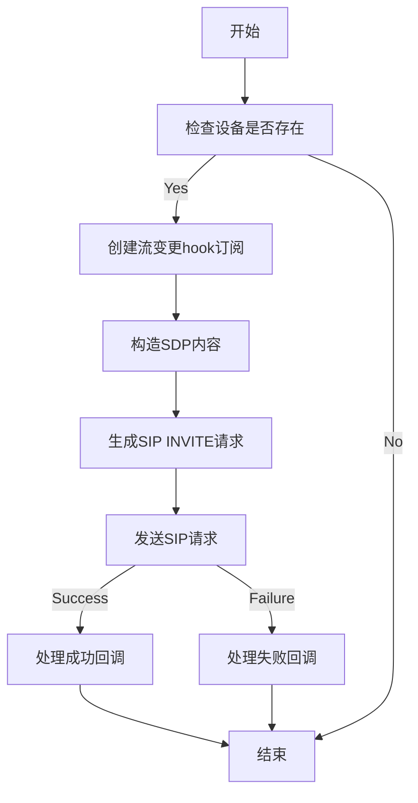

```java
HookSubscribeForStreamChange hookSubscribe = HookSubscribeFactory.on_stream_changed("rtp", stream, true, "rtsp", mediaServerItem.getId());
        subscribe.addSubscribe(hookSubscribe, (MediaServerItem mediaServerItemInUse, HookParam hookParam) -> {
            if (event != null) {
                event.response(mediaServerItemInUse, hookParam);
                subscribe.removeSubscribe(hookSubscribe);
            }
        });
```

以上是创建流变更hook订阅的代码，逻辑分析如下：

#### **1. 创建一个“监听任务”**

```java
HookSubscribeForStreamChange hookSubscribe = HookSubscribeFactory.on_stream_changed(
    "rtp",          // 监听的应用类型（比如实时传输协议）
    stream,         // 要监听的具体流名称（比如摄像头ID）
    true,           // true=开启监听，false=关闭监听
    "rtsp",         // 流媒体协议（比如RTSP）
    mediaServerItem.getId() // 媒体服务器的ID（标识哪台服务器）
);
```


- **作用** ：生成一个“监听任务”，告诉系统：“我要监听 `mediaServerItem` 服务器上，名为 `stream` 的 RTSP 流状态变化”。

------

#### **2. 将监听任务添加到系统**

```java
subscribe.addSubscribe(hookSubscribe, (mediaServerItemInUse, hookParam) -> {
    // 当事件触发时要执行的代码
});
```

- **作用** ：把监听任务交给系统，系统会持续监控目标流的状态。
- 参数解释 
  - `hookSubscribe`：刚才创建的监听任务。
  - `(mediaServerItemInUse, hookParam) -> { ... }`：当流状态变化时，系统会自动调用这个函数（类似“触发器”）。

------

#### **3. 定义事件触发时的动作**

```java
if (event != null) {
    event.response(mediaServerItemInUse, hookParam); // 执行用户定义的操作
    subscribe.removeSubscribe(hookSubscribe); // 执行后移除监听
}
```

- **作用** ：当监听到流状态变化时，执行用户预设的操作。

- 关键细节 

  ：

  1. **`event.response(...)`** ：调用用户传入的逻辑（比如更新界面、记录日志）。
  2. **`removeSubscribe`** ：执行完后移除监听任务，避免重复触发（比如流断开后，不需要再监听了）。

------

### **完整的逻辑流程图**

1. ```java
   1. 创建监听任务 → 2. 添加到系统 → 3. 等待事件触发 → 4. 触发后执行回调 → 5. 移除监听任务
   ```

------

### **举个实际场景**

假设你要监控摄像头 `camera001` 的推流状态：

1. **创建监听任务** ：监听 `camera001` 的 RTSP 流。
2. **添加到系统** ：系统开始监控这个流。
3. **事件触发** ：当摄像头突然断流（比如网络故障），系统会调用回调函数。
4. **执行回调** ：在控制台打印错误日志，并通知前端显示“摄像头离线”。
5. **移除监听** ：任务完成，不再监听这个流。

------

### **为什么需要移除监听？**

- **避免重复执行** ：如果不移除，同一个事件会多次触发（比如流断开后又触发一次）。
- **节省资源** ：监听任务会占用内存，及时移除可以避免内存泄漏。

------

### **小白总结**

这段代码的逻辑就像：

1. 给快递公司打电话：“请帮我监控包裹 `camera001` 的状态”。
2. 快递公司记录你的请求。
3. 当包裹状态变化（比如签收），快递公司通知你。
4. 你收到通知后，处理后续操作（比如拆包裹），然后说：“不用再监控这个包裹了”。

整个过程是**事件驱动** 的，系统自动触发，无需手动轮询！


# 参考：

1. 发送http 点播请求
2. 业务服务器收到点播请求，使用sip协议发送invite(携带SDP消息体)
3. 设备收到invite 之后回复200 ok (携带SDP消息体)
4. 业务服务器收到200 ok，使用sip 协议发送ACK到设备
5. 设备收到ACK之后就往ZLM媒体服务器推送媒体流包含音频的
6. 业务服务器的hook on_stream_change 监听事件收到zlm返回的播放地址
7. 业务服务器将地址组装并异步返回到浏览器
8. 浏览器拿到播放地址，选择合适的地址进行渲染

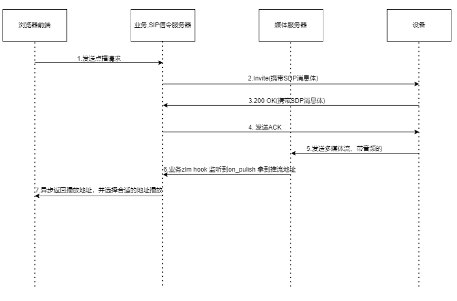

# Q & A

1.其中的devideId和ChannelId是干什么的？

2.为什么redis用了两个库，一个db6，一个db7，默认配置的索引好像是7

```yaml
redis:
  # 数据库索引，默认0
  database: 7
  #    # 服务器IP地址
  host: 127.0.0.1
  #    # 连接端口
  port: 5700
  #    # Redis服务器连接密码（默认为空）
  password: gbcom@gidata@123
```

3.zlm媒体服务器相关的设备信息，是怎么放到redis中去的，一启动就先放到redis中去吗？

4.异步，DeferredResult，这个是怎么写的？

5.isSsrcCheck这个是干什么的？

6.SN又是什么东西？我靠获取mediaServer可用的ssrc？

`ssrc` 是 "Synchronization Source Identifier" 的缩写，通常用于 RTP（实时传输协议）中标识数据流的来源。在视频流媒体场景中，`ssrc` 是一个唯一的数值，用于区分不同的音视频流。

1. 如果传入了 `presetSsrc`（预设的 `ssrc`），则直接使用它。
2. 如果没有预设值：
      1. 如果是回放流（`isPlayback == true`），调用 `ssrcFactory.getPlayBackSsrc(mediaServerItem.getId())` 获取回放流的 `ssrc`。
      2. 如果是普通播放流，调用 `ssrcFactory.getPlaySsrc(mediaServerItem.getId())` 获取播放流的 `ssrc`。

   `ssrc` 的作用是确保每个媒体流在传输过程中有唯一标识，避免混淆。

# TODO

后续看一下JWT的代码

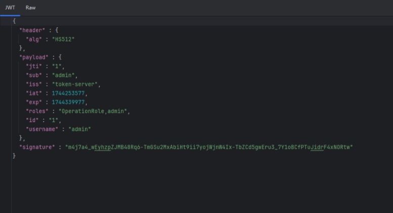

# 附录

**前端代码结构**

```
├─api
│  └─system
│      ├─access
│      ├─account
│      ├─alarmArea
│      ├─android
│      ├─channel
│      ├─communication
│      ├─config
│      ├─control
│      ├─device
│      ├─dict
│      ├─gbWhiteDeviceList
│      ├─im
│      ├─lisence
│      ├─log
│      ├─media
│      ├─meshNarrowband
│      ├─meshNarrowbandPdt
│      ├─meshT
│      ├─model
│      ├─neighbor
│      ├─nmiServer
│      ├─operator
│      ├─parentplatform
│      ├─playVideo
│      ├─proxy
│      ├─pushVideoList
│      ├─record
│      ├─regional
│      ├─role
│      ├─space
│      ├─streamProxy
│      ├─student
│      ├─tag
│      ├─triggers
│      ├─upgrade
│      ├─webrtc
│      ├─wvp
│      └─zlm
├─assets
│  ├─httpsauthoriza
│  ├─icons
│  ├─im
│  ├─images
│  ├─lmap
│  │  ├─icons
│  │  └─newicons
│  ├─mesh
│  ├─music
│  ├─newUI
│  └─wvp
├─components
│  ├─a-account-upload
│  ├─a-android-off-gis
│  │  └─components
│  ├─a-android-off-map
│  │  ├─alarm
│  │  └─components
│  ├─a-custom-modal
│  ├─a-h5live-play
│  ├─a-live-jessibuca
│  ├─a-offline-map
│  │  └─components
│  ├─a-play-jessibuca
│  ├─a-play-rtc
│  ├─a-play-video
│  ├─a-regional-tree
│  ├─a-rtc-player
│  ├─a-screen-player
│  ├─a-select-pattern
│  ├─a-slider-tree
│  ├─a-slider-tree-right
│  ├─a-speak-icon
│  ├─a-switch-modal
│  ├─a-switch-modalForGbDev
│  ├─a-take-photo
│  ├─a-talk-icon
│  ├─a-video-player
│  ├─alarm-area-screen-shot-off-map
│  ├─button
│  │  └─styles
│  ├─context-menu
│  ├─device-info
│  │  └─newInfos
│  ├─device-ip
│  ├─device-video-ip
│  ├─dynamic-table
│  │  ├─components
│  │  │  └─tool-bar
│  │  ├─types
│  │  └─utils
│  ├─dynamic-table-for-user
│  │  ├─components
│  │  │  └─tool-bar
│  │  ├─types
│  │  └─utils
│  ├─gps-map
│  ├─https-authorization-modal
│  ├─iconfont
│  ├─JSON-schema-form
│  │  └─components
│  ├─lockscreen
│  ├─operate-row
│  ├─photo
│  │  └─cover
│  ├─play-jessibuca
│  ├─play-modal
│  ├─play-webrtc
│  ├─play-webrtc-div
│  ├─ptt-switch-modal
│  ├─pwdLevel
│  ├─radioSex
│  ├─record-index
│  ├─split-panel
│  ├─subscribe-details
│  ├─svg-icon
│  ├─tag-icon
│  ├─tag-modal
│  ├─transition
│  └─userType
├─directives
├─enums
├─hooks
│  ├─functions
│  ├─useFormModal
│  └─useVolume
├─layout
│  ├─footer
│  ├─header
│  ├─logo
│  ├─menu
│  ├─menu-right
│  ├─sider-tree
│  └─tabs
├─lib
│  ├─eventbus
│  ├─h5live
│  ├─jessibuca
│  ├─presentation
│  └─qunee
├─plugins
├─router
│  └─modules
├─store
│  └─modules
│      ├─async-route
│      ├─lockscreen
│      ├─system
│      ├─tabs-view
│      └─user
├─styles
├─types
│  └─shims
├─utils
│  ├─http
│  │  └─axios
│  ├─is
│  ├─lnglatUtil
│  ├─permission
│  └─ws-axios
└─views
    ├─auth
    │  └─system
    │      ├─access
    │      ├─account
    │      │  └─components
    │      ├─android
    │      │  └─components
    │      ├─audio
    │      ├─channel
    │      ├─communication
    │      ├─config
    │      │  └─components
    │      ├─conTest
    │      │  └─components
    │      ├─control
    │      │  ├─components
    │      │  ├─css
    │      │  ├─font
    │      │  └─images
    │      ├─device
    │      │  └─components
    │      │      ├─meshDevice
    │      │      │  └─components
    │      │      ├─meshNarrowband
    │      │      └─utils
    │      ├─dict
    │      ├─home
    │      ├─im
    │      │  └─components
    │      │      ├─addressBook
    │      │      ├─chatWindow
    │      │      ├─groupchatAvatar
    │      │      ├─im
    │      │      ├─initiateGroupChat
    │      │      ├─messages
    │      │      ├─search
    │      │      ├─setting
    │      │      ├─util
    │      │      └─videoChat
    │      ├─leafletMap
    │      │  ├─alarm
    │      │  ├─components
    │      │  └─warningPoint
    │      ├─live
    │      ├─log
    │      ├─media
    │      ├─meeting
    │      │  └─components
    │      ├─northconfig
    │      ├─onlineMap
    │      │  └─components
    │      ├─onmap
    │      ├─operator
    │      ├─parentplatform
    │      │  └─components
    │      ├─pushVideoList
    │      │  └─components
    │      │      └─utils
    │      ├─record
    │      │  └─recordPlan
    │      ├─regional
    │      │  └─components
    │      ├─role
    │      │  └─components
    │      ├─rtc
    │      ├─space
    │      ├─streamProxy
    │      │  └─components
    │      │      └─utils
    │      ├─student
    │      ├─test
    │      ├─toponeighbor
    │      ├─toporouter
    │      ├─triggers
    │      └─upgrade
    │          └─components
    ├─monitor
    └─shared
        ├─dashboard
        │  └─welcome
        ├─demos
        │  ├─form
        │  ├─icons
        │  └─tables
        ├─error
        ├─icons
        ├─login
        └─redirect
```

