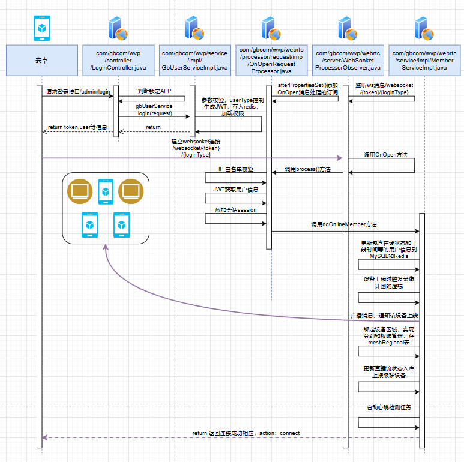
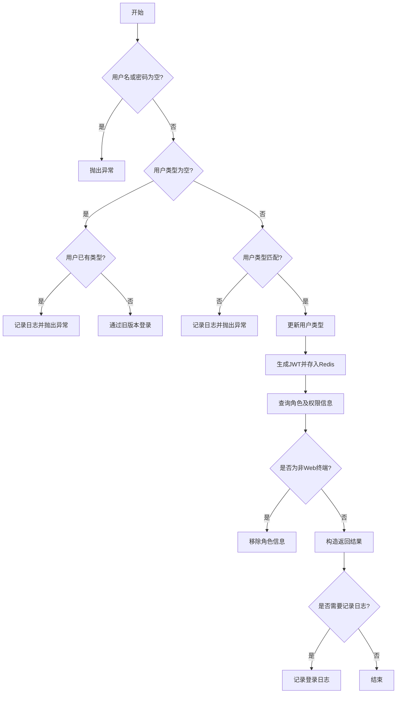

# 安卓上下线流程

## 零、UML流程图



## 一、上线流程

### 0. 安卓调用服务端的Login接口

TODO这段安卓的代码没有看

### 1.调用登录Login接口，Controller

**`src/main/java/com/gbcom/wvp/controller/LoginController.java`**

```java
@ApiOperation(value = "用户登录", notes = "POST用户登录返回JWT")
    @PostMapping("/login")
    public RS userLogin(HttpServletRequest request){
        Map<String,Object> map = new HashMap<>();
        Map<String, String> params = RequestResponseUtil.getRequestBodyMap(request);
        String username = params.get("username");
        //新增获取设备的deviceId 同时获取用户信息 判断是否锁定app 如果锁定了， 就不能登陆其它设备
        String deviceId = params.get("deviceId");
        GbUser gbUser = gbUserMapper.selectByUserName(username);
        Integer isLockApp = gbUser.getIsLockApp();
        if(isLockApp!=null) {
            if (isLockApp == 1) {
                //说明该用户已经锁定了app
                if (!StringUtils.isEmpty(deviceId)) {
                    //从app 登陆的
                    String deviceInfo = gbUser.getDeviceInfo();
                    if(!StringUtils.isEmpty(deviceInfo)) {
                        JSONObject jsonObject = JSONObject.parseObject(deviceInfo);
                        if (jsonObject != null) {
                            String deviceIdSave = jsonObject.getString("deviceId");
                            if (deviceIdSave.equals(deviceId)) {
                                //唯一标识相同 放行给与登陆
                                map = gbUserService.login(request);
                            } else {
                                map.put("messageInfo", "该用户已经锁定了固定设备，不能登陆其它设备");
                            }
                        } else {
                            //处理异常数据的，登录
                            map = gbUserService.login(request);
                        }
                    }else{
                        //说明是空锁APP 不进行标识校验 //直接放行登录app
                        map = gbUserService.login(request);
                    }
                } else {
                    //web登陆直接不给登
                    map.put("messageInfo", "该用户已经锁定了固定设备，不能登陆网页系统");
                }
            } else {
                map = gbUserService.login(request);
            }
        }else{
            map = gbUserService.login(request);
        }
        return new RS().ok().addResult("maps",map);
    }
```




### 2.进入Login的Service层

**`com/gbcom/wvp/service/impl/GbUserServiceImpl.java`**

这里边的逻辑主要是IP 白名单校验，处理级联设备、副屏播放的逻辑，但是如果是普通设备就走**普通用户登录（JWT校验）**的逻辑

```java
@Override
    public Map<String, Object> login(HttpServletRequest request) {
        Map<String, String> params = RequestResponseUtil.getRequestBodyMap(request);
        String username = params.get("username");
        String password = params.get("password");
        String userType = params.get("userType");
        GbUser gbUser = gbUserMapper.selectByUserName(username);
        if (StringUtils.isEmpty(password) || StringUtils.isEmpty(username)) {
            throw new MyException(1, "用户名和密码不能为空");
        }
        // 放行旧版本登录 新版本限制登录类型
        if(StringUtils.isEmpty(userType)){
            if(!StringUtils.isEmpty(gbUser.getUserType())){
                logger.info("用户名："+username+"登录失败，旧版本app携带用户类型为空");
                throw new MyException(1, "此用户已被限制类型登录");
            }
        }else {
            if(StringUtils.isEmpty(gbUser.getUserType())) {
                // 新版本第一次登录 将其登录类型限制
                gbUser.setUserType(userType);
                gbUserMapper.updateByPrimaryKey(gbUser);
            }else {
                if(!Objects.equals(userType,gbUser.getUserType())){
                    logger.info("用户名："+username+"登录失败，用户类型不一致");
                    throw new MyException(1, "此用户已被限制类型登录");
                }
            }
        }
        String roles = gbUserMapper.selectUserRole(username);
        long refreshPeriodTime = 24 * 60 * 60L;
        String jwt = JsonWebTokenUtil.issueJWT(gbUser.getId(), username,
                "token-server", refreshPeriodTime, roles, null, SignatureAlgorithm.HS512);
        //将jwt备份一份到redis中 2个小时
        redisTemplate.opsForValue().set("JWT-SESSION-WVP" + username, jwt, refreshPeriodTime * 2, TimeUnit.SECONDS);
        String redisKey = "jwt:refresh:" + username;
        long refreshExpiration = System.currentTimeMillis() + 24 * 60 * 60*1000*2;
        redisTemplate.opsForValue().set(redisKey, String.valueOf(refreshExpiration));
        //从数据库获取该用户角色集合
        List<GbRole> gbRoles = gbRoleMapper.getRolesById(gbUser.getId());
        for (GbRole gbRole :
                gbRoles) {
            List<GbPermission> permissions = gbPermissionMapper.getMenusByRoleId(gbRole.getId());
            gbRole.setGbPermissions(permissions);
        }
        //List<GbPermission> permissions = gbPermissionMapper.getMenusByUid(gbUser.getId());
        //ArrayList<GbPermission> PermissionLists = new ArrayList<>(new HashSet<>(permissions));
        gbUser.setRoles(gbRoles);
        //非web登录的终端不需要多余信息
        Member member = memberService.getMemberById(gbUser.getId());
        if (member != null && member.getOnlineType() == 3) {
            gbUser.setRoles(null);
        }
        Map<String, Object> map = new HashMap<>();
        map.put("status",true);
        map.put("gbUser", gbUser);
        map.put("token", jwt);
        map.put("time", new Date(System.currentTimeMillis() + refreshPeriodTime * 1000).getTime());
        String logName = "登录日志";
        String ip = IpUtil.getClientIP(request);
        // 排除meshT的登录日志记录
        if(!username.contains("MT_")){
            LogExeManager.getInstance().executeLogTask(LogTaskFactory.bussinssLog(username, logName,
                    request.getRequestURI(), request.getMethod(), (byte) 1, "操作成功", ip));
        }
        return map;
    }
```

总结一下，该登录接口逻辑为：

1. **参数校验** ：获取用户名/密码/userType，仅校验非空；
2. **用户类型控制** ：旧版本（无userType）若数据库已存在userType则拒绝，新版本强制校验userType一致性；
3. **生成JWT** ：有效期24小时存储到redis中，但Redis存储48小时（可能复用过期Token）；
4. **加载权限** ：通过循环查询角色和权限（N+1性能问题），非Web端清空权限；
5. **返回响应** ：直接暴露用户对象（可能含敏感字段），记录日志（可绕过）。

### 3.拿到登录的token，安卓发送websocket消息，通知自己上线

TODO这段涉及到安卓的代码没有看

### 4.服务端处理收到的websocket消息，消息注册

首先会有众多websocket的消息，不同类型的会进行注册，目前代码中有实际中的消息类型

```shel
|-- CallAckRequestProcessor.javas
|-- CameraRequestProcessor.java
|-- DeviceConfigRequestProcessor.java
|-- HeartBeatForScreenPlayRequestProcessor.java
|-- HeartBeatRequestProcessor.java
|-- LogoutRequestProcessor.java
|-- MeshTConfigRequestProcessor.java
|-- OnCloseRequestProcessor.java
|-- OnOpenRequestProcessor.java
|-- PlayGbDeviceReplyRequestProcessor.java
|-- PushStreamRequestProcessor.java
|-- ReadyForCallRequestProcessor.java
|-- ReadyForRecordRequestProcessor.java
|-- RequestProcessorParent.java
|-- SosRequestProcessor.java
`-- StopPushRequestProcessor.java
```

举一个例子，比如说**`OnOpenRequestProcessor.java`**,核心代码如下，`afterPropertiesSet()` 是在 **属性注入完成后** 、**Bean完全初始化前** 调用的

```java
@Override
public void afterPropertiesSet() throws Exception {
    // 添加消息处理的订阅
    webSocketProcessorObserver.addRequestProcessor(WsConst.ONOPEN, this);
}
```

### 5.调用OnOpen方法以及Process方法

**`com/gbcom/wvp/webrtc/server/WebSocketProcessorObserver.java`**

IP 白名单校验、JWT获取用户信息、添加会话session

```java
@OnOpen
    public void onOpen(Session session, @PathParam(value = "token") String token, @PathParam(value = "loginType") String loginType) {
        this.session = session;
        try {
            WsRequestMessage message = new WsRequestMessage();
            message.setToken(token);
            if (!StringUtils.isEmpty(loginType)) {
                Map<String, Object> mapObject = new HashMap<>();
                mapObject.put("loginType", loginType);
                mapObject.put("queryString", session.getQueryString());
                message.setParam(new JSONObject(mapObject));
            }
            requestProcessorMap.get("ONOPEN").process(session, message);
        } catch (Exception e) {
            logger.error(e.getMessage(), e);
        }
    }
```

**`com/gbcom/wvp/webrtc/processor/request/imp/OnOpenRequestProcessor.java`**

```java
@Override
    public void process(Session session, WsRequestMessage message) {
        boolean enable = true;
        boolean isNormal = true;
        String clientIP = session.getRequestURI().getHost();
        String externalIP = environmentConfig.getProperty("externalIP");
        if(clientIP.equalsIgnoreCase( sipIp) || clientIP.equalsIgnoreCase(externalIP)){
            isNormal = true;
           
        }else{
            isNormal = false;
            boolean isDocker = LicenseMange.isDocker();
            if(!isDocker){
            WsSendMessage sendMessageWarn = new WsSendMessage();
            sendMessageWarn.setAction(WsConst.SERVER_IP_CONFIG_WARN);
            JSONObject info = new JSONObject();
            info.put("member", "");
            sendMessageWarn.setInfo(info);
            WebsocketSessionManager.sendMessageTo(sendMessageWarn.toJsonString(),2);
            logger.error("triggerServerIPWarningMsg:" +  clientIP +" is not equal with  "  + sipIp + "-" + isNormal);
            }
        }
        String id = null;
        try {
            String token = message.getToken();
            // 用于级联平台的通信 直接放行 loginType默认为9
            if(token.startsWith("wvp_server_")){
                String ip = token.split("wvp_server_")[1];
                WebsocketSessionManager.addSession(ip, session, 9);
                logger.info(ip+"下级websocket server connect");
                return;
            }
            // 用于副屏播放 直接放行 loginType默认为9
            if(token.startsWith("screenPlay_")){
                String[] screenPlayInfo = token.split("_");
                String userId = screenPlayInfo[1];
                String devId = screenPlayInfo[2];
                String uuid = screenPlayInfo[5];
                if(StringUtils.isEmpty(userId) || StringUtils.isEmpty(devId)){
                    logger.error("screenPlay_userId or devId is null");
                    return;
                }
                // 当有副屏产生时 将此流的点播数量存入redis中
                String redisKey = "screenPlay_" + userId + "_" + devId;
                String infoStr = redisTemplate.opsForValue().get(redisKey);
                Set<String> set = new HashSet<>();
                if(!StringUtils.isEmpty(infoStr)){
                    set = JSON.parseObject(infoStr, new TypeReference<HashSet<String>>() {});
                }
                set.add("secondary"+uuid);
                redisTemplate.opsForValue().set(redisKey, JSONObject.toJSONString(set));

                WebsocketSessionManager.addSession(token, session, 9);

                // 保存其心跳时间
                long timeMillis = System.currentTimeMillis();
                redisTemplate.opsForValue().set(token, String.valueOf(timeMillis));
                logger.info(token+"的副屏播放websocket server connect");
                return;
            }
            String s = JsonWebTokenUtil.parseJwtPayload(token);
            Map<String, Object> map = JsonWebTokenUtil.readValue(s);
            String uid = (String) map.get("id");
            GbUser gbUser = gbUserService.getUserById(uid);
            id = gbUser.getId();
        } catch (Exception e) {
            enable = false;
            logger.error("onopenError", e);
        }
        logger.info("onOpen：id: {} sessionId: {}", id, session.getId());
        if (enable) {
            String loginTypeStr = message.getParam().getString("loginType");
            String queryString = message.getParam().getString("queryString");
            JSONObject params = getQueryStringJsonObj(queryString);
            Integer loginType = Integer.parseInt(loginTypeStr);
            WebsocketSessionManager.addSession(id, session, loginType);
            memberService.doOnlineMember(id, loginType, params);
            memberService.doHeartBeat(id);//默认登录，就是心跳了一次！ 
            WsSendMessage wsSendMessage = new WsSendMessage();
            wsSendMessage.setAction("connect");
            wsSendMessage.setMessageId(MessageIdUtil.random());
            Map<String, Object> mapObject = new HashMap<>();
            mapObject.put("message", "ok");
            mapObject.put("code", 0);
            wsSendMessage.setInfo(mapObject);
            WebsocketSessionManager.send(session, JSONArray.toJSONString(wsSendMessage));
            logger.info("【websocket】有新的连接，总数为:" + WebsocketSessionManager.getSessionSize());
            //新增一个检测是否存在未发生消息 延迟2秒 给前端初始化时间
            String finalId = id;
            Timer timer = new Timer();
            timer.schedule(new TimerTask() {
                @Override
                public void run() {
                    sendMessageUtil.sendMessageByOne(finalId);
                    timer.cancel();
                }
            }, 2000);
        } else {
            try {
                session.close();
            } catch (IOException e) {
                logger.error("close", e);
            }
        }
    }
```

### 6. 调用doOnlineMember方法

**`com/gbcom/wvp/webrtc/service/impl/MemberServiceImpl.java`**

- 第一步，是更新了一波用户的信息，比如改成在线状态，更新登录的时间等等，设计的主要是**`webrtc_member`**这张表，里面的一些基本信息来自**`gb_user`**这张表
- 第二步更新包含在线状态和上线时间等的用户信息到MySQL和Redis（其中meshT的逻辑跳过）
- 第三步广播消息，通知该设备上线
- 第四步，绑定设备区域，实现分组和权限管理，存meshRegional表
- 第五步，更新直播流状态入库，上报级联设备

```java
@Override
    public void doOnlineMember(String id, Integer loginType, JSONObject params) {
        GbUser user = gbUserService.getUserById(id);
        Member member = getMemberById(id);
        if (member == null) {
            member = new Member();
            WebrtcMember webrtcMember = this.webrtcMemberMapper.selectByUserId(id);
            if(webrtcMember == null) {
                member.setId(id);
                if (StringUtils.isEmpty(user.getNickname())) {
                    member.setDisplayName(user.getUsername());
                } else {
                    member.setDisplayName(user.getNickname());
                }
                member.setAvatar(user.getAvatar());
                member.setName(user.getUsername());
//            member.setBePlayStatus(false);
//            member.setPlayStatus(false);
//            member.setMettingStatus(false);
                this.webrtcMemberMapper.insert(new WebrtcMember().setData(member));
            }
        }
        member.setOnline(true);
        member.setOnlineTime(new Date());
        if (StringUtils.isEmpty(user.getNickname())) {
            member.setDisplayName(user.getUsername());
        } else {
            member.setDisplayName(user.getNickname());
        }
        member.setAvatar(user.getAvatar());
        member.setName(user.getUsername());
//        member.setBePlayStatus(false);
//        member.setPlayStatus(false);
//        member.setMettingStatus(false);
        if (loginType != null) {
            member.setOnlineType(loginType);
            if (loginType.equals(1)) {
                //0 代表都有 1代表都没有 2代表有视频无音频 3代表无视频有音频
                //安卓默认都有
                member.setIsVideoAudio(0);
            }
            // 处理meshT设备ptt
            if(loginType.equals(3)){
                try {
                    //处理meshT入库
                    meshTDeviceService.handleMeshTDeviceOnline(id,params);
                }catch (Exception e){
                    logger.error("处理meshT设备上线出现错误",e);
                }

                WebrtcMemberConfig webrtcMemberConfig = webrtcMemberConfigMapper.selectByUserId(id);
                // 若库中未存 则新建 （默认未true）
                if(webrtcMemberConfig == null){
                    webrtcMemberConfig = new WebrtcMemberConfig();
                    webrtcMemberConfig.setMemberId(id);
                    HashMap<String, Object> map = new HashMap<>();
                    map.put("pttSwitch",true);
                    webrtcMemberConfig.setConfig(JSONObject.toJSONString(map));
                    webrtcMemberConfigMapper.insert(webrtcMemberConfig);
                }
                // 向meshT设备发送ptt状态值
                WsSendMessage sendMessage = new WsSendMessage();
                sendMessage.setAction(WsConst.PTT_SWITCH_MSG);
                JSONObject info = new JSONObject();
                JSONObject jsonObject = JSONObject.parseObject(webrtcMemberConfig.getConfig());
                info.put("eventId", "pttSwitch" + MessageIdUtil.random());
                info.put("pttSwitch", jsonObject.getBoolean("pttSwitch"));
                sendMessage.setInfo(info);
                WebsocketSessionManager.send(id, sendMessage.toJsonString());
            }
        }
        if(params != null) {
            logger.info("doOnlineMember params: member={}, {}" ,member.getDisplayName(), params.toJSONString());
            String videoId = params.getString("videoId");
            String singleMeshT  = params.getString("singleMeshT");
            if(StringUtils.isNotBlank(videoId)) {
                member.setVideoId(videoId);
            }
            // 是否只是单独的meshT视频模块 默认0 =>0表示绑定在单兵上 1表示此视频板单独连接服务器
            member.setSingleMeshT(StringUtils.isNotBlank(singleMeshT) && singleMeshT.equals("1"));
            //绑定在单兵的MeshT  名称设为单兵名称
            if(loginType.equals(3) && StringUtils.isNotBlank(videoId) && !(member.getSingleMeshT() != null && member.getSingleMeshT())) {
                List<MeshDevice> meshDeviceList = meshDeviceMapper.deviceAll();
                for (MeshDevice meshDevice : meshDeviceList) {
                    String jsonStr = meshDevice.getJsonstr();
                    if(StringUtils.isEmpty(jsonStr)) continue;
                    JSONObject jsonObject = JSONObject.parseObject(jsonStr);
                    String crPuid = jsonObject.getString("CrPuid");
                    if(StringUtils.isEmpty(crPuid)) continue;
                    if(crPuid.equals(member.getVideoId())) {
                        String displayName = !StringUtils.isEmpty(meshDevice.getName()) ? meshDevice.getName() : CommonUtil.getDeviceType(JSON.parseObject(meshDevice.getJsonstr())) + "-" + meshDevice.getDeviceId();;
                        member.setDisplayName(displayName);
                        break;
                    }
                }
            }
        }
        int result = this.webrtcMemberMapper.updateByMemberIdSelective(new WebrtcMember().setData(member));
        if (result > 0) {
            this.saveMemberToRedis(member);
        } else {
            logger.error("失败 doOnlineMember updateByMemberIdSelective");
        }

        Timer delayTimer = new Timer();
        delayTimer.schedule(new TimerTask() {
            @Override
            public void run() {
                wvpRecordPlanService.start(id);
                logger.info("[录像计划]上线触发：" + id );
                delayTimer.cancel();
            }
        }, 1000 * 3);

        WsSendMessage sendMessage = new WsSendMessage();
        sendMessage.setAction(WsConst.ONLINE_MSG);
        JSONObject info = new JSONObject();
        info.put("id", id);
        info.put("loginType", loginType);
        // 非meshT设备 或者是单独的meshT
        if(!loginType.equals(3) || (member.getSingleMeshT()!=null && member.getSingleMeshT())){
            info.put("deviceForTree",CommonUtil.getDeviceVoForTreeByMember(member));
        }
        sendMessage.setInfo(info);
        WebsocketSessionManager.sendOther(id, sendMessage.toJsonString());
        //处理登录系统的用户 加入到meshRegional 表中 排除绑定的meshT 设备
        insertMemberToMeshRegional(member,loginType);
        //
        platformService.handleRefreshPlatformByMember(member);
    }
```

### 7. 其中心跳机制的监听机制如下：

**`com/gbcom/wvp/webrtc/service/impl/MemberServiceImpl.java`**

```java
@Override
    public void doHeartBeat(String id) {
        Member member = getMemberById(id);
        if(member!=null) {
            member.setHeartBeatTime(new Date());
            save(member);
            int timeOut = 10 * 3 * 1000 + 100;
            String timeTaskid = "heartbeat" + id;
            webSocketDynamicTask.startDelay(timeTaskid, new Runnable() {
                @Override
                public void run() {
                    Session session = WebsocketSessionManager.getSession(id);
                    if (session != null) {
                        Member memberById = getMemberById(id);
                        if(memberById != null && memberById.getHeartBeatTime() != null && System.currentTimeMillis() - memberById.getHeartBeatTime().getTime() >= timeOut-100){
                            doOfflineMember(id);
                            logger.info("【websocket】" + member.getDisplayName() + "心跳超时触发离线");
                        }
                    } else {
                        //应对别人已经登出，还多余发很多的离线通知
                        logger.info("【websocket】" + member.getDisplayName() + "心跳超时触发离线;但session已经被主动下线了，所以啥也不做");
                    }
                }
            }, timeOut);
        }
    }
```

这段代码实现了 **心跳检测** 的核心功能。它通过定期更新用户的心跳时间，并在超时未收到新心跳时触发离线处理。以下是详细解析：

------

#### **1. 心跳检测的基本概念**

- **心跳机制** 是一种用于维持长连接（如WebSocket）的技术：
  - 客户端每隔一段时间向服务器发送一次“心跳包”。
  - 服务器记录最后一次收到心跳的时间。
  - 若超过设定的超时时间仍未收到心跳，则认为客户端已断开连接。
- **目的** ：
  1. 检测客户端是否存活（如网络断开、设备关机）。
  2. 清理无效会话，释放资源（如关闭数据库连接、清理缓存）。

#### **2. 代码逻辑分步解析**

##### **2.1 更新心跳时间**

```java
Member member = getMemberById(id);
if (member != null) {
    member.setHeartBeatTime(new Date()); // 更新最后一次心跳时间
    save(member); // 持久化到数据库
}
```

- **作用** ：
  每次调用 `doHeartBeat` 时，将用户的 `heartBeatTime` 更新为当前时间，并保存到数据库中。
- **关键点** ：
  - `heartBeatTime` 用于判断用户是否存活。
  - 数据库持久化确保即使服务器重启也能恢复状态。

##### **2.2 启动延迟任务**

```java
int timeOut = 10 * 3 * 1000 + 100; // 超时时间 = 30秒 + 100毫秒
String timeTaskid = "heartbeat" + id;
webSocketDynamicTask.startDelay(timeTaskid, new Runnable() {
    @Override
    public void run() {
        // 延迟任务逻辑
    }
}, timeOut);
```

- **作用** ：
  启动一个延迟任务，在 `timeOut`（30.1秒）后检查用户是否仍存活。
- **关键点** ：
  - `timeOut` 是允许的最大心跳间隔时间。
  - `timeTaskid` 唯一标识该任务（如 `heartbeat12345`），便于取消或管理。

##### **2.3 延迟任务逻辑**

```java
Session session = WebsocketSessionManager.getSession(id);
if (session != null) {
    Member memberById = getMemberById(id);
    if (memberById != null 
        && memberById.getHeartBeatTime() != null 
        && System.currentTimeMillis() - memberById.getHeartBeatTime().getTime() >= timeOut - 100) {
        doOfflineMember(id); // 标记用户离线
        logger.info("【websocket】" + member.getDisplayName() + "心跳超时触发离线");
    }
} else {
    logger.info("【websocket】" + member.getDisplayName() + "心跳超时触发离线;但session已经被主动下线了，所以啥也不做");
}
```

- **作用** ：
  在延迟任务执行时，检查用户是否存活：
  1. **会话存在** ：若会话仍在（`session != null`），继续检查心跳时间。
  2. **心跳超时** ：若当前时间与最后一次心跳时间差 ≥ `timeOut - 100`（即30秒），调用 `doOfflineMember` 将用户标记为离线。
  3. **会话不存在** ：若会话已被主动关闭（如用户登出），则无需重复处理。
- **关键点** ：
  - `System.currentTimeMillis()` 获取当前时间戳，与 `heartBeatTime` 比较计算超时。
  - `doOfflineMember` 执行离线逻辑（如更新状态、通知其他用户）。

#### **3. 心跳检测的整体流程**

1. **客户端心跳** ：客户端每隔固定时间（如5秒）调用 `doHeartBeat`，更新心跳时间。
2. **服务器延迟任务** ：服务器启动一个延迟任务，在 `timeOut` 时间后检查心跳是否超时。
3. **超时判定** ：若超时未收到新的心跳，则触发离线处理。

------

#### **4. 心跳检测的关键特性**

- **实时性** ：每次心跳都会重置超时倒计时。
- **容错性** ：允许一定范围内的网络波动（如超时时间为30秒，心跳间隔为5秒）。
- **资源优化** ：通过延迟任务避免频繁查询数据库。

### 8.调用heartbeat的process处理方法（旧任务是如何取消的见Q & A）

**`com/gbcom/wvp/webrtc/processor/request/imp/HeartBeatRequestProcessor.java`**

- 第一步，再次调用doHeartBeat方法重启心跳检测任务
- 第二步，发送ws消息，回复请求端
- 第三步，上报经纬度电量等信息
- 第四步，预警圈检测

```java
@Override
    public void process(Session session, WsRequestMessage message) {
        String id = WebsocketSessionManager.getIdBySession(session);
        logger.info("heartbeat：sessionId: {} memberId: {} message:{} ", session.getId(), id, JSON.toJSONString(message));
        memberService.doHeartBeat(id);
        WsResponseMessage responseMessage = new WsResponseMessage(message.getMessageId());
        responseMessage.resultOk();

        //回复请求端
        WebsocketSessionManager.send(session, responseMessage.toJsonString());
        if (!responseMessage.resultIsOk()) {
            return;
        }
        //心跳 处理设备上报的经纬度
        if (!AndroidInfoTopoLimitManage.checkInSeconds(id+"report", 10)) {
            JSONObject param = message.getParam();
            androidInfoTopoService.insertAndroidInfoTopo(message, id);
            if (param.containsKey("batteryLevel")) {
                batteryLevelService.save(id, param.getInteger("batteryLevel"));
            }
        }
        //预警圈检测 终端经纬度上报时触发
        if (message.getParam().containsKey("longitude") && !AndroidInfoTopoLimitManage.checkInSeconds(id, 10)) {
            JSONObject param = message.getParam();
            String latitude = param.getString("latitude");
            String longitude = param.getString("longitude");
            if (StringUtils.isNotBlank(latitude) && StringUtils.isNotBlank(longitude)) {
                String lnglatStr = longitude + "," + latitude;
                wvpAlarmAreaService.onMemberLnglatMessageEvent(id, lnglatStr);
            }
        }
    }
```

### 9.上报经纬度电量等信息(60s限流是怎么做到的)

**`com/gbcom/wvp/webrtc/service/impl/AndroidInfoTopoServiceImpl.java`**

```java
@Override
public void insertAndroidInfoTopo(WsRequestMessage message, String id) {
    JSONObject param = message.getParam();
    String latitude = param.getString("latitude");
    String longitude = param.getString("longitude");
    if (!StringUtils.isEmpty(latitude) && !StringUtils.isEmpty(longitude)) {
        AndroidInfoTopo androidInfoTopo = new AndroidInfoTopo();
        androidInfoTopo.setLatitude(latitude);
        androidInfoTopo.setLongitude(longitude);
        androidInfoTopo.setCreateTime(new Date());
        androidInfoTopo.setUserId(id);
        String memberStr = redisTemplate.opsForValue().get(WsConst.WS_MEMBER_ID_PREFIX + id);
        androidInfoTopo.setDeviceMessage(memberStr);
        if(!AndroidInfoTopoLimitManage.checkInSeconds(id+"insertDB", 60)){
            int insert = androidInfoTopoMapper.insert(androidInfoTopo);
        }
//            if (insert < 0) {
//                logger.error("该账号" + id + "GPS入库失败");
//            } else {
            saveToRedis(androidInfoTopo);
        //}
    }
}
```

#### **1. 核心功能**

该方法处理客户端上报的经纬度信息，完成以下任务：

1. **解析经纬度** ：从消息中提取 `latitude` 和 `longitude`。
2. **限流控制** ：60秒内仅允许插入一次数据库。
3. **数据持久化** ：将经纬度信息存入数据库（`AndroidInfoTopo` 表）和 Redis。

#### **2. 代码逻辑分步解析**

##### **2.1 参数提取与校验**

```java
JSONObject param = message.getParam();
String latitude = param.getString("latitude");
String longitude = param.getString("longitude");
if (!StringUtils.isEmpty(latitude) && !StringUtils.isEmpty(longitude)) {
    // 继续处理
}
```

- **作用** ：确保经纬度非空，避免无效数据入库。

##### **2.2 构造数据对象**

```java
AndroidInfoTopo androidInfoTopo = new AndroidInfoTopo();
androidInfoTopo.setLatitude(latitude);
androidInfoTopo.setLongitude(longitude);
androidInfoTopo.setCreateTime(new Date());
androidInfoTopo.setUserId(id);
```

- **作用** ：将经纬度、用户ID、创建时间封装为实体对象

##### **2.3 补充设备信息**

```java
String memberStr = redisTemplate.opsForValue().get(WsConst.WS_MEMBER_ID_PREFIX + id);
androidInfoTopo.setDeviceMessage(memberStr);
```

- **作用** ：从 Redis 中获取用户设备信息（如型号、状态），附加到记录中。

##### **2.4 限流与数据库插入**

```java
if (!AndroidInfoTopoLimitManage.checkInSeconds(id + "insertDB", 60)) {
    int insert = androidInfoTopoMapper.insert(androidInfoTopo);
}
saveToRedis(androidInfoTopo); // 无论插入是否成功，均存入Redis
```

- 作用 ：
  - **限流** ：60秒内仅允许插入一次数据库（防止高频写入）。
  - **持久化** ：插入数据库后，将数据存入 Redis（可能用于实时展示或缓存）。

------

##### **3. 关键问题与风险**（待补充，过程中有什么隐藏的问题）

##### **4. 总结**

该方法实现了 **经纬度上报** 的限流与持久化功能，但存在 **限流键冲突** 、**数据一致性风险** 、**校验缺失** 等问题。建议通过 **优化键名** 、**增强校验** 、**分离数据库与Redis操作** 等方式提升健壮性。

## 二、下线流程

### 1.请求端主动发送LogOut的Websocket消息

因为是已经建立websocket连接的情况下，因此这个首先会触发`OnMessage`方法

**`com/gbcom/wvp/webrtc/server/WebSocketProcessorObserver.java`**

```java
@OnMessage
    public void onMessage(String message, Session session) {
        MemberService memberService = SpringContextHolder.getBean(MemberServiceImpl.class);
        String name = "";
        String idBySession = WebsocketSessionManager.getIdBySession(session);
        Member member = memberService.getMemberById(idBySession);
        if (member != null) {
            name = member.getDisplayName();
        }
        logger.info("【websocket】收到 " + name + " 消息:" + message);
        try {
            // 级联平台的心跳
            if("heartbeat".equals(message)){
                WsSendMessage wsSendMessage = new WsSendMessage();
                wsSendMessage.setAction("");
                wsSendMessage.setMessageId(MessageIdUtil.random());
                Map<String, Object> mapObject = new HashMap<>();
                mapObject.put("message", "ok");
                mapObject.put("code", 0);
                wsSendMessage.setInfo(mapObject);
                WebsocketSessionManager.send(session, JSONArray.toJSONString(wsSendMessage));
            }else {
                JSONObject object = JSON.parseObject(message);
                if (object.containsKey("action")) {
                    WsRequestMessage requestMessage = JSON.parseObject(message, WsRequestMessage.class);
                    String action = requestMessage.getAction().toUpperCase();
                    IRequestProcessor iRequestProcessor = requestProcessorMap.get(action);
                    if (iRequestProcessor == null) {
                        logger.warn("不支持方法{}的request", action);
                        return;
                    }
                    iRequestProcessor.process(session, requestMessage);
                }
            }
        } catch (Exception e) {
            e.printStackTrace();
            logger.error(e.getMessage(), e);
        }
    }
```

然后紧接着调用`process`方法,注意`action`是`logout`，因此触发的是`LogoutRequestProcessor`的`process`方法

**`com/gbcom/wvp/webrtc/processor/request/imp/LogoutRequestProcessor.java`**

```java
@Override
    public void process(Session session, WsRequestMessage message) {
        String id = WebsocketSessionManager.getIdBySession(session);
        memberService.doOfflineMember(id);
        wvpRecordPlanService.stop(id);
        MemberService memberService = SpringContextHolder.getBean(MemberServiceImpl.class);
        Member member = memberService.getMemberById(id);
        if (member != null) {
            logger.info("websoket OnCloseRequestProcessor ,from user " + member.getDisplayName());
        } else {
            logger.info("websoket OnCloseRequestProcessor ,unknow user ");
        }
        logger.info("【websocket】连接断开，总数为:" + WebsocketSessionManager.getSessionSize());
        //需更新redis 字段 便于tree 的刷新
//        long time = System.currentTimeMillis();
//        redisTemplate.opsForValue().set("tree-device-map-time",String.valueOf(time));
    }
```

### 2.调用doOfflineMember方法

**`com/gbcom/wvp/webrtc/service/impl/MemberServiceImpl.java`**

```java
@Override
    public void doOfflineMember(String id) {
        Member member = getMemberById(id);
        if (member != null) {
            member.setBePlayStatus(false);
            member.setPlayStatus(false);
            member.setMettingStatus(false);
            member.setOnline(false);
            member.setOfflineTime(new Date());
        } else {
            logger.error("不存在的");
            return;
        }
        if(member.getOnlineType().equals(3)){
            try {
                meshTDeviceService.handleMeshTDeviceOffline(id);
            }catch (Exception e){
                logger.error("meshTDeviceService.handleMeshTDeviceOffline error",e);
            }
        }
        int result = this.webrtcMemberMapper.updateByMemberIdSelective(new WebrtcMember().setData(member));
        if (result > 0) {
            this.saveMemberToRedis(member);
        } else {
            logger.error("失败 doOfflineMember updateByMemberIdSelective");
        }
        WebsocketSessionManager.removeSession(id);

        WsSendMessage sendMessage = new WsSendMessage();
        sendMessage.setAction(WsConst.OFFLINE_MSG);
        JSONObject info = new JSONObject();
        info.put("id", id);
        info.put("loginType", member.getOnlineType());
        sendMessage.setInfo(info);
        WebsocketSessionManager.sendOther(id, sendMessage.toJsonString());

        meetingRoomService.exit(id);
        //
        platformService.handleRefreshPlatformByMember(member);
    }
```

以上的核心逻辑如下：

-	1. 更新用户状态 ：

   - 将 `online` 设为 `false`，并记录离线时间。
   - 清空播放状态（`playStatus`）、会议状态（`meetingStatus`）等字段。
   
- 2. 处理MeshT设备离线 ：

   - 若用户类型为 `3`（MeshT设备），调用 `meshTDeviceService.handleMeshTDeviceOffline`。

- 3. 同步到数据库与Redis ：

   - 更新 `webrtcMember` 表中的用户状态。
   - 将最新状态存入 Redis，供其他服务使用。

- 4. **移除会话** ：从 `WebsocketSessionManager` 中移除用户会话。

- 5. **广播离线消息** ：通知其他客户端该用户已离线。

- 6. 退出会议与刷新平台 ：

   - 调用 `meetingRoomService.exit` 退出会议。
   - 调用 `platformService.handleRefreshPlatformByMember` 刷新平台数据。


## 三、Q & A

 ### （1.用户已经锁定了app是什么意思？为什么登录不校验密码

### （2.websocket的入口在哪里，和http的入口有什么不一样的吗

`@ServerEndpoint("/websocket/{token}/{loginType}")` 是 Java WebSocket API 的注解，用于定义一个 WebSocket 服务端的入口路径。它与传统的 HTTP 请求（由 Spring MVC 的 `@Controller` 或 `@RestController` 处理）有本质区别。

以下是对 `@ServerEndpoint` 和其与传统 HTTP 请求的区别、工作机制的详细分析：

------

#### **1. 什么是 `@ServerEndpoint`？**

- **定义** ：`@ServerEndpoint` 是 Java WebSocket API 中的一个注解，用于声明一个 WebSocket 端点（Endpoint）。它表示服务器会监听指定的 WebSocket 路径，并处理客户端的连接、消息、关闭等事件。
- **路径参数** ：像 `/websocket/{token}/{loginType}` 这样的路径支持动态占位符 `{token}` 和 `{loginType}`，类似于 Spring MVC 中的路径变量。可以通过 `@PathParam` 注解获取这些参数。

------

#### **2. WebSocket 和 HTTP 请求的区别**

| **特性**     | **HTTP 请求 (Spring MVC)**                    | **WebSocket (`@ServerEndpoint`)**                |
| ------------ | --------------------------------------------- | ------------------------------------------------ |
| **协议**     | 基于 HTTP 协议                                | 基于 WebSocket 协议                              |
| **通信方式** | 单向请求-响应模型                             | 全双工通信（服务器和客户端可以随时互相发送消息） |
| **连接状态** | 无状态（每次请求独立）                        | 有状态（建立持久连接，直到关闭）                 |
| **适用场景** | 适合短时间、单次交互的任务                    | 适合长时间、实时交互的任务（如聊天、推送通知）   |
| **入口**     | Spring MVC 的`@Controller`或`@RestController` | WebSocket 的`@ServerEndpoint`                    |

#### **3. `@ServerEndpoint` 的工作机制**

##### **(1) 定义 WebSocket 端点**

通过 `@ServerEndpoint` 注解定义一个 WebSocket 服务端点：

```java
@ServerEndpoint("/websocket/{token}/{loginType}")
public class WebSocketProcessorObserver {
    // WebSocket 生命周期方法
}
```

- 路径 `/websocket/{token}/{loginType}` 表示客户端需要通过类似 `ws://<host>:<port>/websocket/<token>/<loginType>` 的 URL 连接到这个 WebSocket 端点。
- `{token}` 和 `{loginType}` 是动态路径参数，可以通过 `@PathParam` 获取。

##### **(2) 生命周期方法**

WebSocket 提供了几个关键的生命周期方法：

- **`@OnOpen`** ：当客户端成功连接时触发。

```java
@OnOpen
public void onOpen(Session session, @PathParam("token") String token) {
    System.out.println("WebSocket opened with token: " + token);
}
```

- **`@OnMessage`** ：当客户端发送消息时触发。

```java
@OnMessage
public void onMessage(String message, Session session) {
    System.out.println("Received message: " + message);
}
```

- **`@OnClose`** ：当客户端断开连接时触发。

```java
@OnClose
public void onClose(Session session) {
    System.out.println("WebSocket closed");
}
```

- **`@OnError`** ：当发生错误时触发。

```java
@OnError
public void onError(Session session, Throwable error) {
    System.err.println("WebSocket error: " + error.getMessage());
}
```

##### **(3) 持久连接**

WebSocket 的核心特点是 **全双工通信** 和 **持久连接** ：

- 一旦客户端与服务器建立 WebSocket 连接，双方可以随时发送消息，无需每次都重新建立连接（不像 HTTP 每次都需要三次握手）。
- 服务器也可以主动向客户端推送消息，而不需要客户端发起请求。

------

#### **4. 为什么不是 Spring MVC 的 `@Controller`？**

- **WebSocket 不是 HTTP 请求** ：WebSocket 是一种独立的协议，虽然初始握手阶段使用 HTTP 协议，但握手完成后会升级为 WebSocket 协议（`Upgrade: websocket`）。
- **Spring MVC 的局限性** ：Spring MVC 主要用于处理传统的 HTTP 请求-响应模型，无法直接支持 WebSocket 的全双工通信需求。
- **WebSocket 的注解** ：Java 提供了专门的 WebSocket API（JSR 356），并使用 `@ServerEndpoint` 注解来定义 WebSocket 端点。

------

#### **5. Spring 对 WebSocket 的支持**

尽管 `@ServerEndpoint` 是 Java 标准 API，Spring 也提供了对 WebSocket 的支持，主要包括以下两种方式：

##### **(1) 使用 `@ServerEndpoint`**

可以直接使用标准的 `@ServerEndpoint` 注解，但需要注意以下几点：

- 依赖注入问题 ：

  ```
  @ServerEndpoint
  ```

   不是 Spring 管理的 Bean，因此无法直接使用 

  ```
  @Autowired
  ```

   注入 Spring Bean。

  - 解决方案：使用 `SpringContextHolder` 或将 WebSocket 类注册为 Spring Bean（通过 `serverEndpointExporter` 配置）。

```java
@Configuration
public class WebSocketConfig {
    @Bean
    public ServerEndpointExporter serverEndpointExporter() {
        return new ServerEndpointExporter();
    }
}
```

##### **(2) 使用 Spring 的 `@MessageMapping`**

Spring 提供了更高层次的抽象，可以通过 `@MessageMapping` 和 `Stomp` 协议实现 WebSocket 功能：

- **优点** ：与 Spring MVC 更加集成，支持依赖注入和消息代理。
- **缺点** ：需要额外引入 STOMP 协议，增加了复杂性。

#### **6. 示例对比**

##### **(1) HTTP 请求（Spring MVC）**

```java
@RestController
@RequestMapping("/api")
public class MyController {

    @GetMapping("/hello")
    public String hello(@RequestParam String name) {
        return "Hello, " + name;
    }
}
```

- 客户端通过 `GET /api/hello?name=John` 发起请求，服务器返回响应。

##### **(2) WebSocket（`@ServerEndpoint`）**

```java
@ServerEndpoint("/websocket/{name}")
public class MyWebSocket {

    @OnOpen
    public void onOpen(Session session, @PathParam("name") String name) {
        System.out.println(name + " connected!");
    }

    @OnMessage
    public void onMessage(String message, Session session) {
        System.out.println("Received: " + message);
        try {
            session.getBasicRemote().sendText("Echo: " + message);
        } catch (IOException e) {
            e.printStackTrace();
        }
    }
}
```

- 客户端通过 `ws://<host>:<port>/websocket/John` 建立连接，之后可以随时发送消息，服务器也会实时响应。

#### **7. 总结**

- **`@ServerEndpoint`** 是 Java WebSocket API 的注解，用于定义 WebSocket 服务端点。
- 它与 Spring MVC 的 `@Controller` 不同，适用于全双工、持久化的实时通信场景。
- 如果需要在 Spring 中使用 WebSocket，可以选择标准的 `@ServerEndpoint` 或 Spring 提供的 `@MessageMapping` 和 STOMP 协议。
- 在实际开发中，选择合适的通信方式（HTTP 或 WebSocket）取决于业务需求。

### （3.为什么socket请求中不需要验证token的过期时间

安卓客户端在登录接口中刚刚获取到新生成的 JWT Token，并紧接着调用 WebSocket 接口，那么在这种情况下，确实可以认为 Token 是有效的，不需要额外验证过期时间。s

### （4.SessoinPool去了解一下，是怎么初始化和管理session的，为什么这个用conurrentHaspmap，但是用户的session放在redis中呢？以下为代码

`com/gbcom/wvp/webrtc/server/WebSocketProcessorObserver.java`

```java
String idBySession = WebsocketSessionManager.getIdBySession(session);
Member member = memberService.getMemberById(idBySession);
```

`com/gbcom/wvp/webrtc/server/WebsocketSessionManager.java`

```JAVA
    // 用来存在线连接用户信息
    private static final ConcurrentHashMap<String, Session> sessionPool = new ConcurrentHashMap<String, Session>();
    // 用来存在线连接用户信息
    private static final ConcurrentHashMap<String, Integer> sessionMemberType = new ConcurrentHashMap<String, Integer>();

	public static String getIdBySession(Session session) {
        if (session == null) {
            logger.warn("session is null");
            return null;
        }
        for (Map.Entry<String, Session> entry : sessionPool.entrySet()) {
            if (session.getId().equals(entry.getValue().getId())) {
                return entry.getKey();
            }
        }
        return null;
    }
```

`com/gbcom/wvp/webrtc/service/impl/MemberServiceImpl.java`

```JAVA
@Override
    public Member getMemberById(String id) {
        String s = redisTemplate.opsForValue().get(WsConst.WS_MEMBER_ID_PREFIX + id);
        if (StringUtils.isBlank(s)) {
            return null;
        }
        return JSON.parseObject(s, Member.class);
    }
```

### （5.心跳函数调用的doHeartBeat，旧任务是如何取消的

在WebSocket心跳检测中，每次调用`doHeartBeat`方法时都重新启动`webSocketDynamicTask`，是为了重置超时计时器，确保从最后一次心跳开始重新计算超时时间（如30秒），避免因网络延迟导致的误判离线

**`com/gbcom/wvp/webrtc/service/impl/MemberServiceImpl.java`**

```java
@Override
    public void doHeartBeat(String id) {
        Member member = getMemberById(id);
        if(member!=null) {
            member.setHeartBeatTime(new Date());
            save(member);
            int timeOut = 10 * 3 * 1000 + 100;
            String timeTaskid = "heartbeat" + id;
            webSocketDynamicTask.startDelay(timeTaskid, new Runnable() {
                @Override
                public void run() {
                    Session session = WebsocketSessionManager.getSession(id);
                    if (session != null) {
                        Member memberById = getMemberById(id);
                        if(memberById != null && memberById.getHeartBeatTime() != null && System.currentTimeMillis() - memberById.getHeartBeatTime().getTime() >= timeOut-100){
                            doOfflineMember(id);
                            logger.info("【websocket】" + member.getDisplayName() + "心跳超时触发离线");
                        }
                    } else {
                        //应对别人已经登出，还多余发很多的离线通知
                        logger.info("【websocket】" + member.getDisplayName() + "心跳超时触发离线;但session已经被主动下线了，所以啥也不做");
                    }
                }
            }, timeOut);
        }
    }
```

**`com/gbcom/wvp/webrtc/heartbeat/WebSocketDynamicTask.java`**

```java
/**
     * 延时任务
     *
     * @param key   任务ID
     * @param task  任务
     * @param delay 延时 /毫秒
     * @return
     */
    public void startDelay(String key, Runnable task, int delay) {
        stop(key);

        // 获取执行的时刻
        Instant startInstant = Instant.now().plusMillis(TimeUnit.MILLISECONDS.toMillis(delay));

        // scheduleWithFixedDelay 必须等待上一个任务结束才开始计时period， cycleForCatalog表示执行的间隔
        ScheduledFuture future = threadPoolTaskScheduler.schedule(task, startInstant);
        futureMap.put(key, future);
        logger.debug("任务【{}】启动成功！！！", key);
    }
```


