# DeferredResult

**学习文章：**

```url
https://mp.weixin.qq.com/s?__biz=MzAxNjk4ODE4OQ==&mid=2247533620&idx=2&sn=c44610d459bfe1d98c58850f186d6890&chksm=9bee6546ac99ec50ec37721b18f2a22c0508f992997b114a5846016c7b5cadee897aedcd2d26&scene=126&&sessionid=0

https://blog.csdn.net/li1325169021/article/details/120276645?ops_request_misc=&request_id=&biz_id=102&utm_term=DeferredResult%20&utm_medium=distribute.pc_search_result.none-task-blog-2~all~sobaiduweb~default-1-120276645.142^v102^pc_search_result_base7&spm=1018.2226.3001.4187
```

**代码地址：**

```url
https://gitee.com/cnjszzw/asynchronous_task
```

## 一、概念

> 大家都知道，`Callable`和`DeferredResult`可以用来进行异步请求处理。利用它们，我们可以异步生成返回值，在具体处理的过程中，我们直接在`controller`中返回相应的`Callable`或者`DeferredResult`，在这之后，servlet线程将被释放，可用于其他连接；`DeferredResult`另外会有线程来进行结果处理，并`setResult`。

以上是文章中的定义，下面两张对比图展示了这一点。

**同步处理：**一个http请求进来，一个tomcat或者中间件会有一个相应的线程来处理http请求，所有的业务逻辑都会在此线程中执行，并会返回一个响应。

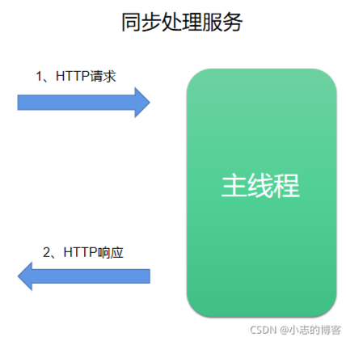

**异步处理：**一个http请求进来，一个tomcat或者中间件的主线程会调用一个副线程去执行业务逻辑，当副线程执行完以后，主线程再把结果返回。当副线程处理业务逻辑的过程中，主线程可以空闲出来处理其他请求。

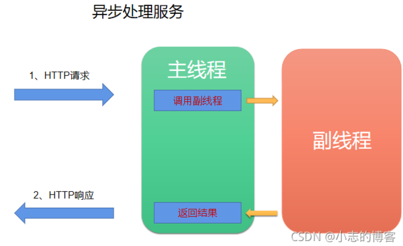

1、接收请求的为服务1，而处理请求的为服务2；
2、http请求发送到服务1后，服务1中的线程1会把请求发送到消息队列中；
3、而服务2监听消息队列，当监听到消息队列中有请求消息后，服务2去处理具体逻辑并把处理结果再放回消息队列；
4、同时服务1中有另外一个线程2去监听消息队列，如果发现消息队列中油处理结果的消息，会根据消息的结果返回http响应；
5、服务1中的线程1和线程2是隔离的。
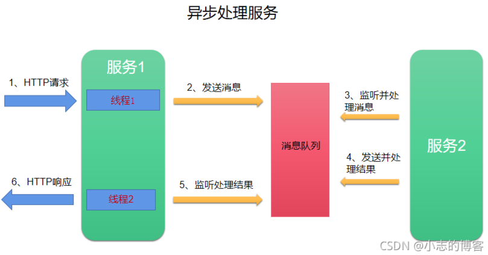


## 二、同步

特点：主线程**`nio-8080-exec-3`**阻塞等待这个service数据的返回

```java
@RestController
public class BlockController {

    private static final Logger log = LoggerFactory.getLogger(BlockController.class);

    @Autowired
    private TaskService taskService;

    @RequestMapping(value = "/get", method = RequestMethod.GET)
    public ResponseMsg<String> getResult(){

        log.info("接收请求，开始处理...");


        ResponseMsg<String> result =  taskService.getResult();


        log.info("接收任务线程完成并退出");

        return result;

    }

}
```

```java
@Service
public class TaskService {

    private static final Logger log = LoggerFactory.getLogger(TaskService.class);

    public ResponseMsg<String> getResult(){

        log.info("任务开始执行，持续等待中...");

        try {
            Thread.sleep(30000L);
        } catch (InterruptedException e) {
            e.printStackTrace();
        }

        log.info("任务处理完成");

        return new ResponseMsg<String>(0,"操作成功","success");

    }

}
```

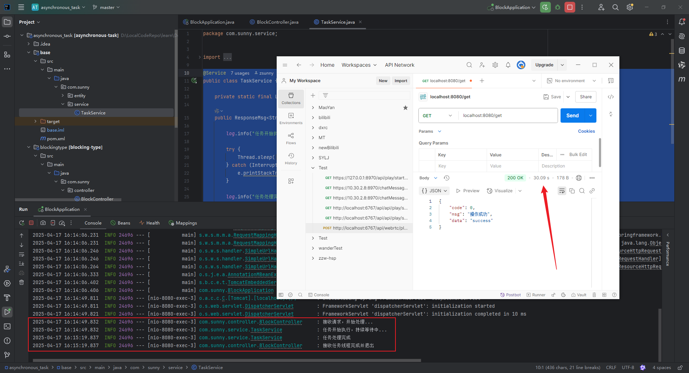

## 三、Callable异步

```java
@RestController
public class TaskController {

    private static final Logger log = LoggerFactory.getLogger(TaskController.class);

    @Autowired
    private TaskService taskService;

    @RequestMapping(value = "/get",method = RequestMethod.GET)
    public Callable<ResponseMsg<String>> getResult(){

        log.info("接收请求，开始处理...");

        Callable<ResponseMsg<String>> result = (()->{
            return taskService.getResult();
        });

        log.info("接收任务线程完成并退出");

        return result;
    }

}
```

```java
@Service
public class TaskService {

    private static final Logger log = LoggerFactory.getLogger(TaskService.class);

    public ResponseMsg<String> getResult(){

        log.info("任务开始执行，持续等待中...");

        try {
            Thread.sleep(30000L);
        } catch (InterruptedException e) {
            e.printStackTrace();
        }

        log.info("任务处理完成");

        return new ResponseMsg<String>(0,"操作成功","success");

    }

}
```

可以看到主线程**`nio-8081-exec-1`**立即返回数据，而不是阻塞等待service层的数据返回。而数据的获取交给**`MvcAsync1`**线程去进行处理。但是用户还是等待了30s，`16:34:50.810`至`16:35:20.819`。

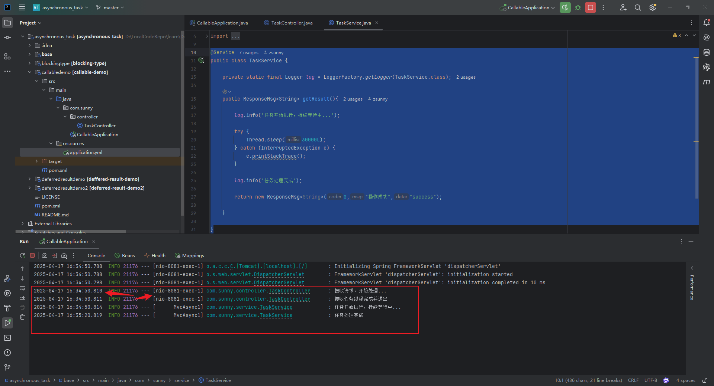

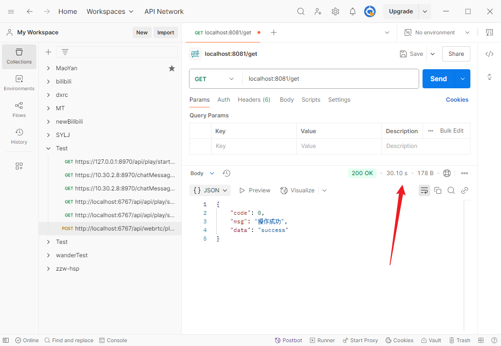

## 四、DeferredResult异步 ：案例一

**`任务实体类` 、`com/sunny/other/Task.java`**

```java
/**
 * 任务实体类
 */
@Data
@NoArgsConstructor
@AllArgsConstructor
public class Task {

    private int taskId;

    private DeferredResult<ResponseMsg<String>> taskResult;

    @Override
    public String toString() {
        return "Task{" +
                "taskId=" + taskId +
                ", taskResult" + "{responseMsg=" + taskResult.getResult() + "}" +
                '}';
    }
}
```

**`任务队列实体类`、`com/sunny/bean/TaskQueue.java`**

```java
@Component
public class TaskQueue {

    private static final Logger log = LoggerFactory.getLogger(TaskQueue.class);

    private static final int QUEUE_LENGTH = 10;

    private BlockingQueue<Task> queue = new LinkedBlockingDeque<>(QUEUE_LENGTH);

    private int taskId = 0;


    /**
     * 加入任务
     * @param deferredResult
     */
    public void put(DeferredResult<ResponseMsg<String>> deferredResult){

        taskId++;

        log.info("任务加入队列，id为：{}",taskId);

        queue.offer(new Task(taskId,deferredResult));

    }

    /**
     * 获取任务
     * @return
     * @throws InterruptedException
     */
    public Task take() throws InterruptedException {

        Task task = queue.poll();

        log.info("获得任务:{}",task);

        return task;

    }
}
```

**`任务执行类` `com/sunny/bean/TaskExecute.java`**

> @PostConstruct 是一个注解，用于标记在 Spring 容器完成依赖注入后需要执行的初始化方法。该方法会在所有必需的依赖注入完成后、类对外提供服务之前自动调用,也就是，启动启动类后，会自动执行@PostConstruct中的逻辑

```java
@Component
public class TaskExecute {

    private static final Logger log = LoggerFactory.getLogger(TaskExecute.class);

    private static final Random random = new Random();

    //默认随机结果的长度
    private static final int DEFAULT_STR_LEN = 10;

    //用于生成随机结果
    private static final String str = "abcdefghijklmnopqrstuvwxyzABCDEFGHIJKLMNOPQRSTUVWXYZ0123456789";

    @Autowired
    private TaskQueue taskQueue;


    /**
     * 初始化启动
     */
    @PostConstruct
    public void init(){

        log.info("开始持续处理任务");

        new Thread(this::execute).start();


    }


    /**
     * 持续处理
     * 返回执行结果
     */
    private void execute(){

        while (true){

            try {

                //取出任务
                Task task;

                synchronized (taskQueue) {

                    task = taskQueue.take();

                }

                if(task != null) {

                    //设置返回结果
                    String randomStr = getRandomStr(DEFAULT_STR_LEN);

                    ResponseMsg<String> responseMsg = new ResponseMsg<String>(0, "success", randomStr);

                    log.info("返回结果:{}", responseMsg);

                    task.getTaskResult().setResult(responseMsg);
                }

                int time = random.nextInt(10);

                log.info("处理间隔：{}秒",time);

                Thread.sleep(time*1000L);

            } catch (InterruptedException e) {
                e.printStackTrace();
            }


        }

    }

    /**
     * 获取长度为len的随机串
     * @param len
     * @return
     */
    private String getRandomStr(int len){

        int maxInd = str.length();

        StringBuilder sb = new StringBuilder();

        int ind;

        for(int i=0;i<len;i++){

            ind = random.nextInt(maxInd);

            sb.append(str.charAt(ind));

        }

        return String.valueOf(sb);

    }

}

```

**`Controller` `com/sunny/controller/TaskController.java`**

```java
@RestController
public class TaskController {

    private static final Logger log = LoggerFactory.getLogger(TaskController.class);

    //超时结果
    private static final ResponseMsg<String> OUT_OF_TIME_RESULT = new ResponseMsg<>(-1,"超时","out of time");

    //超时时间
    private static final long OUT_OF_TIME = 3000L;

    @Autowired
    private TaskQueue taskQueue;


    @RequestMapping(value = "/get",method = RequestMethod.GET)
    public DeferredResult<ResponseMsg<String>> getResult() {

        log.info("接收请求，开始处理...");

        //建立DeferredResult对象，设置超时时间，以及超时返回超时结果
        DeferredResult<ResponseMsg<String>> result = new DeferredResult<>(OUT_OF_TIME, OUT_OF_TIME_RESULT);

        result.onTimeout(() -> {
            log.info("调用超时");
        });

        result.onCompletion(() -> {
            log.info("调用完成");
        });

        //并发，加锁
        synchronized (taskQueue) {

            taskQueue.put(result);

        }


        log.info("接收任务线程完成并退出");

        return result;

    }

}
```

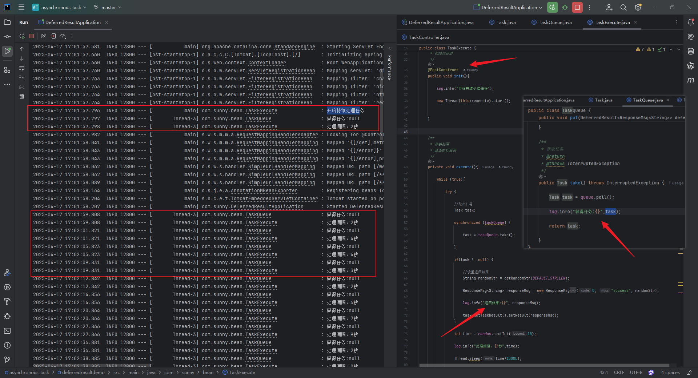

可以看到，启动后，TaskExecute的主线程`main`开启了另一个线程`Thread-3`执行了execute逻辑。

>  这个逻辑做的就是，不断从queue里面取出数据，然后弹出，但是一开始如果没有执行任何get请求，queue肯定是空的
>
> 所以报错获得任务:null ，这个是正常的，因为queue是空的，一旦执行get

📌`TaskQueue`是被**所有线程共享**的，这个是由于Spring默认的单例模式来决定的。所有当我请求get，往这个`TaskQueue`放入数据的时候，另一个execuate线程可以读取到`TaskQueue`里面的数据，来进行处理。

### **1. 核心组件**

#### **1.1 TaskExecute（任务执行器）**

- **职责** ：持续从任务队列中取出任务，异步生成随机字符串作为结果。
- 关键逻辑 
  - **`@PostConstruct init()`** ：在 Spring Bean 初始化时启动一个后台线程，开始执行 `execute()` 方法。
  - **`execute()`** ：无限循环从队列中取出任务，生成随机结果，并设置到任务的 `TaskResult` 中。
  - **线程安全** ：通过 `synchronized(taskQueue)` 确保多线程环境下对任务队列的线程安全访问。
  - **随机休眠** ：模拟任务处理耗时，避免 CPU 过载。

#### **1.2 TaskController（控制器）**

- **职责** ：接收 HTTP 请求，将任务封装为 `DeferredResult` 放入队列，并立即返回。
- 关键逻辑 
  - **`DeferredResult`** ：Spring MVC 的异步结果对象，允许请求线程立即释放，由后台线程后续填充结果。
  - **超时机制** ：设置超时时间（3秒），超时后返回预定义的超时结果。
  - **任务入队** ：通过 `synchronized(taskQueue)` 将 `DeferredResult` 安全地放入队列。

📌 **Q: **  **DeferredResult** 到底异步在哪里，体现在什么地方？

**``Example，举个栗子🌰``**

如图，我用postman发出一个请求，显示请求中


打开后台idea的控制台，发现这个请求的线程是**`nio-8082-exec-6`**,可以发现，**没有阻塞，立即返回**，时间是**2025-04-17 18:03:27.984**至**2025-04-17 18:03:27.985**，之后这个线程就结束了

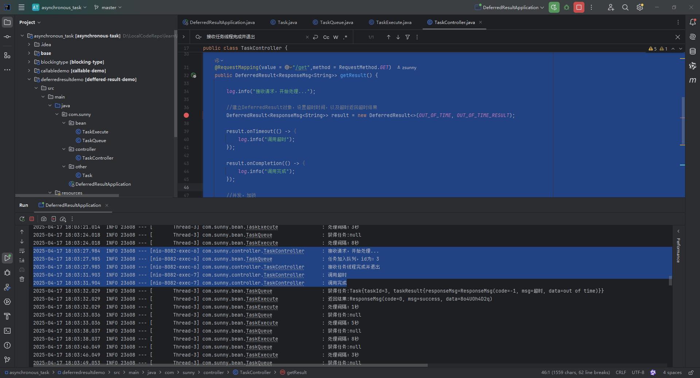

之后等待三秒钟，`TaskQueue`并没有处理，于是另一个线程`nio-8082-exec-7`就执行了DeferredResult设置的`onTimeout`和`onCompletion`的回调函数，时间是`2025-04-17 18:03:27.984`至`2025-04-17 18:03:32.029`

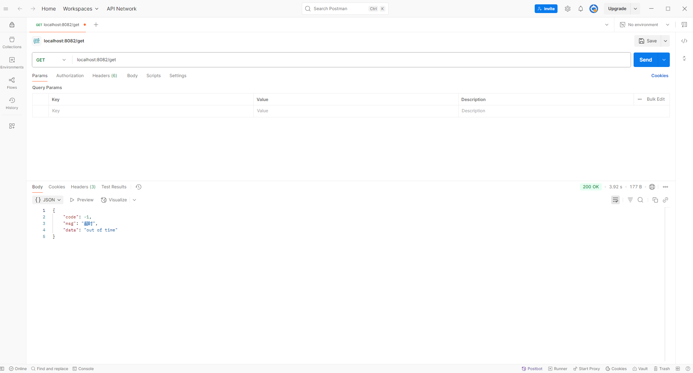

之后即使`TaskExecute`执行力`setResult`也无济于事了

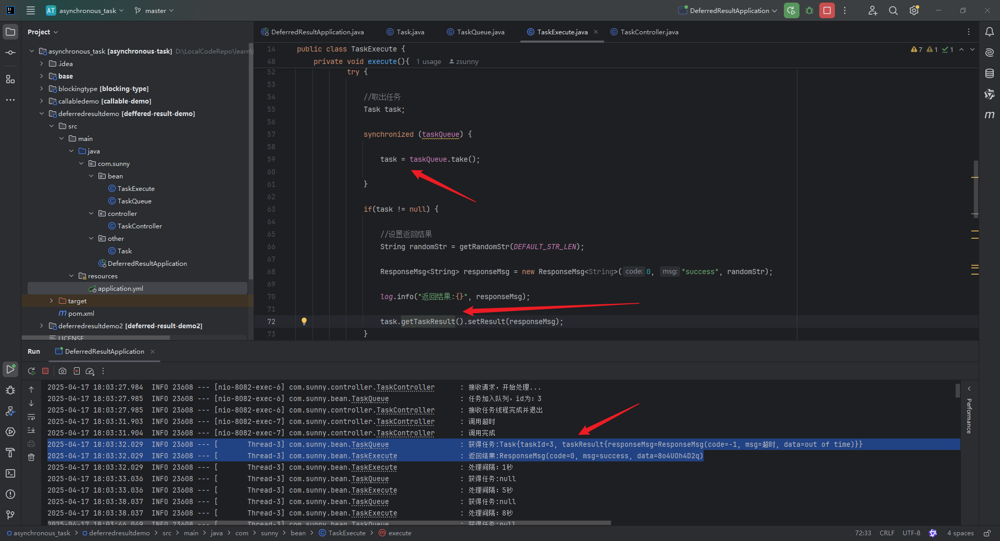

当然也会有运气好的情况，刚刚调用请求，把Task放入Queue，就被Thread-3捕获处理了，并进行了setResult操作，之后另一个线程`nio-8082-exec-2`感知到后，立马返回了结果给前端(Postman)，并且触发了回调函数`onCompletion`


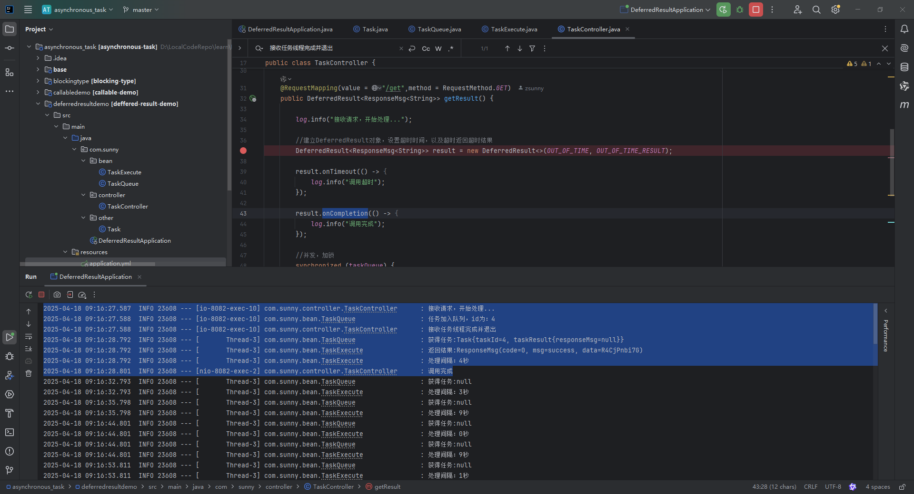

## Q&A

### 1. 什么是长轮询？

以下是 **长轮询（Long Polling）** 、**传统轮询（Polling）** 和 **WebSocket** 的对比表格，帮助你快速理解差异：

| **特性**         | **传统轮询（Polling）**                | **长轮询（Long Polling）**                                   | **WebSocket**                        |
| ---------------- | -------------------------------------- | ------------------------------------------------------------ | ------------------------------------ |
| **定义**         | 客户端按固定频率发送请求               | 客户端发送请求后，服务端挂起直到有数据或超时                 | 全双工通信协议，保持长连接           |
| **连接方式**     | 短连接（每次请求后关闭）               | 短连接（每次响应后关闭，客户端立即重连）                     | 长连接（持续保持）                   |
| **实时性**       | 低（取决于轮询间隔，如1秒）            | 中高（取决于服务端处理速度）                                 | 高（实时双向通信）                   |
| **资源消耗**     | 高（频繁请求消耗带宽和服务器资源）     | 中低（减少无效请求）                                         | 低（单次连接，数据传输高效）         |
| **实现复杂度**   | 简单（`setInterval`发送请求）          | 中等（需管理挂起的请求和超时）                               | 复杂（需维护连接状态和心跳机制）     |
| **兼容性**       | 兼容所有浏览器                         | 兼容所有浏览器                                               | 需现代浏览器支持（IE 10+）           |
| **典型适用场景** | 对实时性要求低的简单场景（如天气查询） | 实时性要求中等的场景（如聊天、通知）                         | 高实时性场景（如在线游戏、实时协作） |
| **代码示例**     | `setInterval(fetchData, 1000);`        | `DeferredResult<RS> deferredResult = new DeferredResult<>(12000L);` | `new WebSocket('ws://server');`      |
| **关键机制**     | 固定频率轮询                           | `setResult`触发响应或超时                                    | 双向消息推送                         |

### 2. **为什么 `DeferredResult` 是长轮询？**

- **异步等待** ：服务端不主动关闭连接，而是等待事件（`setResult` 或超时）。
- **资源高效** ：避免频繁创建/销毁连接，减少无效请求。
- **实时性** ：数据一旦可用，立即返回（无需等待下一个轮询周期）。
