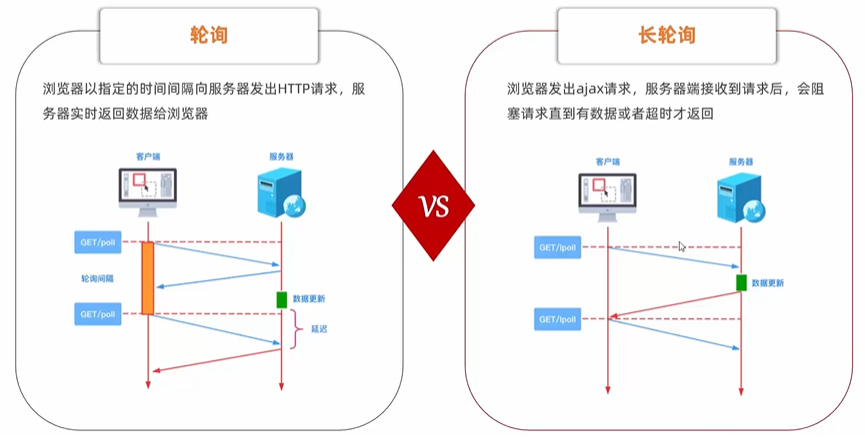
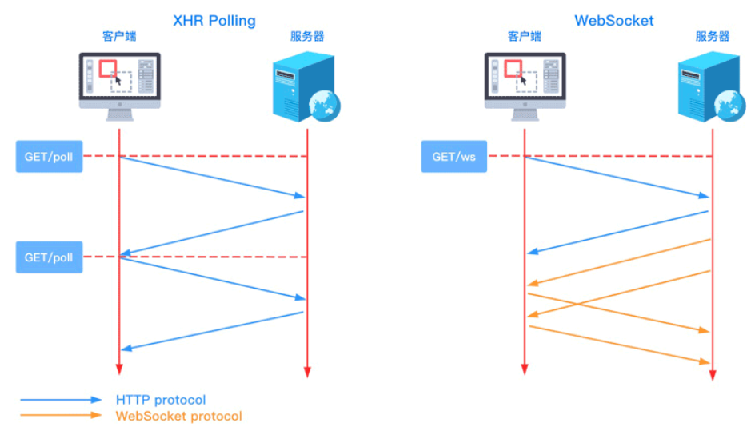
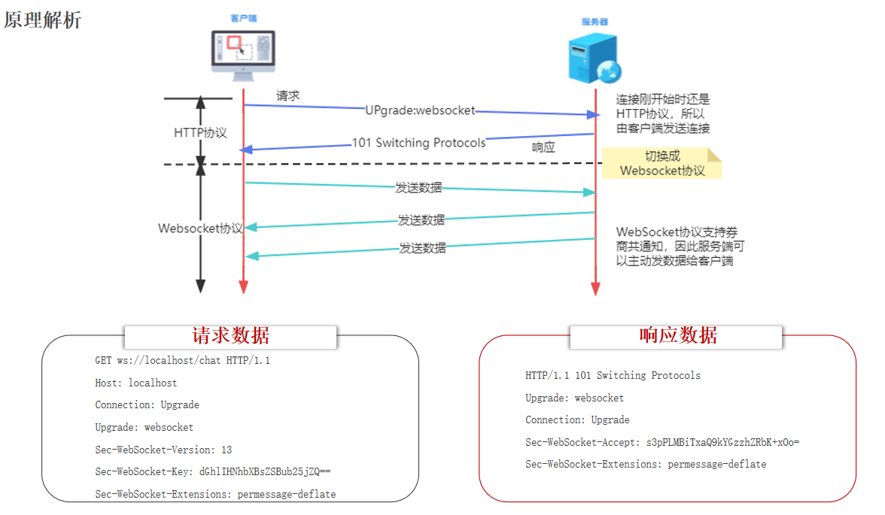
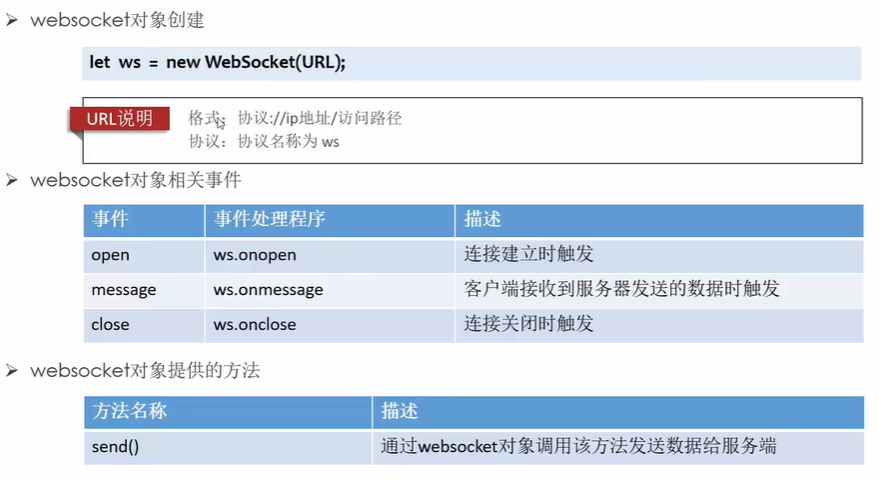
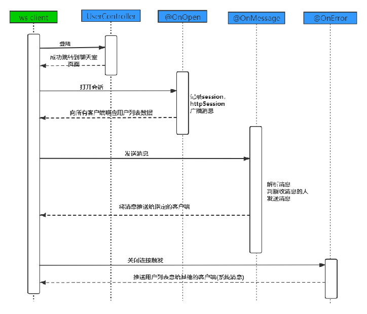
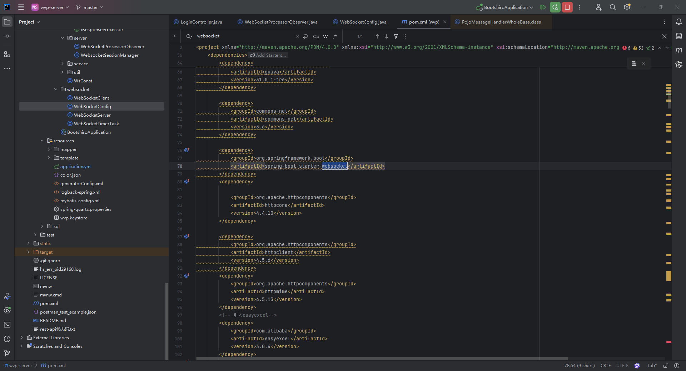
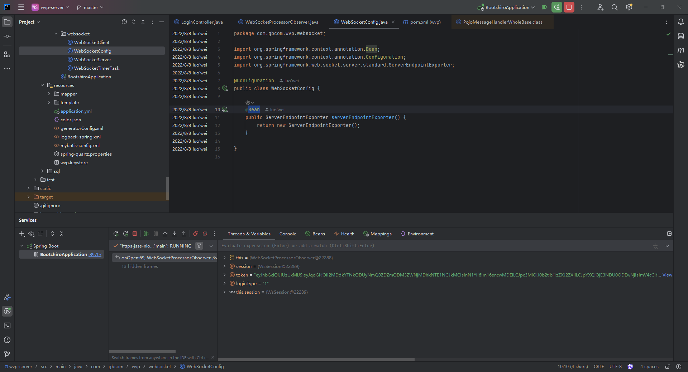

# Websocket学习文档

> 参考视频
>
> ```url
> 【黑马java实战教程，教你快速上手新项目，使用websocket搭建在线聊天室】 https://www.bilibili.com/video/BV1KN411n7WD/?share_source=copy_web&vd_source=f7f48f1ed79263bbbc17c452084e9965
> ```

## 一、消息推送常用方式介绍

- 轮询
- 长轮询



- websocket
- SSE(server-sentevent):服务器发送事件（有点像一点点追加信息的感觉）

    - SSE在服务器和客户端之间打开一个单向通道(服务器向客户端)
    - 服务端响应的不再是一次性的数据包，而是text/event-stream类型的数据流信息服务器
    - 数据变更时将数据流式传输到客户端

##  二、websocket介绍

WebSocket是一种在基于TCP连接上进行全双工通信的协议

> [!NOTE]
>
> 全双工（Full Duplex）：允许数据在两个方向上同时传输。半双工（Half Duplex）：允许数据在两个方向上传输，但是同一个时间段内只允许一个方向上传输。



websocket协议，也是从http升级而来的，有一次http的握手



## 三、websocketAPI

### 客户端【浏览器】API

> 一般主流的浏览器都用了html5，html5原生支持ws协议



### 服务端API

Tomcat的7.0.5 版本开始支持WebSocket,并且实现了Java WebSocket规范。

Java WebSocket应用由一系列的Endpoint组成。Endpoint 是一个java对象，代表WebSocket链接的一端，对于服务端，我们可以视为处理具体WebSocket消息的接口。

我们可以通过两种方式定义Endpoint:

- 第一种是编程式， 即继承类 javax.websocket.Endpoint并实现其方法。
- 第二种是注解式, 即定义一个POJO, 并添加 @ServerEndpoint相关注解。

Endpoint实例在WebSocket握手时创建，并在客户端与服务端链接过程中有效，最后在链接关闭时结束。在Endpoint接口中明确定义了与其生命周期相关的方法， 规范实现者确保生命周期的各个阶段调用实例的相关方法。生命周期方法如下：

> [!IMPORTANT]
>
> | **方法**  | **描述**                                                     | **注解** |
> | --------- | ------------------------------------------------------------ | -------- |
> | onOpen()  | 当开启一个新的会话时调用，该方法是客户端与服务端握手成功后调用的方法 | @OnOpen  |
> | onClose() | 当会话关闭时调用                                             | @OnClose |
> | onError() | 当连接过程异常时调用                                         | @OnError |

> [!IMPORTANT]
>
> **服务端如何接收客户端发送的数据呢？**

- 编程式

     - 通过添加 MessageHandler 消息处理器来接收消息

- 注解式

     - 在定义Endpoint时，通过@OnMessage注解指定接收消息的方法

> [!IMPORTANT]
>
> **服务端如何推送数据给客户端呢？**

发送消息则由 RemoteEndpoint 完成， 其实例由 Session 维护。发送消息有2种方式发送消息

- 通过session.getBasicRemote 获取同步消息发送的实例 ， 然后调用其 sendXxx()方法发送消息

- 通过session.getAsyncRemote 获取异步消息发送实例，然后调用其 sendXxx() 方法发送消息

```java
@ServerEndpoint("/chat")
@Component
public class ChatEndpoint {

    @OnOpen
    // 连接建立时被调用
    public void onOpen(Session session, EndpointConfig config) {
    }

    @OnMessage
    // 接收到客户端发送的数据时被调用
    public void onMessage(String message) {
    }

    @OnClose
    // 连接关闭时被调用
    public void onClose(Session session) {
    }
}
```

## 四、在线聊天室

- 流程分析

注意，OnError更正为**`OnClose`**



- 消息格式

     - 客户端 `-->` 服务端

       ```json
       {"toName":"张三","message":"你好"}
       ```

     - 服务端 `-->` 客户端

       **系统消息格式**：

       ```json
       {"system":true,"fromName":null,"message"：["李四","王五"]}
       ```
       
       **推送给某一个用户的消息格式**：
       
       ```json
       {"system":false,"fromName":"张三","message"："你好"}
       ```

- 代码实现

  - 引入坐标

      ```xml
      <dependency>
          <groupId>org.springframework.boot</groupId>
          <artifactId>spring-boot-starter-websocket</artifactId>
      </dependency>
      
      ```
      
      
      
  - 编写配置类，扫描添加有@ServerEndpoint注解的 Bean

      ```java
      @Configuration
      public class WebSocketConfig {
      
          @Bean
          // 注入 ServerEndpointExporter，自动注册使用@ServerEndpoint注解的 Bean
          public ServerEndpointExporter serverEndpointExporter() {
              return new ServerEndpointExporter();
          }
      }
      ```
      
      
      
  - 编写配置类，用于获取 HttpSession 对象

    ```java
    public class GetHttpSessionConfigurator extends ServerEndpointConfig.Configurator {
    
        @Override
        public void modifyHandshake(ServerEndpointConfig sec, HandshakeRequest request, HandshakeResponse response) {
            HttpSession httpSession = (HttpSession) request.getHttpSession();
            // 将 HttpSession 对象存储到配置对象中
            sec.getUserProperties().put(HttpSession.class.getName(), httpSession);
        }
    }
    ```

  - 在 @ServerEndpoint 注解中引入配置器

    ```java
    @ServerEndpoint(value = "/chat", configurator = GetHttpSessionConfigurator.class)
    ```

    
  


