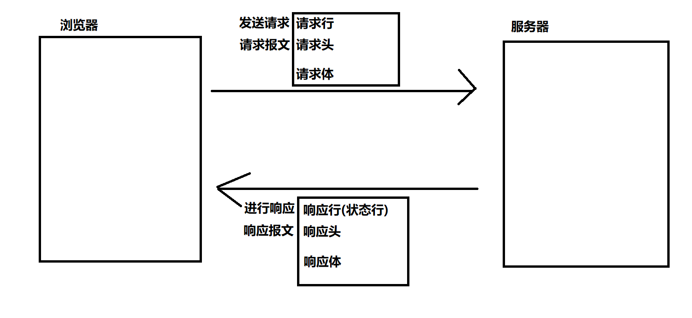
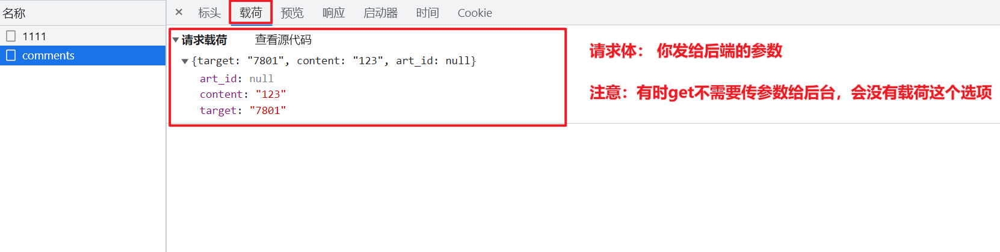
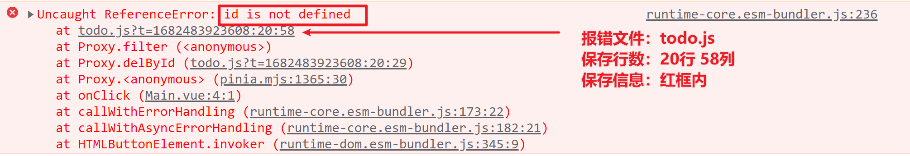

# 调试入门秘籍

## 学习目标

报错和Bug，是贯穿程序员整个编程生涯中，无法回避的问题。而调试，就是帮助程序员定位问题、解决问题的重要手段，因此，**调试是每个程序员必备技能**。


本次课程需要基础的CSS、JS知识作为支撑，如果懂一些Vue和React语法，那就更好了。如果还没有掌握以上知识的同学，可以联系运营老师，获取福利课。


调试本身可分为两个过程：**定位问题** 和 **解决问题**。


本课程将集中讨论如何**快速发现** 和 **定位问题**，解决问题本身就是开发的基本功，具体办法涉及框架，这里不深入探讨。我们将从以下几点开始：

1. 掌握调试工具的基本使用
2. 调试基本流程
3. 通过案例定位Bug，修复Bug。


学完今天的内容：

1. 掌握Chrome调试工具的基本使用
2. 认识常见`JS`4种报错姿势
3. 能够在报错中提取关键信息
4. 能够通过调试工具、二分注释排除法，准确定位代码Bug位置。


**验证效果：**

1. **常见Bug，1分钟**内找出Bug位置。
2. **隐藏Bug，二分注释法**，准确找出Bug位置。


## Chrome DevTool调试工具

效果图：


**两种打开方式：**

1. 右击网页-选择"检查"
2. 快捷键`F12` 或 `Fn` + `F12`


**修改停靠位置：**


## 调试工具的基本功能介绍

调试工具的面板有很多，先掌握做常用的**4个**：

- **元素(Element)**
- **控制台（Console）**
- **源代码（Sources）**
- **网络（Network）**


如下图：


<hr />

### 元素 (Element)

**作用：**快速调试样式

**注意：**刷新会丢失

**实用小技巧：**🔔🔔

1. 调试样式 **上 下** 方向键可以快速微调
1. 存储为全局变量，快速获取`dom`元素


###  控制台（Console）

**作用：**输出浏览器运行过程中产生的信息

**实用小技巧：**🔔🔔

1. 可以当做计算器
2. 可以运行代码


**如何打印不同的颜色？**

```js
  console.error('这是一条红色的文字');
  console.log('这是一条黑色的文字');
  console.warn('这是一条黄色的文字');
```


**如何打印一个DOM元素？**

```js
	const h1Node = document.querySelector('h1')

  // JS中万物皆对象
  // dir专门打印对象
  console.dir(h1Node)

	function hello() { }

	console.dir(hello)
```


### 源代码 （Source）

> 断点：代码会在断点处停住，给开发者观察的机会

需要掌握的操作按钮：


上面有几个控制执行的按钮，分别是：

 恢复执行

 跳过下一个函数的执行过程

 进入函数调用

 跳出函数调用

单步执行

 让断点失效


### 网络 （NetWork）

知识补充：浏览器与服务器通过HTTP协议通信流程




访问示例网站（http://geek.itheima.net/），观察请求信息：

浏览器发的请求信息展示





服务端响应的信息展示：


### 了解的HTTP状态码有哪些？

扩展：[完整的状态码](https://www.runoob.com/http/http-status-codes.html)

**成功（2XX）**

| 状态码 | 原因短语   | 说明                                                         |
| ------ | ---------- | ------------------------------------------------------------ |
| 200    | OK         | 表示从客户端发来的请求，在服务器端被正确处理                 |
| 201    | Created    | 请求已经被实现，⽽且有⼀个新的资源已经依据请求的需要⽽建⽴<br />通常是在POST请求，或是某些PUT请求之后创建了内容, 进行的返回的响应 |
|        |            |                                                              |
| 204    | No content | 表示请求成功，但响应报⽂不含实体的主体部分（后端不返回任何内容） |
|        |            |                                                              |


**客户端错误（4XX）**

| 状态码  | 原因短语           | 说明                                          |
| ------- | ------------------ | --------------------------------------------- |
| **400** | **Bad Request**    | **请求报⽂存在语法错误(（传参格式不正确）** - |
|         |                    |                                               |
| 401     | `UnAuthorized`     | 权限认证未通过(没有权限)                      |
|         |                    |                                               |
| 404     | Not Found          | 表示在服务器上没有找到请求的资源              |
| 405     | Method Not Allowed | 请求的方法不对                                |
|         |                    |                                               |


**服务端错误（5XX）**

| 状态码 | 原因短语             | 说明                                                 |
| ------ | -------------------- | ---------------------------------------------------- |
| 500    | Internal Sever Error | 表示服务器端在执⾏请求时发⽣了错误                   |
|        |                      |                                                      |
| 503    | Service Unavailable  | 表明服务器暂时处于超负载或正在停机维护，⽆法处理请求 |
|        |                      |                                                      |


## 调试基本流程

核心原则：精确定位bug位置，分析原因、解决问题。


### 整体流程：

1. **有报错**：查看**控制台**，定位是否为语法问题、类库兼容问题。
2. **通信不成功**：查看**网络**，定位前端问题，或是后端问题。
4. 无报错，或报错且无有效信息-**二分注释排查法**。


### 控制台报错：💥💥💥💥💥

> 程序报错是编程中，设计的辅助开发机制，报错是要把关键信息，给程序员查看。
> 因此，看见报错不要慌，看见英文不要慌。
>
> 掌握以下几个关键点，不会英文，也能吊打报错。
> 报错不可怕，可怕的是不报错。


报错可简单分**两大类：**

1. `JS`常见错误
2. 类库兼容问题

程序员问题，掌握报错查看技巧，快速解决。类库兼容问题，面向百度、`Github`、`Google`编程。

<hr />


####  认识-JS常见错误

> 思考：是否留意过控制台报错，有几种类型？各自代表什么？


参考：[来自1000个大型JS项目中的报错](https://rollbar.com/blog/top-10-javascript-errors-from-1000-projects-and-how-to-avoid-them/)

常见错误有3~4类：

1. `SyntaxError`（语法错误）

   

2. `ReferenceError` （引用错误）

   

3. `TypeError` （类型错误）

   

4. `RangeError `(死循环)

   

小结：

- 常见报错类型-**4类**：
  - `SyntaxError` - 语法错误
  - `ReferenceError` -  引用错误，通常是变量或方法没有声明，直接使用
  - `TypeError` -  类型错误，通常是在错误的数据类型上，访问某个方法或属性
  - `RangeError` - 死循环
- 报错中需要关注的三类信息
  - 报错信息：错误类型、提示文字
  - 报错文件
  - 报错行数


小技巧🔔：

1. **从左向右、从上向下**阅读报错
2. **点击报错文件**，Chrome调试工具，**自动定位到报错位置**。

<hr />


#### 认识-类库兼容问题

目前前端工程化、模块化开发，一个项目中会使用到大量的第三方库，而不同的库升级速度之间存在差异，会导致前端出现大量的兼容报错。

- 如何界定是第三方库的问题？
- 如何解决此类问题？


**如何确定是第三方库的问题？**

报错信息中无源码文件提示，无常见错误提示。如下图


**如何解决此类问题？**

- 面向百度编程、面向Google编程。
- 经验积累，看得多，了解的多。


###  前后端通信问题

> 目标：前后端分离开发方式普及，前后端先各自开发，再联调。因此，前端开发工程师，需要熟练使用`NetWork`面试调试。


**如何确定前后端通信出现问题？**

> HTTP状态码：出现`4XX、5XX`

`4XX`：根据状态码和接口报错信息，修复代码。

`5XX`：提供调用数据，通知后台查看。

`2XX`：以预期数据与实际数据一致为准。


#### 状态码`4XX`

> 目标：`4XX`大概率是前端调用API出现问题，需要熟练结合 `Console` 和 `NetWork` 面板处理。


出现4XX，结合状态码快速分析原因：

400：请求体传递参数不对。

1. NetWork查看请求体
2. 比对接口文档，
   1. 数据格式，是否一致。
   2. 属性名，是否一致。

401：token失效，请求头没有携带token。

1. 查看请求头，是否有token
2. 重新登录，验证token过期。


404：没有该接口（通常是url路径写的有问题）

1. 查看请求头上的url路径
2. 核对接口文档的url路径


405：请求方式不对（通常是get  、post、put等方式写错）

1. 查看请求头中的method字段
2. 核对接口文档的method字段


#### 快速修复技巧

> 目标：原因已经确定，如果快速定位代码？

可以通过善用Source面板。


#### 状态码`5XX`

> 目标：5XX一般为后台问题，可以把**关键信息**发送给后端，通知后端参与处理。

想想如下对话：

前端："老哥，你的接口报500，你帮忙看看？"

后台："哪个接口报错？"

前端："xxx接口报错"


......10分钟.......

后台：“你调接口，传了什么参数？”


.... 这个时候你可能忘了10分钟前调用接口传了什么参数

前端：“稍等，我复现一下”.


...这个时候你不得不听下手头工作，去复现报错，再发给后台


...10分钟后...

后台：“没测出来啊，响应有什么报错提示吗？”

<hr />


**建议一次性发给后端的数据：**

请求路径

请求方式

状态码

请求体（载荷）：数据

响应体（预览）


#### 状态码`2XX`

> 目标：2XX一般代表成功，但也不绝对。
>
> 定位：以预期数据与实际数据，是否相符合为准。


**建议一次性发给后端的数据：**

请求路径

请求方式

状态码

请求体（载荷）：数据

响应体（预览）


### 二分注释法

> 目标：Bug是编码错误导致的。
>
> 推导1：删除掉所有的代码，应该不会有Bug存在。
>
> 推导2：删除掉错误的代码，应该不会有Bug存在。


程序员最头疼的Bug，没有报错，没有任何提示。

步骤：

1. 通过不断注释代码，观察程序是否恢复正常
2. 注释掉部分代码后，程序正常，证明该部分代码有Bug
3. 在Bug部分，继续小部分的注释，观察程序是否正常。
4. 持续1-3步骤，定位出Bug位置。


## 总结

学完本节课程，应该具备以下能力：

1. 掌握Chrome调试工具的基本使用
2. 认识常见报错的种类
3. 能够在报错中提取关键信息
4. 能够通过调试工具、二分注释排除法，准确定位代码Bug位置。
