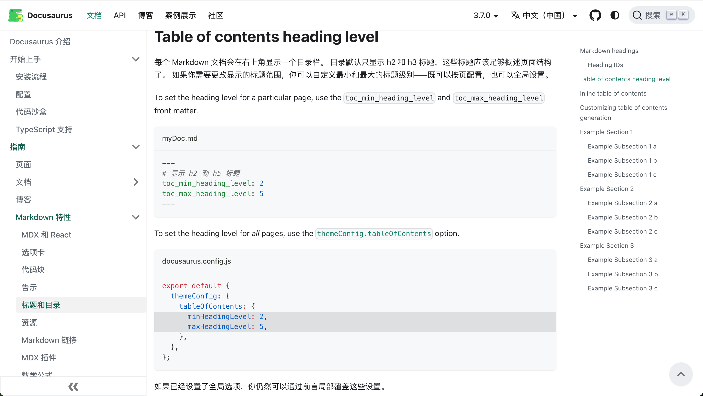

# Docusaurus_Q&A

## 一、Doc(MarkDown)

### 1.如何自定义目录栏显示层级？
Hello你好yaya
docusaurus 目录默认只显示 h2 和 h3 标题，但可以在md文档的前面加上yaml代码

```url
https://docusaurus.io/zh-CN/docs/markdown-features/toc
```

```yaml
---
# 显示 h2 到 h5 标题
toc_min_heading_level: 2
toc_max_heading_level: 5
---
```



注意：toc_min_heading_level最低为2