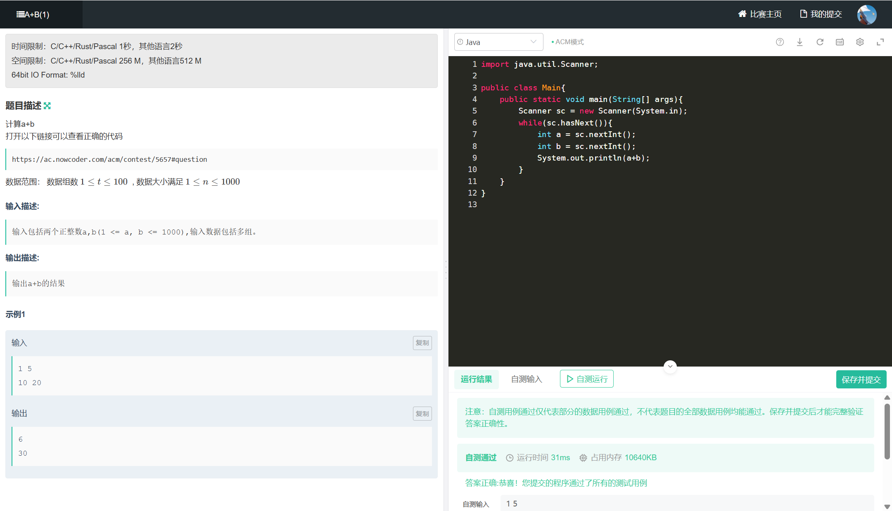
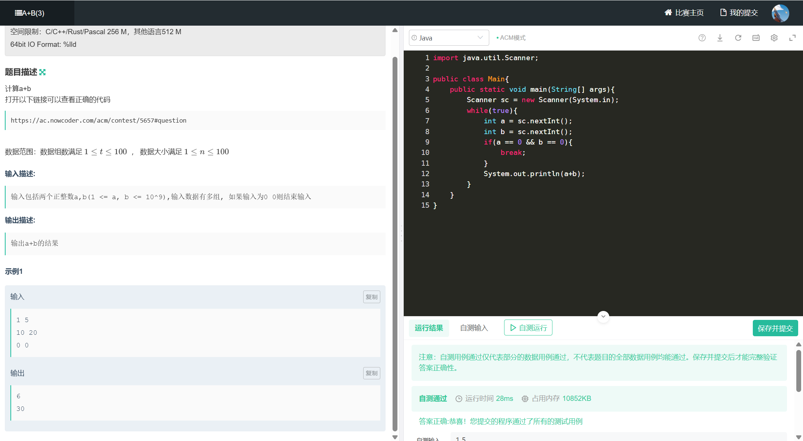
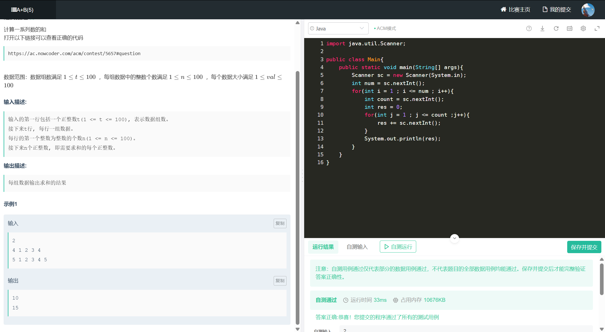
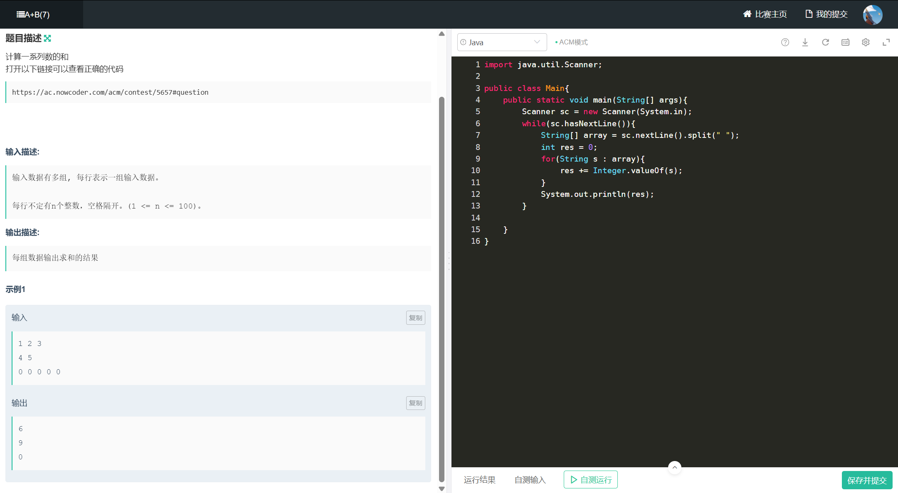
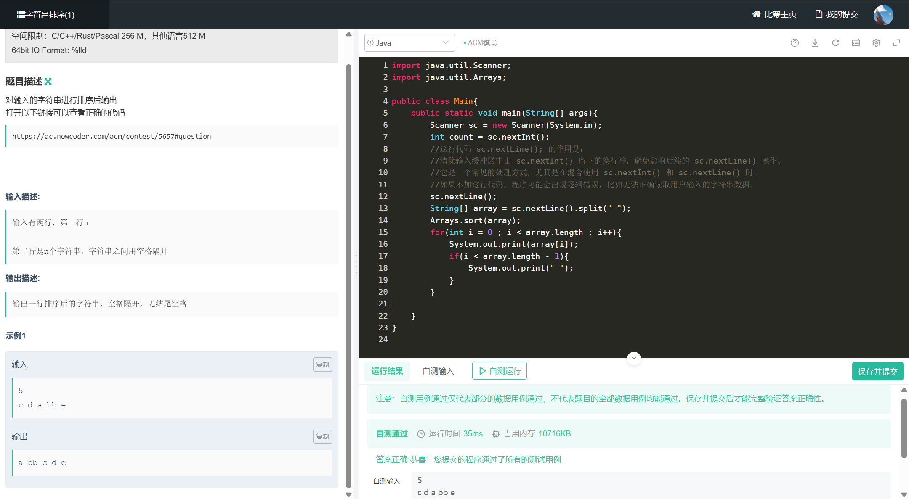
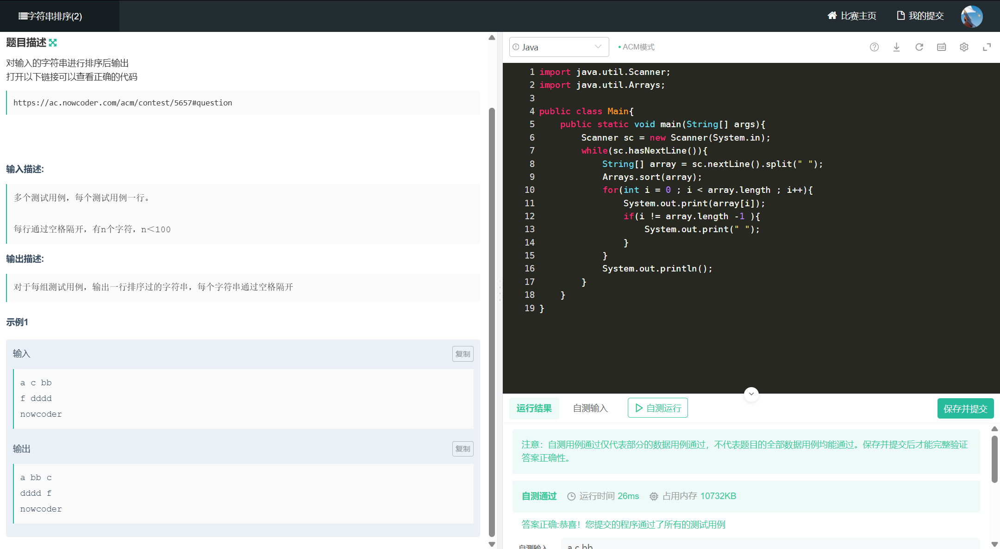
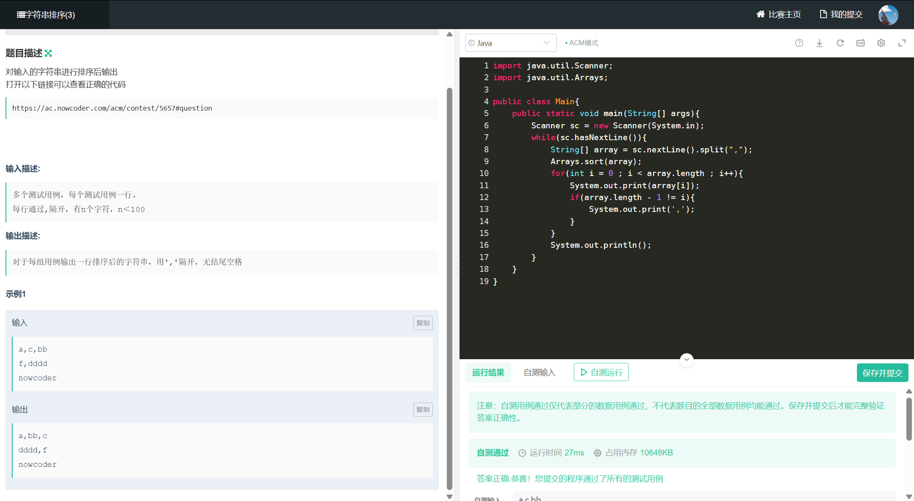

# ACM模式

**输入输出练习场：**

[牛客竞赛: OJ在线编程常见输入输出练习场](https://ac.nowcoder.com/acm/contest/5652?from=hr_test#question)

## 〇、常识

- **`LinkedList`、`HashSet`、`TreeMap`、`Arrays` 等** ：均属于 `java.util` 包，需显式导入。

- **`String`、`Math`、`System` 等** ：属于 `java.lang` 包，无需导入

- 可以通过 **`import java.util.*;`** 一次性导入 `java.util` 包中的所有类

  ```java
  import java.util.LinkedList
  import java.util.HashMap
  import java.util.ArrayList
  import java.util.Arrays
  //一次性导入
  import java.util.*;
  ```
  
- `Integer.parseInt()`和`Integer.valueOf()`的主要区别？

  **`Integer.parseInt(String s)`**会返回一个`Int`类型,但是**`Integer.valueOf(String s)`**会返回一个`Integer`类型

​	Java中有基本类型和包装类型的自动转换，成为自动装箱和拆箱，以下是对照的表格

| 基本类型  | 包装类      | 自动装箱示例           | 自动拆箱示例                        |
| --------- | ----------- | ---------------------- | ----------------------------------- |
| `byte`    | `Byte`      | `Byte b = 100;`        | `byte b = new Byte((byte)100);`     |
| `short`   | `Short`     | `Short s = 200;`       | `short s = new Short((short)200);`  |
| `int`     | `Integer`   | `Integer i = 300;`     | `int i = new Integer(300);`         |
| `long`    | `Long`      | `Long l = 400L;`       | `long l = new Long(400L);`          |
| `float`   | `Float`     | `Float f = 3.14f;`     | `float f = new Float(3.14f);`       |
| `double`  | `Double`    | `Double d = 2.718;`    | `double d = new Double(2.718);`     |
| `char`    | `Character` | `Character c = 'A';`   | `char c = new Character('A');`      |
| `boolean` | `Boolean`   | `Boolean bool = true;` | `boolean bool = new Boolean(true);` |

## 一、字符串

### 1. String的基本特性

String是Java中的引用类型，一旦创建，内容不可变（immutable）。String对象存储在字符串常量池中，相同内容的字符串会共享同一个对象。

```java
// 两种创建方式
String s1 = "hello"; // 字面量方式，直接在常量池中创建
String s2 = new String("hello"); // 使用构造函数，在堆中创建对象
```

### 2. 常用API

#### 2.1 长度和访问

- **length()**: 获取字符串长度
  ```java
  String str = "Hello";
  int len = str.length(); // 返回5
  ```

- **charAt(int index)**: 获取指定索引位置的字符
  ```java
  String str = "Hello";
  char ch = str.charAt(2); // 返回'l'
  ```

- **toCharArray()**: 将字符串转换为字符数组
  ```java
  String str = "Hello";
  char[] chars = str.toCharArray(); // 返回{'H','e','l','l','o'}
  ```

#### 2.2 查找和判断

- **indexOf(String str)**: 查找子字符串第一次出现的位置
  ```java
  String str = "Hello world";
  int index = str.indexOf("world"); // 返回6
  ```

- **indexOf(String str, int fromIndex)**: 从指定位置开始查找
  ```java
  String str = "Hello world Hello";
  int index = str.indexOf("Hello", 2); // 返回12
  ```

- **lastIndexOf(String str)**: 查找子字符串最后一次出现的位置
  ```java
  String str = "Hello world Hello";
  int index = str.lastIndexOf("Hello"); // 返回12
  ```

- **contains(CharSequence s)**: 判断是否包含指定字符序列
  ```java
  String str = "Hello world";
  boolean contains = str.contains("world"); // 返回true
  ```

- **startsWith(String prefix)**: 判断是否以指定前缀开始
  ```java
  String str = "Hello world";
  boolean starts = str.startsWith("Hello"); // 返回true
  ```

- **endsWith(String suffix)**: 判断是否以指定后缀结束
  ```java
  String str = "Hello world";
  boolean ends = str.endsWith("world"); // 返回true
  ```

- **isEmpty()**: 判断字符串是否为空
  ```java
  String str = "";
  boolean empty = str.isEmpty(); // 返回true
  ```

- **isBlank()** (Java 11+): 判断字符串是否为空或仅包含空白字符
  ```java
  String str = "  \t  ";
  boolean blank = str.isBlank(); // 返回true
  ```

#### 2.3 字符串比较

- **equals(Object obj)**: 比较字符串内容是否相等
  ```java
  String s1 = "hello";
  String s2 = "hello";
  boolean equal = s1.equals(s2); // 返回true
  ```

- **equalsIgnoreCase(String anotherString)**: 忽略大小写比较
  ```java
  String s1 = "Hello";
  String s2 = "hello";
  boolean equal = s1.equalsIgnoreCase(s2); // 返回true
  ```

- **compareTo(String anotherString)**: 按字典顺序比较两个字符串
  ```java
  String s1 = "apple";
  String s2 = "banana";
  int result = s1.compareTo(s2); // 返回负数，表示s1在s2之前
  ```

#### 2.4 字符串截取和分割

- **substring(int beginIndex)**: 截取从指定索引到结尾的子字符串
  ```java
  String str = "Hello world";
  String sub = str.substring(6); // 返回"world"
  ```

- **substring(int beginIndex, int endIndex)**: 截取指定范围的子字符串，左闭右开
  
  ```java
  String str = "Hello world";
  String sub = str.substring(0, 5); // 返回"Hello"
  ```
  
- **split(String regex)**: 使用正则表达式分割字符串
  ```java
  String str = "apple,banana,orange";
  String[] fruits = str.split(","); // 返回["apple", "banana", "orange"]
  ```

- **split(String regex, int limit)**: 限制分割次数
  ```java
  String str = "apple,banana,orange,grape";
  String[] fruits = str.split(",", 3); // 返回["apple", "banana", "orange,grape"]
  ```

#### 2.5 字符串修改

- **replace(char oldChar, char newChar)**: 替换所有指定字符
  ```java
  String str = "Hello";
  String newStr = str.replace('l', 'L'); // 返回"HeLLo"
  ```

- **replace(CharSequence target, CharSequence replacement)**: 替换所有指定子字符串
  ```java
  String str = "Hello world";
  String newStr = str.replace("world", "Java"); // 返回"Hello Java"
  ```

- **replaceAll(String regex, String replacement)**: 使用正则表达式替换
  ```java
  String str = "Hello123World456";
  String newStr = str.replaceAll("\\d+", ""); // 返回"HelloWorld"
  ```

- **toLowerCase()**: 转换为小写
  ```java
  String str = "HELLO";
  String lower = str.toLowerCase(); // 返回"hello"
  ```

- **toUpperCase()**: 转换为大写
  ```java
  String str = "hello";
  String upper = str.toUpperCase(); // 返回"HELLO"
  ```

- **trim()**: 去除首尾空白字符
  ```java
  String str = "  Hello  ";
  String trimmed = str.trim(); // 返回"Hello"
  ```

- **strip()** (Java 11+): 去除首尾空白字符（支持Unicode空白）
  ```java
  String str = "  Hello  ";
  String stripped = str.strip(); // 返回"Hello"
  ```

### 3. char[]和String的转换

#### 3.1 String转char[]

```java
String str = "Hello";
char[] chars = str.toCharArray();
// chars = {'H', 'e', 'l', 'l', 'o'}
```

#### 3.2 char[]转String

```java
// 方式1：使用构造函数
char[] chars = {'H', 'e', 'l', 'l', 'o'};
String str1 = new String(chars);
// str1 = "Hello"

// 方式2：使用构造函数并指定范围
char[] chars = {'H', 'e', 'l', 'l', 'o', 'W', 'o', 'r', 'l', 'd'};
String str2 = new String(chars, 0, 5);
// str2 = "Hello"

// 方式3：使用valueOf方法
String str3 = String.valueOf(chars);
// str3 = "Hello"
```

### 4. StringBuilder和StringBuffer

由于String是不可变的，频繁的字符串拼接会创建多个对象，影响性能。可以使用StringBuilder（非线程安全）或StringBuffer（线程安全）进行高效的字符串操作。

```java
// 使用StringBuilder
StringBuilder sb = new StringBuilder();
sb.append("Hello");
sb.append(" ");
sb.append("World");
String result = sb.toString(); // 返回"Hello World"

// 常用方法
StringBuilder sb = new StringBuilder("Hello");
sb.insert(5, " Java"); // 插入字符串，结果为"Hello Java"
sb.delete(5, 6); // 删除指定范围的字符，结果为"HelloJava"，左闭右开
sb.reverse(); // 反转字符串，结果为"avaJolleH"
sb.setCharAt(0, 'J'); // 设置指定位置的字符，结果为"JvaJolleH"
sb.replace(1, 4, "a"); // 替换指定范围的字符串，结果为"JaJolleH"
```

### 5. 字符串的其他常用操作

#### 5.1 字符串拼接

```java
// 使用+运算符（底层会转换为StringBuilder）
String s1 = "Hello";
String s2 = s1 + " World"; // 返回"Hello World"

// 使用concat方法
String s3 = s1.concat(" World"); // 返回"Hello World"

// 使用join方法（Java 8+）
String joined = String.join(", ", "apple", "banana", "orange"); // 返回"apple, banana, orange"
```

#### 5.2 字符串格式化

```java
// 使用format方法
String formatted = String.format("Name: %s, Age: %d", "John", 25); // 返回"Name: John, Age: 25"

// 常用格式说明符
// %s - 字符串，%d - 整数，%f - 浮点数，%c - 字符，%b - 布尔值
String num = String.format("%.2f", 3.14159); // 返回"3.14"
```

#### 5.3 字符串处理实例

```java
// 字符串反转
public static String reverse(String str) {
    return new StringBuilder(str).reverse().toString();
}

// 判断回文字符串
public static boolean isPalindrome(String str) {
    int left = 0;
    int right = str.length() - 1;
    
    while (left < right) {
        if (str.charAt(left) != str.charAt(right)) {
            return false;
        }
        left++;
        right--;
    }
    
    return true;
}

// 统计字符出现次数
public static int countChar(String str, char ch) {
    int count = 0;
    for (char c : str.toCharArray()) {
        if (c == ch) {
            count++;
        }
    }
    return count;
}
```

## 二、输入输出

### 1. Scanner 类的基本用法

Scanner 是 Java 中最常用的输入工具类，用于从标准输入、文件或字符串中读取数据。

```java
import java.util.Scanner;

// 创建 Scanner 对象
Scanner sc = new Scanner(System.in);
```

### 2. 基本数据类型的读取

#### 2.1 整数类型
```java
// 读取整数
int num = sc.nextInt();

// 读取长整型
long bigNum = sc.nextLong();

// 读取短整型
short smallNum = sc.nextShort();

// 读取字节
byte b = sc.nextByte();
```

#### 2.2 浮点数类型
```java
// 读取单精度浮点数
float f = sc.nextFloat();

// 读取双精度浮点数
double d = sc.nextDouble();
```

#### 2.3 字符和字符串
```java
// 读取单个字符
char c = sc.next().charAt(0);

// 读取字符串（以空格为分隔符）
String str = sc.next();

// 读取整行字符串
String line = sc.nextLine();
```

### 3. 判断输入是否有效

```java
// 判断是否还有下一个整数
while (sc.hasNextInt()) {
    int num = sc.nextInt();
}

// 判断是否还有下一个字符串
while (sc.hasNext()) {
    String str = sc.next();
}

// 判断是否还有下一行
while (sc.hasNextLine()) {
    String line = sc.nextLine();
}

// 判断是否还有下一个双精度浮点数
while (sc.hasNextDouble()) {
    double d = sc.nextDouble();
}
```

### 4. 常见输入模式

#### 4.1 单行输入
```java
// 读取一行数字，以空格分隔
String[] nums = sc.nextLine().split(" ");
for (String num : nums) {
    int n = Integer.parseInt(num);
}

// 读取一行数字，以逗号分隔
String[] nums = sc.nextLine().split(",");
for (String num : nums) {
    int n = Integer.parseInt(num);
}
```

#### 4.2 多行输入
```java
// 读取多行，直到遇到空行
while (sc.hasNextLine()) {
    String line = sc.nextLine();
    if (line.isEmpty()) break;
    // 处理每一行
}

// 读取多行，直到遇到特定值
while (true) {
    int num = sc.nextInt();
    if (num == 0) break;
    // 处理每个数字
}
```

### 5. 输出格式控制

```java
// 基本输出
System.out.println("Hello");  // 输出并换行
System.out.print("Hello");    // 输出不换行
System.out.printf("Hello");   // 格式化输出

// 格式化输出示例
int num = 42;
double pi = 3.14159;
System.out.printf("数字：%d，圆周率：%.2f%n", num, pi);
// 输出：数字：42，圆周率：3.14

// 常用格式说明符
// %d - 整数
// %f - 浮点数
// %s - 字符串
// %c - 字符
// %b - 布尔值
// %n - 换行符
```

### 6. 注意事项

1. **混合使用 nextInt() 和 nextLine()**
```java
Scanner sc = new Scanner(System.in);
int n = sc.nextInt();
sc.nextLine();  // 清除换行符
String line = sc.nextLine();  // 正确读取下一行
```

2. **输入缓冲区处理**
```java
// 清空输入缓冲区
while (sc.hasNext()) {
    sc.next();
}
```

3. **关闭 Scanner**
```java
// 使用完毕后关闭
sc.close();
```

## 三、A+B（1）



```java
import java.util.Scanner;

public class Main{
    public static void main(String[] args){
        Scanner sc = new Scanner(System.in);
        while(sc.hasNext()){
            int a = sc.nextInt();
            int b = sc.nextInt();
            System.out.println(a+b);
        }
    }
}
```

## 四、A+B（2）


```java
import java.util.Scanner;

public class Main{
    
    public static void main(String[] args){
        Scanner sc = new Scanner(System.in);
        int count = sc.nextInt();
        while(count > 0){
            int a = sc.nextInt();
            int b = sc.nextInt();
            System.out.println(a+b);
            count--;
        }
        
    }
    
}
```

## 五、A+B（3）



```java
import java.util.Scanner;

public class Main{
    public static void main(String[] args){
        Scanner sc = new Scanner(System.in);
        while(true){
            int a = sc.nextInt();
            int b = sc.nextInt();
            if(a == 0 && b == 0){
                break;
            }
            System.out.println(a+b);
        }
    }
}
```

## 六、A+B（4）


```java
import java.util.Scanner;

public class Main{
    public static void main(String[] args){
        Scanner sc = new Scanner(System.in);
        while(true){
            int count = sc.nextInt();
            if(count == 0){
                break;
            }
            int res = 0;
            for(int i = 1 ; i <= count ; i++){
                res += sc.nextInt();
            }
            System.out.println(res);
        }
    }
}
```

## 七、A+B（5）



```java
import java.util.Scanner;

public class Main{
    public static void main(String[] args){
        Scanner sc = new Scanner(System.in);
        int num = sc.nextInt();
        for(int i = 1 ; i <= num ; i++){
            int count = sc.nextInt();
            int res = 0;
            for(int j = 1 ; j <= count ;j++){
                res += sc.nextInt();
            }
            System.out.println(res);
        }
    }
}
```

## 八、A+B（6）


```java
import java.util.Scanner;

public class Main{
    public static void main(String[] args){
        Scanner sc = new Scanner(System.in);
        while(sc.hasNextInt()){
            int count = sc.nextInt();
            int res = 0;
            for(int i = 1 ; i <= count ;i++){
                res += sc.nextInt();
            }
            System.out.println(res);
        }
        
    }
}
```

## 九、A+B（7）



```java
import java.util.Scanner;

public class Main{
    public static void main(String[] args){
        Scanner sc = new Scanner(System.in);
        while(sc.hasNextLine()){
            String[] array = sc.nextLine().split(" ");
            int res = 0;
            for(String s : array){
                res += Integer.valueOf(s);
            }
            System.out.println(res);
        }
        
    }
}
```

## 十、字符串排序（1）



```java
import java.util.Scanner;
import java.util.Arrays;

public class Main{
    public static void main(String[] args){
        Scanner sc = new Scanner(System.in);
        int count = sc.nextInt();
        //这行代码 sc.nextLine(); 的作用是：
        //清除输入缓冲区中由 sc.nextInt() 留下的换行符，避免影响后续的 sc.nextLine() 操作。
        //它是一个常见的处理方式，尤其是在混合使用 sc.nextInt() 和 sc.nextLine() 时。
        //如果不加这行代码，程序可能会出现逻辑错误，比如无法正确读取用户输入的字符串数据。
        sc.nextLine();
        String[] array = sc.nextLine().split(" ");
        Arrays.sort(array);
        for(int i = 0 ; i < array.length ; i++){
            System.out.print(array[i]);
            if(i < array.length - 1){
                System.out.print(" ");
            }
        }

    }
}
```

## 十一、字符串排序（2）



```java
import java.util.Scanner;
import java.util.Arrays;

public class Main{
    public static void main(String[] args){
        Scanner sc = new Scanner(System.in);
        while(sc.hasNextLine()){
            String[] array = sc.nextLine().split(" ");
            Arrays.sort(array);
            for(int i = 0 ; i < array.length ; i++){
                System.out.print(array[i]);
                if(i != array.length -1 ){
                    System.out.print(" ");
                }
            }
            System.out.println();
        }
    }
}
```

## 十二、字符串排序



```java
import java.util.Scanner;
import java.util.Arrays;

public class Main{
    public static void main(String[] args){
        Scanner sc = new Scanner(System.in);
        while(sc.hasNextLine()){
            String[] array = sc.nextLine().split(",");
            Arrays.sort(array);
            for(int i = 0 ; i < array.length ; i++){
                System.out.print(array[i]);
                if(array.length - 1 != i){
                    System.out.print(',');
                }
            }
            System.out.println();
        }
    }
}
```

