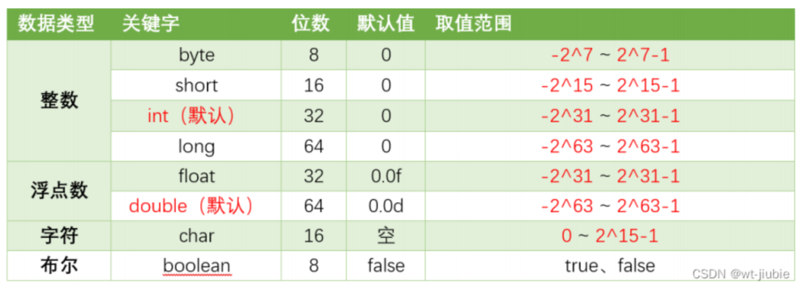
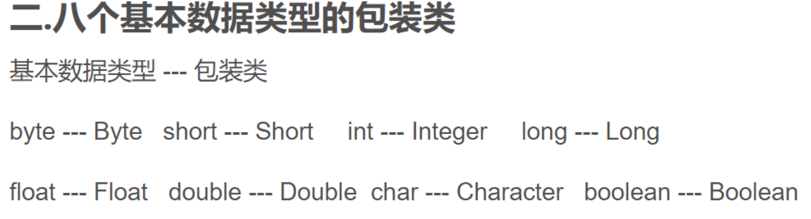

# Java-API

JAVA API参考资料

## 一、Map

### 00 基本

```java
#放元素
    HashMap hm = new HashMap();
	hm.put("key","value");
	
- 集合框架
- Collection 单列集合
    - List 有序，可重复
        - Vector 数组结构，线程安全
        - ArrayList 数组结构，非线程安全
        - LinkedList 链表结构，非线程安全
    - Set 无序，唯一
        - HashSet 哈希表结构
        - LinkedHashSet 哈希表和链表结构
        - TreeSet 红黑树结构
- Map 双列集合
    - HashTable 哈希表结构，线程安全
    - HashMap 哈希表结构，非线程安全
    - ConcurrentHashMap 哈希表结构，线程安全
    - TreeMap 红黑树结构
    - LinkedHashMap 哈希表和链表结构
```

### 01 如何判断一个key是否存在

mp.containsKey

```java
import java.util.HashMap;

public class Main {
    public static void main(String[] args) {
        // 创建一个HashMap
        HashMap<String, Integer> map = new HashMap<>();
        
        // 向HashMap添加一些键值对
        map.put("one", 1);
        map.put("two", 2);
        map.put("three", 3);
        
        // 要检查的键
        String keyToCheck = "two";
        
        // 判断键是否存在
        if (map.containsKey(keyToCheck)) {
            System.out.println("键 '" + keyToCheck + "' 存在于HashMap中。");
        } else {
            System.out.println("键 '" + keyToCheck + "' 不存在于HashMap中。");
        }
    }
}

```

### 02 遍历（增强for循环）

```java
//--------------------------只遍历key---------------------------
HashMap<String, Integer> map = new HashMap<>();
map.put("one", 1);
map.put("two", 2);
map.put("three", 3);
// 遍历所有键
for (String key : map.keySet()) {
    System.out.println("Key: " + key);
    
    
//--------------------------只遍历Value---------------------------
HashMap<String, Integer> map = new HashMap<>();
map.put("one", 1);
map.put("two", 2);
map.put("three", 3);
// 遍历所有值
for (Integer value : map.values()) {
    System.out.println("Value: " + value);
    
    
//--------------------------同时遍历key和value---------------------------
HashMap<String, Integer> map = new HashMap<>();
map.put("one", 1);
map.put("two", 2);
map.put("three", 3);
// 遍历所有键值对
for (Map.Entry<String, Integer> entry : map.entrySet()) {
    System.out.println("Key: " + entry.getKey() + ", Value: " + entry.getValue());
```


## 二、队列LinkedList（Queue/Deque）

### 00 基本

```java
#注意事项！！
    想要当做队列来使用，引用类型一定要是Queue或者LinkedList
---------------------------------------------------------
#放元素
    List queue = new LinkedList();
	queue.put("test");
#判空
    queue.isEmpty();
#大小
    queue.size();
#移除队头元素/出队
    #移除同时返回元素
    queue.poll()
    #只移除
    queue.remove()
    !!!!!!!!!!!!!!!!!!!!!!!!!!
    #注意，remove可以根据索引或者对象来删除，假设传入4,也就是remove(4)是什么情况呢?
    #默认是根据索引4，如果想根据4这个对象，则必须写成remove(Integer.valueOf(4))
    !!!!!!!!!!!!!!!!!!!!!!!!!

#返回队头元素
    #ps如果没有元素返回null
    queue.peek()
#返回队尾元素
    queue.peekLast()
    
    
    
    
    
#双端队列
    #deque
    LinkedList deque = new LinkedList();
	deque.removeFirst();//移除队头元素
	deque.removeLast();//移除队尾元素
	deque.addLast();//从队尾加元素
	deque.add();//队尾加元素
	deque.addFirst();//队头加元素

```

## 三、ArrayList

### 00 基本

```java
#初始化
    #正确
    ArrayList list = new ArrayList();
	#错误,这样初始化后续调用比如add方法会直接报错NPE
    ArrayList list = null;


#放元素
    ArrayList arraylist = new ArrayList();
	arraylist.add("test");
#大小
    arraylist.size();
#获取第n个元素
    #注意下标从0开始
    arraylist.get(n-1)
    
#删除指定元素
    list.add("drg");
	list.add("erg");
	list.remove("drg");//这样就可以删除指定元素了


#移除元素
    #移除同时返回元素
    queue.poll()
    #只移除
    queue.remove()
    !!!!!!!!!!!!!!!!!!!!!!!!!!
    #注意，remove可以根据索引或者对象来删除，假设传入4,也就是remove(4)是什么情况呢?
    #默认是根据索引4，如果想根据4这个对象，则必须写成remove(Integer.valueOf(4))
    !!!!!!!!!!!!!!!!!!!!!!!!!
    
#排序
    Collections.sort(list)
    list.sort();
//备注;Arrays.sort对普通数组用，Collections.sort对arraylist数组用
```

## 四、普通数组

### 00 基本

```java
#普通数组的长度
    int[] test = {1,2,343,466,555};
    int length = test.length;

#排序
    Arrays.sort(test);
```

### 01 初始化-三种方式

```java
public class Main {
    public static void main(String[] args) {
        // 初始化固定大小的空数组
        int[] fixedSizeIntArray = new int[10];
        String[] fixedSizeStringArray = new String[10];
        //如何进行填充呢？用fill,比如将int类型的数组填充为0
        Arrays.fill(fixedSizeIntArray,0)
        
        // 初始化大小为0的空数组
        int[] zeroSizeIntArray = new int[0];
        String[] zeroSizeStringArray = new String[0];
        
        // 使用数组字面量来初始化
        int[] literalIntArray = {};
        String[] literalStringArray = {};
        
        // 打印数组的长度
        System.out.println("fixedSizeIntArray length: " + fixedSizeIntArray.length);
        System.out.println("fixedSizeStringArray length: " + fixedSizeStringArray.length);
        System.out.println("zeroSizeIntArray length: " + zeroSizeIntArray.length);
        System.out.println("zeroSizeStringArray length: " + zeroSizeStringArray.length);
        System.out.println("literalIntArray length: " + literalIntArray.length);
        System.out.println("literalStringArray length: " + literalStringArray.length);
        
        //length 是数组的一个属性，表示数组中元素的数量。
        //在 Java 中，数组的 length 是一个固定的字段，它存储着数组的大小（即元素的数量）。
        //而 Java 的数组对象并不像其他对象那样有方法（比如 size() 等），它直接通过 length 来访问数组的大小。
    }
}
```
## 五、HashSet

```java
HashSet<Integer> set = new HashSet();
set.add(1)
set.contains(key);
```


## 六、Stack

```java
#栈压入元素
	Stack stack = new Stack();
	stack.push();
#栈弹出元素
    stack.pop();
#返回栈顶元素
    stack.peek();
```

## 七、String

```java
#分割
    #eg：按照空格进行分割
    String str = "I am a Student."
    String [] array = str.split(" ");
#长度
    int length = str.length();

#取出某个索引下的元素
    String nums = "12";
	//!!!!!!!!!!!,注意了，charAt返回的是char类型的，转换成int会按照ascii来转换！！！
	int num1 = nums.charAt(0);//num1结果是49
	int num2 = nums.charAt(0) - '0';//num2结果才是1
	//提供另一个一个利用Integer.parseInt()的方法
    // 将字符转换为字符串，再用 Integer.parseInt() 解析为整数
    int pre = Integer.parseInt(String.valueOf(str.charAt(0))); 

#转换成数组
    String word = "cusihduigfuisgfi";
	char[] words = word.toCharArray();


	
```

### 01 String、 StringBuilder、StringBuffer

| 类型          | 特点                                                        | 试用场景                       |
| ------------- | ----------------------------------------------------------- | ------------------------------ |
| String        | 不可变对象，改变String会创建一个新的对象，改变指向          | 操作少量数据，或者不操作数据   |
| StringBuilder | 底层同样也是char[],可变字符串，线程不安全                   | 频繁操作数据，且不考虑线程安全 |
| StringBuffer  | 底层同样也是char[],可变字符串，线程安全（通过synchornized） | 频繁操作数据，考虑线程安全j    |

```java
//StringBuilder
//1.构造
StringBuilder sb = new StringBuilder();
StringBuilder sb = new StringBuilder(10);//指定大小
StringBuilder sb = new StringBuilder(“start”);//指定字符串的开始部分字符

//2.添加

//append(String str): 追加字符串到当前 StringBuilder 对象的末尾
sb.append("test");

//反转
sb.reverse();

//3.长度
sb.length();

//4.转换成普通String
sb.toString();

//5.删除某一个元素
sb.deleteCharAt(0);
```

```java
public class StringBuilderExample {
    public static void main(String[] args) {
        // 创建一个 StringBuilder 对象
        StringBuilder sb = new StringBuilder("Hello");

        // 追加字符串
        sb.append(" World");
        System.out.println(sb); // 输出: Hello World

        // 插入字符串
        sb.insert(6, "Beautiful ");
        System.out.println(sb); // 输出: Hello Beautiful World

        // 删除字符串,左闭右开
        sb.delete(6, 16);
        System.out.println(sb); // 输出: Hello World

        // 替换字符串
        sb.replace(6, 11, "Java");
        System.out.println(sb); // 输出: Hello Java

        // 反转字符串
        sb.reverse();
        System.out.println(sb); // 输出: avaJ olleH

        // 转换为字符串
        String str = sb.toString();
        System.out.println(str); // 输出: avaJ olleH
    }
}

```

### 02 String

```java
//char[]数组和String的转换
char[] array = "sjdifhiusdhf".toCharArray();
String str = new String(array);

字符串如何排序？---->先转换成数组，然后先对数组排序，最后转换回去string
Arrays.sort(array);

//获取string的长度？,注意要加（）这个是一个方法，普通数组不用，因为那个是一个属性
int size = str.length();

//获取Sting的某一个索引的字符,如以下写法
str.charAt(0);


//截取
String substring(int beginIndex, int endIndex) ：返回一个新字符串，它是此字符串从beginIndex开始截取到endIndex(不包含)的一个子字符串
    
str.substring(beginIndex,endIndex);//从beginIndex开始截取到endIndex(不包含)，左闭右开
```


## 八、堆（Heap）

JAVA中的堆也就优先级队列，默认是小根堆（PS：堆的本质就是二叉树，小根堆的意思就是堆的根的值小于左子树和右子树的值，接着递归下去）

```java
//1.创建
//小根堆
PriorityQueue<Integer> minHeap = new PriorityQueue<>();
//大根堆
PriorityQueue<Integer> maxHeap = new PriorityQueue<>(Collections.reverseOrder());
//大根堆的另一种写法
private PriorityQueue<Integer> high = new PriorityQueue<>(new Comparator<Integer>() {
    @Override
    public int compare(Integer o1, Integer o2) {
        return o2.compareTo(o1);
    }
});

//2.插入元素
minHeap.add(10);
minHeap.offer(20);
//3.弹出元素
Integer minElement = minHeap.poll(); // 移除并返回堆顶元素
Integer minElement = minHeap.remove(); // 移除并返回堆顶元素

//4.查看堆顶元素
Integer topElement = minHeap.peek(); // 仅返回堆顶元素，不移除

```


## 九、内置函数

### 00 数学类

```java
#Math是java.lang包里的java.lang.Math，是JRE自带的，所以不需要显示导入
#求绝对值
	int a = 5;
	int b = 9;
	int c = Math.abs(a,b)//c = 5
```

### 01 最大值、最小值

```java
#最大值
    Integer.MAX_VALUE
    Integer.MIN_VALUE
```

## 十、位运算

参考连接：https://blog.csdn.net/xiaochunyong/article/details/7748713?ops_request_misc=%257B%2522request%255Fid%2522%253A%2522172165962116800182790771%2522%252C%2522scm%2522%253A%252220140713.130102334..%2522%257D&request_id=172165962116800182790771&biz_id=0&utm_medium=distribute.pc_search_result.none-task-blog-2~all~top_positive~default-1-7748713-null-null.142

```java
//1.左移( << )

public class Test {
	public static void main(String[] args) {
		System.out.println(5<<2);//运行结果是20
	}
}
```

运行结果是20，但是程序是怎样执行的呢？
首先会将5转为2进制表示形式(java中，整数默认就是int类型,也就是32位):

0000 0000 0000 0000 0000 0000 0000 0101           然后左移2位后，低位补0：

0000 0000 0000 0000 0000 0000 0001 0100           换算成10进制为20

```java
//2.右移( >> )

System.out.println(5>>2);//运行结果是1
```

还是先将5转为2进制表示形式：

0000 0000 0000 0000 0000 0000 0000 0101 然后右移2位，高位补0：

0000 0000 0000 0000 0000 0000 0000 0001

```java
//3.无符号右移( >>> )

public class Test {
	public static void main(String[] args) {
		System.out.println(5>>3);//结果是0
		System.out.println(-5>>3);//结果是-1
		System.out.println(-5>>>3);//结果是536870911
	}
}
```

我们知道在Java中int类型占32位，可以表示一个正数，也可以表示一个负数。正数换算成二进制后的最高位为0，负数的二进制最高为为1

例如  -5换算成二进制后为：

1111 1111 1111 1111 1111 1111 1111 1011   (刚开始接触二进制时，不知道最高位是用来表示正负之分的，当时就总想不通。。明明算起来得到的就是一个正数-_-)

我们分别对5进行右移3位、 -5进行右移3位和无符号右移3位：

```java
//4.位与( & )

public class Test {
	public static void main(String[] args) {
		System.out.println(5 & 3);//结果为1
	}
}
```

还是老套路，将2个操作数和结果都转换为二进制进行比较：
5转换为二进制：0000 0000 0000 0000 0000 0000 0000 0101

3转换为二进制：0000 0000 0000 0000 0000 0000 0000 0011

-------------------------------------------------------------------------------------

1转换为二进制：0000 0000 0000 0000 0000 0000 0000 0001


<u>第一个操作数的的第n位于第二个操作数的第n位如果都是1，那么结果的第n为也为1，否则为0</u>


```java
//5.位或( | )

public class Test {
	public static void main(String[] args) {
		System.out.println(5 | 3);//结果为7
	}
}
```

5转换为二进制：0000 0000 0000 0000 0000 0000 0000 0101

3转换为二进制：0000 0000 0000 0000 0000 0000 0000 0011

-------------------------------------------------------------------------------------

7转换为二进制：0000 0000 0000 0000 0000 0000 0000 0111
<u>第一个操作数的的第n位于第二个操作数的第n位 只要有一个是1，那么结果的第n为也为1，否则为0</u>

```java
//6、位异或( ^ )
public class Test {
	public static void main(String[] args) {
		System.out.println(5 ^ 3);//结果为6
	}
}
```

5转换为二进制：0000 0000 0000 0000 0000 0000 0000 0101

3转换为二进制：0000 0000 0000 0000 0000 0000 0000 0011

-------------------------------------------------------------------------------------

6转换为二进制：0000 0000 0000 0000 0000 0000 0000 0110

<u>第一个操作数的的第n位于第二个操作数的第n位 相反，那么结果的第n为也为1，否则为0</u>

```java
//7、位非( ~ )
public class Test {
	public static void main(String[] args) {
		System.out.println(~5);//结果为-6
	}
}
```


5转换为二进制：0000 0000 0000 0000 0000 0000 0000 0101

-------------------------------------------------------------------------------------

-6转换为二进制：1111 1111 1111 1111 1111 1111 1111 1010


<u>操作数的第n位为1，那么结果的第n位为0，反之。</u>


### 位运算总结

一、与/或/异或/非

（1）与运算&，两个都是1，才为1

（2）或运算|，两个有一个为1，才是1

（3）异或运算^，两个数字不相同为1，否则相同为0

（4）非~，取反，1取0,0取1

二、移位运算

（1）左移位  `<<`  , 二进制数据往左边移动，低位补0

（2）右移运算  `>>` ， 二进制数据往右边移动，左边高位正数补0，负数补1

（3）无符号右移运算`>>>`，二进制数据往右边移动，左边高位无论正数还是负数，都补0（这个时候，负数就变成正数了）


## 十一、循环

```java
//正确
for ( int i = 0, j = 0 ;  i < length / 2 && j < width / 2 ; i++, j++) {

}

//错误
//在 Java 中，不能在 for 循环的初始化部分重复声明变量类型。也就是说，只需要声明一次类型，后面的变量直接使用即可。
for ( int i = 0, int j = 0 ;  i < length / 2 && j < width / 2 ; i++, j++) {

}
```

## 十二、排序

### 01 `Comparator<Object>`接口自定义排序


​	**一个问题：**

​		有一个学生类，有年龄和姓名的参数，同时一个arraylist存储了众多的学生信息，如何根据年龄的大小升序排序？

​	**学生类：**

```java
public class Student {
    private String name;
    private int age;

    public Student(String name, int age) {
        this.name = name;
        this.age = age;
    }

    public String getName() {
        return name;
    }

    public void setName(String name) {
        this.name = name;
    }

    public int getAge() {
        return age;
    }

    public void setAge(int age) {
        this.age = age;
    }

    @Override
    public String toString() {
        return "Student{" +
                "name='" + name + '\'' +
                ", age=" + age +
                '}';
    }
}

```

​	**排序代码**

```java
import java.util.Arrays;
import java.util.Comparator;

public class Main {
    public static void main(String[] args) {
        // 创建学生数组并添加测试数据
        Student[] students = {
            new Student("Alice", 24),
            new Student("Bob", 19),
            new Student("Charlie", 22)
        };

        // 升序排序：根据年龄升序
        Arrays.sort(students, new Comparator<Student>() {
            @Override
            public int compare(Student s1, Student s2) {
                // 自己实现比较逻辑
                if (s1.getAge() < s2.getAge()) {
                    return -1;
                } else if (s1.getAge() > s2.getAge()) {
                    return 1;
                } else {
                    return 0;
                }
                //上面的逻辑可以简化
                return s1.getAge() - s2.getAge();
            }
        });

        // 打印排序后的数组
        for (Student student : students) {
            System.out.println(student);
        }
    }
}


//结果
Student{name='Bob', age=19}
Student{name='Charlie', age=22}
Student{name='Alice', age=24}
```

​	**知识点**

​	1）普通数组和容器都可以用，前者是在arrays.sort中使用，后者是在Collections.sort中使用

​	2）**升序排序和降序排序如何判断？**

| 排序 | 顺序                                       | 判断逻辑                                                     |
| :--: | ------------------------------------------ | ------------------------------------------------------------ |
| 升序 | public int compare(Student s1, Student s2) | 如果 s1 应该排在 s2 前面，返回负数；如果 s1 应该排在 s2 后面，返回正数。 |
| 降序 | public int compare(Student s1, Student s2) | 如果 s1 应该排在 s2 前面，返回正数；如果 s1 应该排在 s2 后面，返回负数。 |

​	**讲了太多，直接记住吧：参数顺序和被减数和减数的顺序一直就是升序，反之逆序**

```java
        public int compare(Student s1, Student s2) {
            // 自己实现比较逻辑
            return s1.getAge() - s2.getAge();
            //最好用compareTo方法，String和Integer都可以用
            (s1 + s2).compareTo(s2 + s1)//例如！！
        }
    });
```


## 十三、备注

### 01 八大基本数据类型及其包装类





### 02 短路与（&&）和按位与（&）区别？

前一个&&第一个条件不符合就不会去判断第二个了

