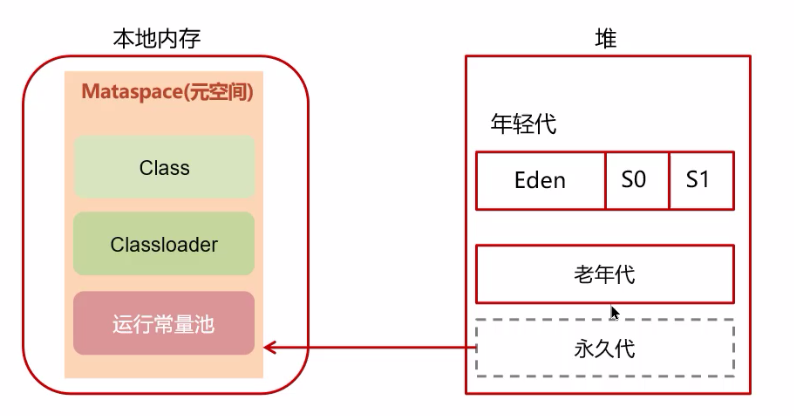

JVM

## JVM组成

## 1.什么是程序计数器

程序计数器是一个线程私有的变量，java程序编译生成class文件后，这个程序计数器记录了当前代码执行到行了，主要是保存的当前字节码指令的行号

## 2.介绍一下Java内存中的堆

堆这块主要是内存共享的区域，主要存放的是这种各种对象实例以及各种数组，它里面又分为两块，一块主要是新生代，一块分为老年代，新生代，又分为Edon区，S1区，S2区域，新的对象实例主要是先放在这个Edon区域，然后逐步再转移到这个S1，S2最后带老生代中，当然过程中也有可能被垃圾回收直接。然后还需要补充的额一个就是方法区或者叫永久代，这个东西主要是存放的一些类的信息，一些静态常量等等，jdk1.7的版本，这个方法区或者说永久代是放    在这个堆当中的，但是jdk1.8之后，就被转移到直接内存了，叫做元空间区域，因为放到堆中，如果堆的内存比较小，这个很容易OOM，因为这个可能是不断增长的，但是这个设置太大了，又会占用过多内存。而放到直接内存，这个问题就会小很多。

## 3.什么是虚拟机栈

虚拟机栈就是每个线程私有的空间，主要是记录了该线程的执行状态，里面主要是一个桟的结构，桟里面主要存放的是一些桟帧，每个桟帧存放着当前的一些内存中的信息，比如说变量，返回值等等，每去调用一个方法就会往里面压入一个桟帧，调用结束就去弹出一个桟帧，先进后出，当前执行的叫做本地桟帧。

能。

## 6.方法内的局部变量是否是线程安全的？

这个分情况，如果这个局部变量不涉及外部应用，那就是安全的，完全私有的，但是如果涉及到外部的引用，就不是安全的，因为可能有多个线程对这个外部引用进行修改

## 7.说一下栈内存溢出的情况？

造成栈溢出一般有两种情况，第一种就是栈帧本身内存占用过大，这个一般不存在。第二个就是递归过多，比如无限递归，就会报错StackOverFlow内存溢出。

## 8.能不能解释一下方法区

方法区其实也是一个内存共享的一个区域，jdk1.7之前都放在堆里面，1.8之后就都放在这个直接内存里面了，里面是主要分为了这个class、classloader和运行常量池，其中class记录了一个类的结构和各种的字段信息，classloader主要是用来进行类的加载的，而最后的运行时常量池，的话，首先我先来说一下什么是常量池，这个其实就是相当于一张表，这个表格里面记录了每个字段对应的地址，比如这个类的字段的值的地址，运行时常量池就是值运行的时候，会把这个常量池中的符号引用去替换成真实的引用，这样的话就会在运行的时候去找到真实的运行地址。

## 9.你听说过这个直接内存的概念吗？

直接内存本质上不属于这个JVM的内存，是属于这个虚拟机或者操作系统的内存，一般用于这个NIO操作，这样效率会高很多，因为不需要涉及这个系统内存缓冲区和这个java内存缓冲区之间

## 类加载器

## 1.什么是类加载器，类加载器有哪些 ？

java程序的运行机制是是这样的，我们写的是java代码，首先需要通过编译，去编译成为一个字节码文件，然后把这个编译过后的字节码文件放到这个JVM虚拟机上，我们的代码才能跑，而这个类加载器就是把这个编译过后的字节码文件进行加载也就是放到这个JVM比如说堆啊，方法区里面的一个机制。一共主要有四种这种类加载器，第一个就是启动类或者核心类，也就是Jre下面的lib包，第二个就是这种扩展类的加载起，加载这个jre下的lib/ext目录中的拓展类，第三种就是用户类的加载起，这个就是一般来取加载我们自己写的程序。第四种就是这个自定义类的加载起，这个会使用相对比较少。

## 2.什么是双亲委派模型？

所谓的双亲委派模型就是，我们再去加载一个类额度过程中，首先会去查找他的父亲加载器，查看这个父加载起有没有加载过，如果没有就一直继续找父加载器去判断，如果最后还没有才自己去进行这种类加载的过程。

## 3.JVM为什么去使用这个双亲委派模型？

有两点原因吧，第一个就是避免类的重复加载，如果父类已经加载了可以去直接用，这样可以节省内存吗。第二个就是去避免核心的类的api被篡改，比如我自己去写了一个String同名类，自己写了一个API，但是如果这个时候去掉用的时候，双亲委派模型就会发现已经加载了，并且判断出这个是你自己写的，不让你改，算是一个安全性上的保障吧。

## 4.说一下类装载的执行过程？（比较难，太多了，难记）

类加载的过程一共分为了七个阶段，第一个阶段就是加载，这个过程中会把类的class信息加载到这个metaspace元空间和这个堆内存中，第二个阶段就是验证，主要是验证两个方面，第一个方面就是有没有基本的语法层面的错误，第二个就是验证符号引用的地址有没有问题，第三个阶段就是准备阶段，这个阶段中会把这个类变量分配内存并且初始化，其中如果有静态类型的final变量，或者引用对象，这个时候会去直接进行初始化，第四个阶段就是解析，就是把这文件中的符号引用给转换为真实的地址引用。第五个阶段就是初始化阶段，为类中的静态变量和静态代码块赋予初始值，如果有多个就按照前后顺序来，值得一提的是如果有父子关系就去先加载父类。第六个阶段就是使用阶段，比如说调用了类的静态方法或者说直接new了一个类，这种情况就会去进入到使用的阶段，最后就是销毁阶段，JVM开始销毁创建的Class对象。

## 垃圾回收

## 1.对象什么时候可以被垃圾回收器回收？

对象没有被引用了就会被回收，如何判断这个对象有没有被引用，目前有两种判别方式，一种是引用计数器，一种是可达性分析，我首先来说一下这个引用计数器，他的原理是每个对象会有一个计数器，这个对象每次被引用这个计数器就会+1，否则-1 ， 当为0的时候，就代表没有被引用，也就也意味着可以被回收，但是这里面有一个循环引用的问题，就是两个对象之间有相互的引用，即使后续这两个对象不再使用了，但是循环引用仍然会造成双方的计数器+1，所以不太好这种方法。第二种方法就是可达性分析，这个里面有一个GCroots的概念，从GCRoots这个根节点出发，往这个数一样的结构往下去便利，如果可以便利到，就代表这个元素或者对象是有被引用的，反之就没被引用。那么GCRoots都有哪些呢，我理解下里就是线程中的虚拟机栈，本地方法栈，还有常量池中的常量和静态变量等等，这四个可以用作这个GCRoots。

## 2.JVM的垃圾回收算法说一说？

一共有三种这种垃圾回收算法。第一种就是标记清楚算法，这个算法通过可达性分析，会标基础所有额需要清楚的碎片区域，直接进行清楚。这种算法的特点就是，比较简单，但是会留下比较碎片化的空间，用的比较少。第二种就是标记整理，该算法就是在标记清楚的算法上多了一个整理的步骤，标记清除之后内存不是不连续和碎片的吗，我们会把用到的内存都去整理放到一块，其他的那就都是空闲空间了，这种算法主要是老年代在用，因为老年代相对来说比较稳定，不存在这种大量的移动。第三种就是标记复制算法，这种算法会把这个内存区域分为两块，一块进行垃圾的标记，标记出来之后，直接全部完整连续的复制到另一块内存中去，再把这一块内存清空，这个算法主要是新生代在用，因为，新生代的垃圾回收比较频繁剩余的可能不多，因此比较适合。

## 3.说一下JVM中的分带回收

首先JVM中堆主要分为两个区域，一个是老年代，一个是新生代，新生代中又分为三个区域，第一个是Eden区，一个是幸存者区域From，另一个是幸存者区域To，然后垃圾回收的过程是这样子的，首先会去根据Edno区域和From区域做可达性分析，然后存活的，一起放在TO区域，再过一段时间针对Edon和TO做可达性分析，把存活的再复制到From区域，如此往复，如果发相某些对象移动的次数太多了， 有一个阈值，应该是15，就会认为这个对象一直存活，放到老年代区域中，避免内存的频繁复制。

## 4.MinorGC、MixedGC 和 FullGC的区别是什么？

MinorGC也被称为YoungGC，主要是针对这个新生代的,STW的时间较短，MixedGC主要是G1垃圾回收器锁特有的，针对的对象是新生代和老年代的部分区域，FullGC主要是针对这个新生代和老年代一起的，这个STW的时间比较长，尽量要避免。

## 5.说一下JVM有哪些垃圾回收器？

我了解的有这么几种垃圾收集器，第一种是串行的，比如说serial，serialnew，其中前者是利用了标记清除算法，用于老年代，后者是利用了标记复制算法，用于新生代，特点就是，只有一个垃圾回收的线程，进行垃圾回收的时候，会有一个比较长的STW的时间去进行垃圾回收，第二种就是并行的垃圾回收器，比如说这个Parallel 和 ParallelNew垃圾回收去器，他会把垃圾回收用多个线程来同时执行。第三个就是并发的垃圾回收器，比如说这个CMS的垃圾回收器，他首先再进行垃圾回收的时候，会有一个初始标记的过程，这个过程其他线程也会被阻塞，也就是存在这个STW的时间，但是由于他只是初始标记，因此时间非常段，紧接着他会开始并发标记这个一个过程，这个过程中标记的线程和其他的任务线程一起并发执行，不存在这个STW，完成之后再进行一个重新标记，这样就结束了标记的过程，最后再去执行并发的垃圾清理，同样，这个线程可以和其他的线程一起进行。jdk9之后出现了一个更优秀的G1垃圾回收器

## 6.详细说一下G1垃圾回收器？

G1垃圾回收器的最大特点就是他把内存区域划分为了许多的一个一个小块小区域，每一个区域都可以是Eden区域，也可以是Surrvior幸存者区域，也可以是老年代的区域，并且考虑到了这种小块可能放不想个别特比大的对象，也设计了一个harmongs区域来放这种大的对象。由于采取了这种设计底层也是采取了这种标记复制的算法。然后我再来说一下这个G1垃圾回收器的工作过程，他一共分为三个这个阶段，第一个阶段叫做这个新生代回收，刚开始的时候，这个堆中什么都没有，加入的元素都是先放入这个Edon区域的，然而随着达到阈值，这个阈值我解释一下就是规定的这个Eden区域的大小，一般在5-6左右，超过了，就要去执行这个新生代垃圾回收，利用这个GCRoots进行这个标记，把被标记过的新生代Edon中的存活的放到一个新的Survivor区域中，然后释放这个Edon区域，当然这是第一次，后续第n次的话，如果已经存在了这个Surrvirror区域，他也会堆已经存在的Surrvirror区域进行复制，把存活的放到这个新的Surrviorr区域中，这个来的幸存者区域就去是放掉，这个过程还会进行判断如果某个对象存活时间过长，会直接放到这个老年代区域。当程序和jvm就这么运行一段时间过后，我们会发现这个old区域是越来越大，一旦打到某一个阈值，也就是G1规定的45%，就会执行一个所谓的并发标记的过程，这个时候不会阻断用户线程，而是去一起并发执行，当然这个之后还有一个STW的重新标记，在这个过程中会标记所有区域的这一个垃圾情况。紧接着这个并发标记结束之后，就会执行一个Mixed混垃圾回收的阶段，这个也就是第三阶段，这个时候对于新生代，同样会把Edon和Surrviorr区域，放入到这个新的Surrviorr区域，并且把Surrviorr存活过久的放到新的来年区域，并把原来的Edon和Surrviorr区域进行一个释放，但是同时他也会对这个老年代进行回收，只不过这个是一个局部回收，他会去判断所有的老年代中那些的回收价值是最大的，比方说有一些这个老年代他存活的对象比较少，如果回收，得到的可用内存就比较大，收益比较高，就会去利用这个复制算法，把这个高收益的老年代进行回收，一起集中放到一个新的这个老年代区域中，然后销毁原来的区域。然后这大概是G1的一个工作的整个过程。最后在这个过程中如果还是发现创建对象的过程还是赶不上销毁对象的过程，就会直接引起FullGC。

## 7.说一下强引用、软引用、弱引用和虚引用的区别？

强引用就是我们正常去创建一个new一个对象，这个时候GCRoots进行可达性分析会扫描到这些对象，但是不会进行垃圾回收，即使内页不足也只会报错OOM。软引用的引用强度低了一个档次，通过GCRoots扫描到的时候，内存足够的时候不会动他，但是一旦不足，就会直接进行回收，不会OOM，弱引用，强度继续低一个档次，GCRoots一旦发现，无论内存够不够都进行回收，比如ThreadLocal中的线程Key就是这个类型的，最后一个虚引用，他一般会放到一个虚拟引用的队列中去，一旦发现有一个虚引用RenfrenceHandler来去处理，一旦发现这个虚引用所关联的对象她已经被垃圾回收了，但是有可能有一些关联的地方，比如放在直接内存中，他会去控制这些地方内存的释放。

## JVM实践

## 1.JVM调优的参数可以在那里进行设置？

有两种方式，一种是这个war包部署在这个tomcat上，这个一般需要去修改这个catalina.sh文件中的两个参数，一个是XMS和XMX，前者是初始大小，后者是最大的大小。如果是那种SpringBoot项目，直接修改启动的命令，在启动的命令上加上这两个参数就可以了

## 2.JVM调优的参数都有哪些？

JVM的参数有很多，想要优化的话有这个几点吧。第一个点就是堆的大小，这里面有两个参数XMS和XMX，前者是初始的堆分配内存的大小，后者是最大的被分配内存的大小，可以设置成一样的来避免内存的收缩，然后具体大小的设置一般建议设置为内存的1/64到1/4，这个主要是看我们有没有其他的程序再用，这个设置过小，会产生频繁的GC，过程中肯定会有STW的问题，但是太大了的话，发生了GC，往往要花很长时间，也更消耗内存，所以这是一个综合的考虑。第二个就是栈的大小，这个就是每个线程的虚拟机栈，默认的大小一般是1M，我们可以设置成256KB，一般的方法堆栈用不到过大的内存，当然设置过小也会造成stack over flow的错误，要谨慎设置。第三个就是垃圾回收器的选择，像是JDK1.8其实用的还是Parael和ParalNew垃圾回收器，可以选择用这个G1垃圾回收器，还有其他的参数，比如说这个新生代和这个老生代的分配也可以，默认是8：2，其中新生代占2，并且被Eden和幸存者区Surrviorr平分了，这个时候可以适当调大一点，来避免这个频繁的MinorGC，但是也不能过大，否则老生代不够用，FullGC的频率会增加。还有一些其他参数，比如说这个新生代的转换到老生代，有一个复制次数的阈值，默认是15，这个也可以去调整。

## 3.说一下JVM调优的工具有哪些？

JVM调优用到的工具主要是分为了两块吧，一块就是这个命令行的工具，比如说是这个jps、jstack、jmap等命令，这个第一个命令主要是查看有哪些进程以及对应的pid的，后面的jstack和jmap可以利用jps拿到的pid去进一步查询相关的堆栈信息，第二块就是可视化的这一块，这里面主要可以用jconsole和VIsualVM这两个工具去查看一些线程和堆栈的信息

## 4.Java内存泄漏的排查思路是什么？

主要的思路，就是要获取内存泄漏导致宕机的dump文件，这个dump文件记录了内存泄漏的时候堆栈的信息以及很详细的报错信息，我们主要去堆这个dump文件定位到代码的错误行数，然后通过阅读上下文来去进行修复。其中这个dump文件如何产生呢，第一种方式就是利用这个jmap命令，但是这个命令必须在jvm没有崩溃的时候才可以用，或者我们可以堆jvm进行配置，增加一个配置，要求在出现OOM的时候自动生成这个dump文件到指定的目录，这样最后再拿这个visualVM的可视化工具去加载这个dump文件进行分析就好了。

## 5.CPU飙高的排查方案以及思路？

首先我们需要看一下到底什么哪一个进程占用了大量的cpu资源，这个时候可以利用这个top命令，他会默认根据cpu的使用率堆所有的进程进行展示，第二个就是拿到了这个进行，我们需要再去使用ps命令查一下这个进程的情况，他会展示出所有进程线程下的情况，找到哪个占用cpu最高的线程的id，最后利用这个jstack打印所有进程中的线程信息，寻找相关线程的日志和报错信息，定位到代码的行数，最后到相应的代码位置查看上下文，进行问题的排查。
