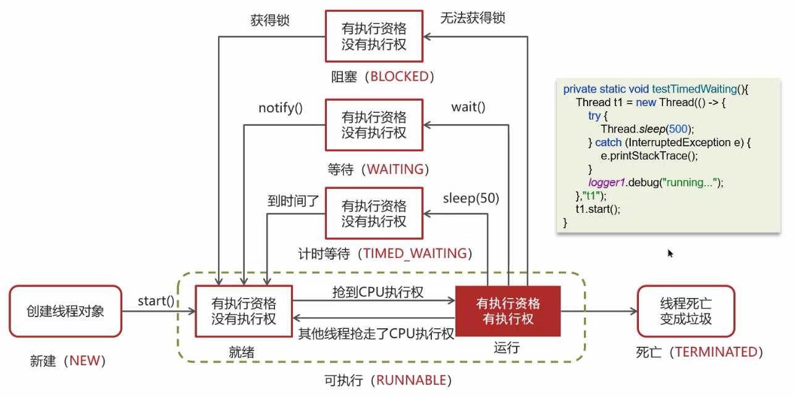

# 并发编程

## 基础

## 1.线程和进程的区别？

进程是一个程序运行的实例，每个进程包含了多个线程，然后线程之间可以共享同一个进程下的共享内存空间。相比于进程来说，线程的上下文切换，也就是从一个线程切换到另一个线程，他的上下文开销会低一些。

## 2.并行与并发有什么区别？

现代计算机基本上都是多核心的cpu，在这种情况下，并发是指的多个线程轮流去使用一个或者多个cpu，是不过这个时间片很短，会给人造成程序都是同时运行的错觉。并行则是指的，例如4个cpu，每个cpu同时去执行不同的线程任务。

## 3.创建线程的方式有哪些？有什么区别？

目前有四种创建线程的方式，第一种直接继承Thread类，第二种直接实现Runnable接口，第三种直接实现Callable接口，第四种直接利用线程池。其中Runnable是不可以获取到线程执行的返回结果的，但是Callable可以获取，主要是通过Futuretaskl来进行获取，并且第一种Runnable中的run方法是无法抛出异常的，只能通过try-catch来去捕获异常，但是Callable中的call方法可以抛出异常。

```java
//继承Thread类
public class MyThread extends Thread {

    @Override
    public void run() {
        System.out.println("MyThread...run...");
    }

    public static void main(String[] args) {
        // 创建MyThread对象
        MyThread t1 = new MyThread();
        MyThread t2 = new MyThread();

        // 调用start方法启动线程
        t1.start();
        t2.start();
    }
}
```

```java
//实现Runnable接口
public class MyRunnable implements Runnable {
    @Override
    public void run() {
        System.out.println("MyRunnable...run...");
    }

    public static void main(String args) {
        // 创建MyRunnable对象
        MyRunnable mr = new MyRunnable();
        // 创建Thread对象
        Thread t1 = new Thread(mr);
        Thread t2 = new Thread(mr);
        // 调用start方法启动线程
        t1.start();
        t2.start();
    }
}
```

```java
//实现Callable接口
public class MyCallable implements Callable<String> {

    @Override
    public String call() throws Exception {
        System.out.println(Thread.currentThread().getName());
        return "ok";
    }

    public static void main(String[] args) throws ExecutionException, InterruptedException {
        // 创建MyCallable对象
        MyCallable mc = new MyCallable();
        // 创建FutureTask
        FutureTask<String> ft = new FutureTask<String>(mc);
        // 创建Thread对象
        Thread t1 = new Thread(ft);
        Thread t2 = new Thread(ft);
        // 调用start方法启动线程
        t1.start();
        // 调用ft的get方法获取执行结果
        String result = ft.get();
        // 输出
        System.out.println(result);
    }
}
```

```java
//线程池创建线程
public class MyExecutors implements Runnable {

    public void run() {
        System.out.println("MyRunnable...run...");
    }

    public static void main(String[] args) {
        // 创建线程池对象
        ExecutorService threadPool = Executors.newFixedThreadPool(3);
        // 提交任务到线程池
        threadPool.submit(new MyExecutors());
        // 关闭线程池
        threadPool.shutdown();
    }
}
```

## 4.线程类中的run()和start()方法有什么区别？

run()方法中的是线程去执行的逻辑方法，直接调用run方法的话，会把这个run()方法当成一个普通方法去执行，可以执行多次，但是start()方法是执行线程的方法，他只能去执行一次，执行多次会报错，之后回去执行线程中的run()方法。

## 5.线程包括哪些状态，状态之间是如何变化的？

线程一共有六种状态。首先当一个线程调用start()方法启动后，会创建一个新的线程对象，这个时候会进入一个所谓的New新建状态，这是第一个状态。紧接着线程需要获取cpu的时间片资源去执行，因此会紧接着进入一个Runnable运行状态，这个状态中又分为两个小状态，就绪状态和这个运行状态，所有的线程都会首先进入就绪状态排队等得cpu的时间片资源分配，分配到了就去运行状态执行，执行结束了就进入termanted死亡态或者结束态，这是第三个状态。这都是比较正常的流程，但是在过程中，会遇到很多情况，比如说如果当前进程遇到这个锁的代码了，就会等待锁的释放，由此进入阻塞态Bolcked，这是第四个状态。如果遇到sleep(5000)这种代码就会休眠5s，进入一个这个时间等待状态，这个是第五个状态。如果该线程被执行了wait()方法也会进入等待状态，直到该线程被调用了notify()方法被唤醒，这个是第六个状态，后三个通常为阻塞或者等待状态，需要一定的机制才能回到运行态。

## 6.如何让线程按照指定的顺序去执行呢？

主要是通过join函数，该方法需要等待线程运行结束

```java
public class JoinTest {
    public static void main(String[] args) throws InterruptedException {
        // 创建线程对象
        Thread t1 = new Thread(() -> {
            System.out.println("t1");
        }) ;
        Thread t2 = new Thread(() -> {
            try {
                t1.join();                          // 加入线程t1,只有t1线程执行完毕以后，再次执行该线程
            } catch (InterruptedException e) {
                e.printStackTrace();
            }
            System.out.println("t2");
        }) ;
        Thread t3 = new Thread(() -> {
            try {
                t2.join();                              // 加入线程t2,只有t2线程执行完毕以后，再次执行该线程
            } catch (InterruptedException e) {
                e.printStackTrace();
            }
            System.out.println("t3");
        }) ;
        // 启动线程
        t3.start();
        t2.start();
        t1.start();
    }
}
```

## 7.notify()和notifyAll()的区别？

notify是去唤醒随机的一个wait()的线程，但是notifyAll()是去唤醒所有阿wait()的线程。

## 8.在java中，wait()和这个sleep()方法有何不同？

wait()和sleep()都可以让线程进入阻塞或者等待这种暂时不可以执行的状态，这是他们的共同点，针对于不同点，由三个方面。第一个方面是wait()是Object对象类内置的方法，而这个sleep()方法是这个Thread类的静态方法。第二点，wait（50)或者Sleep(50)他们都可以在时间到了之后就自己醒过来，但是wait()方法不加参数，如果不被唤醒就会一直睡眠下去。第三点是关于锁的，wait()方法必须搭配wait()对象的锁来去使用，比如说synchronized()，并且当这个wait（）执行的时候，wait（）会去释放wait（）的锁，让别的代码也可以获取这把锁去执行，但是sleep就不行了，即使睡眠了，这个锁也不会被释放，别的线程获取不了这把锁。

## 9.如何停止一个正在运行的线程？

有三种方式来结束一个正在运行的线程，第一种方式就是等待这个线程的run方法去正常得执行结束。第二种方法就是强行调用线程得stop方法，这个已经被官方不推荐了。第三种方法就是去调用interrupt方法，这个方法会停止运行得线程得同时，抛出相应的异常。

## 线程安全

首先，可以回顾一下一个synchronized关键字的基本使用用法

```java
//Synchronized对象锁采用互斥的方式让同一时刻至多只有一个线程能持有[对象锁],
//其它线程再想获取这个[对象锁]时就会阻塞住

static Object lock = new Object();

int ticketNum = 10;

public void getTicket() {
    synchronized (lock) {
        if (ticketNum <= 0) {
            return;
        }
        System.out.println(Thread.currentThread().getName() + "抢到一张票,剩余:" + ticketNum);
        // 非原子性操作 ticketNum--;
    }
}

public static void main(String[] args) {
    TicketDemo ticketDemo = new TicketDemo();
    for (int i = 0; i < 20; i++) {
        new Thread(() -> {
            ticketDemo.getTicket();
        }).start();
    }
}
```


## 1.synchronized关键词的底层原理？

首先这个synchronized这个对象锁是采用互斥的逻辑来实现同一个时刻，最多只有一个线程来持有对象所，起底层主要是通过这个monitor来实现的，这个monitor是jvm内存界别的结构，主要是通过C++来去底层实现的，对于monitor，里面主要有三个部分，一个就是这个owner，这个主要是指向当前持有搞对象锁的线程，最多只能指向一个，还有两个就是entrylist和waitinglist，前者是其他的所有想获取当前锁但是暂时无法获取的线程，都会被暂时放到这个entrylist中，后续锁被释放了，有这些entrylist中的线程去争抢，waitinglist则会存放这个怎事被阻塞的一些线程。

## 2.Monitor实现的锁属于重量级锁，你了解过锁升级吗？

Java中的synchronized有三种锁的实现方式，分别是这个重量级锁，轻量级锁和这个偏向锁。第一个关于这个重量级锁，他适用于有多个锁竞争同一个锁对象的场景，由于这个monitor是jvm级别的，所以会涉及到java代码级别的用户态和系统底层C++级别的内核态的切换，这个上下文的切换，开销特别大。其次就是这个轻量级锁，很多时候，即使有锁，但是不会存在这种竞争的场景，比如，虽然有一个对象锁，这个时候有三个线程，他们的的执行都是，线程1先获取锁然后去执行，然后线程2获取锁去执行，最后线程3获取锁去执行，这种情况下，用这个基于Monitor的重量级锁，开销很大，所以引入了这个轻量级锁，它可以首先获取这个锁对象中的markedword结构中的对象，这个主要是对象Object中对象头中的信息，他记录了当前对象的锁的一些情况，如果没有其他的锁，这个时候，会在当前线程的栈帧中压入一个锁的信息，并且利用cas进行一个原子性的交换操作，将markedword中的锁的信息和当前这个线程桟帧中的锁的信息进行交换，这样，这个线程的桟帧就有了objectmarkedword或者说这个锁的地址，而marekdwork也记录了锁的信息，表明了当前是一个轻量级锁。第三个就是这个偏向锁，他主要是对这个轻量级锁的进一步优化，因为有很多场景，其实只有一个线程，这一个线程再重复的获取一个锁，也就是所谓的可重入锁，这个时候如果还用轻量级锁，就会多次去利用cas操作去交换修改锁的信息，但是这个也会造成这个开销，所以这个偏向锁，只会在第一次的时候进行这个cas操作，在之后的操作中，只会判断当前获取锁的id是不是已经获取过当前锁的，获取过来只会仅仅做一个记录，不会再进行这个第二次的cas操作

## 3.JMM了解吗？（Java内存模型 PS ：不是Java内存结构）

JMM规定了多线程场景下，共享内存如何进行读取的情况。JMM规定了，内存分两块，一块是这种内存共享的区域，一块是这个线程私有的内存取悦，内存共享的区域，所有的线程都可以进行访问，但是如果是线程私有的区域，只有线程本身可以访问，不同线程之间无法互相访问私有的数据，只能通过共享内存进行数据的传输和修改，这样的话这种线程安全的问题也全部留在了共享内存的这一块区域。

## 4.CAS了解吗？

CAS称为compare and swap ， 也就是比较再交换，本质上是一种乐观锁的这种思想，在不用锁的情况下去解决这种数据的原子性操作，java中的很多地方，比如说这个AQS框架还有atomic类都是用这个来取实现的，他不想比如说这种synchronized这种悲观所，他一开始不会对这种对象上锁，完全不考虑这种冲突的情况，但是compare的时候，如果发现真的不一致，冲突了，他就会去进行自旋的操作，重新执行一次操作，然后一直去cas自旋，知道比较成功。

## 5.请你谈谈对volatile关键字的理解

volatile关键字主要是针对针对这个JIT的。JIT会再java代码运行的时候进行一些优化，第一个优化就是变量的可见性优化，就是如果一个变量用的特别多，比如说1一次循环，他就会把暂时用一个固定的值去替代，但是这样的话，原本的变量就不可见了，volite就是禁止了这个编译器的优化，使这个变量的变化对所有线程可见，保证这个结果的一个正确性。第二个优化就是指令重拍，就是我们写的java代码，有的时候JIT或者说这个编译器会帮我们去优化一些代码的顺序，这样执行的时候，有可能顺序不一致，如果我们不想发生这种优化，我们就可以只用这个volatile关键字，一个变量加上这个关键字之后，那门所有的这个关键字之前的写操作都必须再这个volatile之前完成，不能越过，这个关键词之后的这个读操作，都只能在这个volatile关键词之后读，不能越过。

## 6.什么是AQS

AQS是一种锁的机制，是很多基础组件的框架，比如ReentrantLock和Semaphore，其内部维护了一个双向的队列，当有一个线程去尝试获取锁的时候，会去修改AQS内部的一个state值，改为1表示持有锁了，这个时候如果有其他的线程来，获取失败，就会暂时把这个线程放到这个双向等待队列中去等待锁的释放，然后这里面值得说的是，当同时有两个线程去获取锁，并且修改这个AQS的state的值的时候，底层会使用一个CAS的方法去修改，来确保操作的原子性。并且AQS提供了公平锁和非公平锁的两种实现方式，在一个线程来获取锁的时候，这个时候加入还有其他的线程在等待获取锁，公平锁的话，会先把这个新来的锁放到这个队列的尾部，然后从这个队列的头部取出元素来获取锁，如果是非公平锁的话，直接会先让这个新来的线程去直接获取锁，而不管其他已经等待了比较久的锁。

## 7.什么是ReentrantLock，底层原理是什么？

ReentrantLock和synchronized一样，都是java中的一种锁的机制，相比于这个synchronized，reentrantlock支持中断，也支持多个条件wait()等待，支持超时时间，支持公平锁，这个是synchronied不具备的。但是最重要的是，这个Reentrantlock的底层实现和synchronized很不一样，这个ReentrantLock主要是基于这个CAS和这个AQS去实现的，尤其是这个AQS，再这个ReentrantLock中维护了一个双向队列，分别有一个头节点和尾部节点，在这个ReentrantLock的实现类中有两个指针，分别是头指针和这个尾指针分别指向了这个队列的头部和这个队列的尾部，并且这个类中还记录了一个state值和一个当先获取锁的线程的指针，他的这个基本流程是当一个线程过来了之后，会首先尝试去修改这个state值，改为1，如果修改成功就把当前类中的线程指针指向当前线程，如果获取失败，锁已经被别的线程获取，就会把这个线程暂时放入到这个双向队列中去，同时去同步更新指针，这个是针对的单个线程的情况，如果有多个线程去同时获取锁去修改这个state值，机会去利用这个CAS乐观锁的机制去修改，保证原子性的操作，并且没抢到锁的这个线程会暂时放入到这个双向队列中去。并且AQS提供了公平锁和非公平锁的两种实现方式，在一个线程来获取锁的时候，这个时候加入还有其他的线程在等待获取锁，公平锁的话，会先把这个新来的锁放到这个队列的尾部，然后从这个队列的头部取出元素来获取锁，如果是非公平锁的话，直接会先让这个新来的线程去直接获取锁，而不管其他已经等待了比较久的锁。

## 8.synchronized和lock有什么区别？

我觉得可以从三个层面来说一下这个synchronized和lock的不同，首先就是语法层面，这个synchronized是一个关键字，底层是利用了C++来取实现了这个锁的机制，但是这个lock是一个java写的接口，是由jdk去实现的，并且这个synchronized会去随着这个同步代码快的结束自动的去释放这个锁，但是这个lock必须调用unlock方法去手动释放锁。第二个层面可以从这个功能层面来取说一下这个两个锁的区别，首先这个synchronized锁和lock锁都当有具备锁提供的互斥和同步的功能，包括可重入锁，也是实现的，但是lock的具备更多的特性，比如说支持实现公平锁，支持超时等待，支持打算，支持多条件被打断，并且这个lock也有多种的多种场景的实现方式，比如说这个reentrantlock锁，这个reentrantlockReadandWrite锁，可以说功能比较丰富。第三个层面就是这两个锁的性能和适用场景方面，这个ReentrantLock锁适合比较获取锁冲突比较多的情况，性能比较高，因为底层会去使用这个jvm提供的实现方式，但是这个synchronized锁这种场景就会去使用内部的monitor机制，去掉用C++的底层代码，这种上下文尤其是内核态和这种用户态之间的切换，效率确实比较低。但是如果说这种锁的使用场景中，冲突并不是很多的话，synchronized的效率还是更偏高的，因为底层会去使用这个轻量锁和这种偏向锁去实现了一个优化，但是这个lock也不赖。

## 9.死锁产生的条件是什么？如何诊断？

死锁产生的条件是当多线程之间，线程获取多把锁，这种情况下容易产生死锁，比如说，线程1获取了A锁，继续想要获取B锁，另一个线程2获取了B锁，继续想要获取A锁，这个时候线程1和线程2无法主动释放自己拥有的锁，就会造成一个死锁。如何诊断，一种是通过命令行的方式，比如jsp和jstack命令，前者可以去展示当前进程中所有的线程详情，后者可以输出某一个线程的堆栈情况和死锁检测的日志。另一种是通过一些可视化工具，比如jconsole，这些一般在jdk的bin目录下都会存在，可以进行查看

## 10.聊一下这个ConcurrentHashMap

ConcurrentHashMap本质上还是一个hashmap，只不过对这个并发安全做了实现，所以我重点来谈一下这个并发安全这一块，他是怎么做到的，首先在jdk1.7的版本当中，他是采用了一个segmant固定的数组的一个东西，大小为16，每一个数组保存了一个指针，指向了另一个数组，这个数组是可以动态扩容并且去这个添加节点或者说节点转化为链表的，他采用了这个ReentrantLock针对这个Segament数组，的每一个节点，这个粒度去进行了加锁，如果遇到这个并发的情况，往这个同一个segament节点添加元素，ReentrantLock就会去使用这个CAS来去自旋，保证并发安全。jdk1.8之后完全抛弃了这种设计，因为固定小的数组，而且是针对的这个整个segamnet节点加锁，粒度太大了，效率太低了，所以ConcurrentHashMap采用了和HashMap一样的数据结构，也就是所谓的这种数组加上链表和这个红黑树，但是他的加锁策略就是利用了这个CAS和这个synchronized结合，对于空节点，直接利用cas这种悲观锁的机制，但是针对这个已经链表化或者这个红黑树化的这个节点去，直接利用synchronized锁去锁住。这样锁的粒度更细致，性能也相对更高

## 11.导致并发程序出现问题的根本原因是什么？（Java程序中怎么保证多线程的执行安全）

这个就要从并发编程的三大特性谈了，第一个就是原子性，就是cpu再去执行程序的时候，只能有执行和不执行两个阶段，并且无法中断。所以很多时候，如果没有判断好就去执行了程序，就会造成问题，典型的问题，就是有10张票，但是有20个线程去抢，结果卖了11张票，就是因为其中有一个判断有问题，所以解决这类问题通常都会去用锁来取实现，让需要去执行的去执行，否则就不去执行。第二个就是可见性，主要各个线程之间变量的可见性，通常来说，一个线程改变了变量，是需要同步修改共享内存的变量，然后另一个线程从这个共享内存变量去读取，因为线程之间的变量内存是隔离的吗，但是这样挺耗费性能的，于是JAVA中的JIT或者内存编译器，就会去适当的优化，但是这个时候优化可能会出问题，所以这个时候一般也可以加锁，但更推荐有这个voliate关键字来实现这种线程之间的变量可见性。第三个就是这个有序性，这个依旧是编译器优化的问题，有时候会把你的代码顺序进行优化，这个时候就会出问题，这个时候依旧推荐使用这个voliate关键词去声明禁止进行这类优化，保证代码的有序性。

## 线程池

## 1.说一下线程池的核心参数（线程池的执行原理知道吗？）

线程池一共有七个参数，第一个是线程的数量这个主要是指核心线程，第二个是线程的最大数量，其实就是核心线程的数量加上救援线程的数量，第三个就是线程的存活时间，第四个就是线程的存活之间的单位，这两个参数主要是针对救援线程的，第五个就是线程池的阻塞队列，用来放阻塞的线程进行等待，第六个就是线程工厂，这个主要是用来生成一些定制化线程名字是否是守护线程之类的，第七个就是这个拒绝策略。然后我想进一步解释一下这个线程池参数的含义分别是什么，所以就要了解这个线程池的一个大概的流程，首先，从线程池获取线程的时候，会首先判断这个核心线程是否充足，如果充足可以直接获取线程，否则就去进入阻塞队列，这个时候，还回去判断一下阻塞队列是否满了，没有满就放到阻塞队列中，满了的话就去找救援线程，这个时候又会去判断这个救援线程的空闲数量够不够，够的话，直接获取救援线程，否则的话直接进行拒绝，采用提前设定好的拒绝策略，最后一点就是核心线程和救援线程如果有空闲的时候，会去定时轮询这个阻塞队列，看有没有可以直接帮忙解决的。

## 2.线程池中有哪些阻塞队列？

有四种队列，第一种ArrayBlockingQueue，这种底层主要是基于数组的，需要给定一个参数来初始化大小，并且会立即初始化，并且在这种阻塞队列一般会对整个数组的增加和删除的操作加锁，另一个是LinkedBlockingQueue，这种底层主要是基于链表的，因此可以不用传递参数，如果要传递，就是最大值，然后和前一个不一样，这个是懒加载机制的，只有加上元素才会去初始化内存空间，这个链表有队列头部和尾部，一个是出队一个是入队，会在这两个地方都上锁，所以允许这个增加元素和加入元素同时去执行，效率较高，平时用的比较多的也是这个。另外两个就是这个优先阻塞队列和无元素阻塞队列，前者可以根据设定的时间排序，后者相当于一手交钱一手交货。后两个就用的比较少了。

## 3.如何确定核心线程数？

有三种情况吧，第一种是这个高并发的情况下，但是这个每个现成的额执行时间比较短， 这个时候，一般核心线程设置为这个处理器的额数量N + 1，来减少这个上下文的切换。第二种是这个并发不高，但是任务实行时间长的情况，这个时候看一下，如果是这个IO密集型的就去设置2N + 1的数量，如果是计算密集型的，CPU消耗比较多，就去设置N + 1。第三种情况并发量非常高，并且，每个并发的处理时间也需要非常长，那么这种情况就需要考虑一下其他方面的事情了，比如缓存，比如增加机器数量，最后再来考虑这个线程池的配置。这个时候参考第二种或者第一种情况。

## 4.线程池的种类有哪些？

第一个就是固定长度的线程池，这个线程池的最大线程和核心线程相同，不存在救援线程，底层也是用这个LinkedBlockedQueue,然后我接下来将的其实也都是用这个LinkedBlockedQueue。这个线程池比较适合哪些我们已经知道了大概的任务的数量，并且每个任务的执行耗时。第二个就是单利线程池，这个其实相当于就是固定长度为1的线程池，但是他会去按照顺序去一个一个执行，比较适合按照顺序去执行的线程任务。第三种就是可缓存的线程池，这个线程池中，不存在核心线程，只会有救援线程，并且救援现成的存活时间都比较短，比如60秒，这个线程池比较适合哪些任务量特别大，但是每个任务的执行时间又特别短的场景。第四种就是可以执行任务延迟的线程池，这种可以人为去手动设定的线程任务的执行延迟时间。

## 5.为什么不建议使用这个Executors去创建线程池

因为Executors去创建线程池的时候，很多参数都不用自己填，都是默认的，比如说这个固定长的线程池、单利线程池，里面用的LinkedBlockedQueue，默认都是Integer的最大值，很有可能存在大量的任务，导致了OOM，缓存线程池也是的，可能一瞬间开了大量的线程也导致OOM，但是这个ThreadPoolExecutors就会创建的时候，要你填写7个参数的每一个参数，有助于让你注意到，让你别填写错参数。这个阿里的开发手册上面也是这么规定的。

## 使用场景

## 1.场景1：ES批量数据导入

当时的需求背景是，项目需要上线了，这个时候需要提前把这个数据库的数据备份到es，所以当时用了这个线程池的技术，数据库大概有50万条数据，我们按照每页2000条数据量的大小去计算出页数，利用CountDownLaunch去进行这个计数，然后每页的两千条数据，开一个任务提交到线程池去执行，每次执行完了就对这个CountDownLaunch进行减减的操作，在所有任务结束前，会有一个await()的方法，等待所有的线程任务都执行完毕了，输出这个任务的时间。

## 2.场景2：数据汇总

有的时候，我们的业务需要去远程调用多个接口，这个时候，如果这个接口不用这个线程池，就需要去串行执行，这样就会消耗比较大的时间，因此如果这个接口直接他没有这种前后依赖的关系，可以把多个调用都提交到线程池中进行多线程并发执行，然后利用返回的Future对象获取返回值进行整个，这样的话任务的执行速度和效率就会非常好。典型的例子就是报表这种业务吗。

## 3.场景3：异步调用

这种一般是避免下一个方法影响到上一个方法的执行，影响效率，所以可以用一个线程池去异步调用执行这些方法，比如书有一个搜索功能，下面会有很多联想词，并且搜索的记录也会保存到历史记录，这个时候，为了性能考虑，可以让这个搜索的记录保存到历史记录的这个任务，单独去提交到线程池去进行执行，来调高效率

## 4.如何控制某个方法允许并发访问线程的数量

可以利用这个信号量来解决，比如说这个juc下的Semaphore，每次获取这个信号量的时候，信号量的计数器就减去1，执行release操作进行释放的时候，就会计数器+1，以此来实现这个限流的操作。

## 5.请你谈谈对ThreadLocal的理解

TheradLocal是一种解决线程并发问题的一种方式，相比于锁，有点这种空间换时间的这种意思了，他主要是通过创建每个线程的内部变量，来实现这种线程安全的问题。某种程度上实现了线程内部的资源共享。他的底层是会去维护一个ThreadLocalMap的变量，里面有一个Entry数组，他的key就是这个线程，value就是这个线程的本地变量，这个ThreadLocal主要提供了三个API来去调用，一个就是set，一个就是get，另一个就是remove，都是根据key去进行一些添加删除的操作，值得一提的是，如果出事为空，会首先去初始化一个空的Map。其中这个remove方法特别重要，它可以防止一个内存泄露的问题。首先这个内存泄露的概念就是，有一个对象无法被GC去回收，但是一直占着内存，如果泄露越来越多，会导致内存不够用，系统崩溃，产生这种内存泄露的原因就是，这个Map中的key是一个弱引用，而这个value是一个强引用，前者GC扫描到就会尽可能去快速回收，但是后者不会，因为是强引用，jvm宁可去OOM，所以有可能出现key已经被回收了，但是value一直没被回收，产生了内存泄露这个现象。
