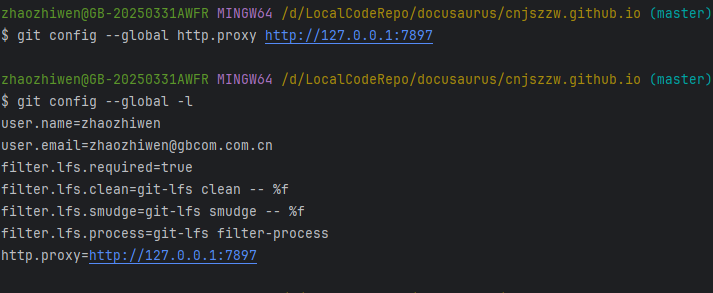
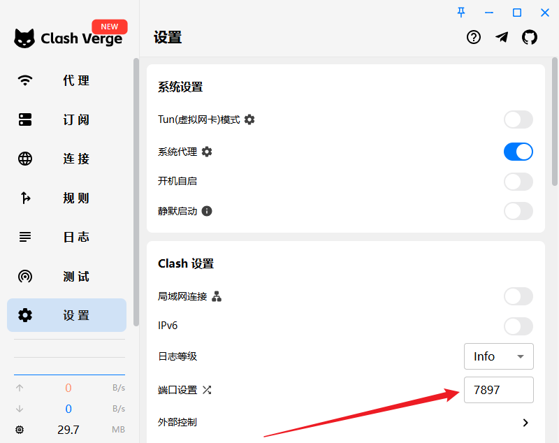

# Git配置报错

## 1. Recv failure: Connection was reset

报错如下：

```shell
unable to access 'https://github.com/Cnjszzw/cnjszzw.github.io.git/': Recv failure: Connection was reset
```

一般是没有设置代理，用一下命令配置下就好了

```shell
git config --global http.proxy http://127.0.0.1:7897
```

```shell
git config --global -l
```



其中端口根据代理的端口进行设置

