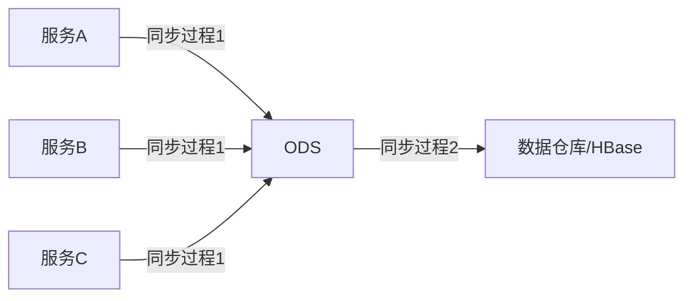
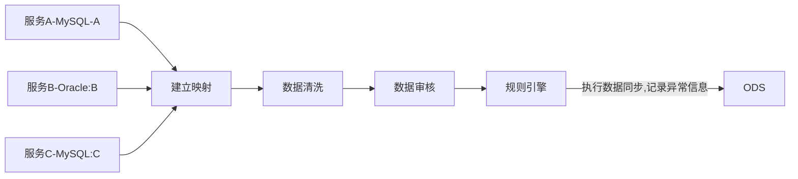
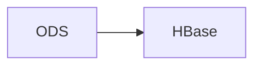
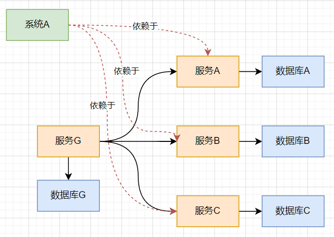
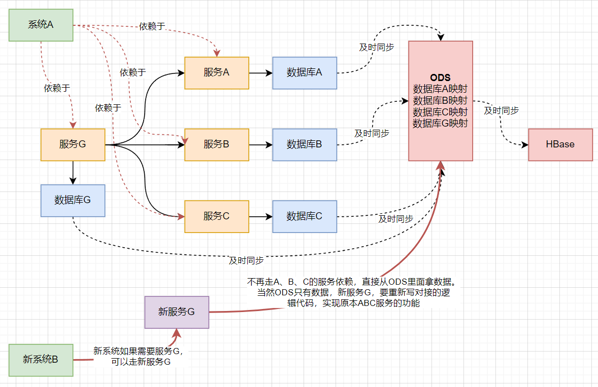
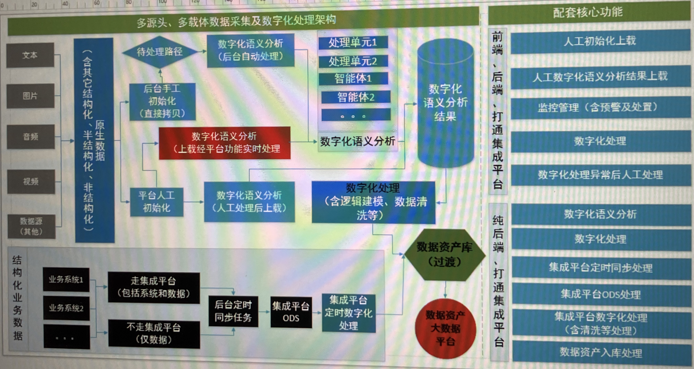

# 数据采集及数字化处理系统

## 1、背景

目前公司并没有数据仓库的基础建设，各个服务数据单独存在各自的数据库中，分散存储，这个就带来了一些问题：

- 数据分散，由于各个服务之间的依赖复杂，调用也比较复杂
- 数据分散带来，难以对数据进行统一管理和数据分析

因此，产生了对数据仓库的需求，数据仓库，可以将所有分散的数据，都集中在一起，有这么些好处：

- 所有的服务调用数据更加简单和统一，全部可以从数据仓库调用
- 大量的数据，可以很方便的进行管理和数据的分析

而数据采集和数字化处理系统，的最终目的就是，采集这些数据，处理后同步到数据仓库中。

## 2、同步流程

### 2.1、结构化数据（数据库）同步流程：

#### 2.1.1同步过程1-迁移至ODS

- **建立映射**

在进行数据同步之前，首先需要规定好同步的映射关系。具体来说，需要明确以下几个方面：

**1**选择要同步的表和字段。

**2**明确同步目标表和目标字段。

**3**确定这些表所在的用户组。

为了管理这些映射关系，我们需要进行持久化操作，并实现对这些映射的管理（CRUD）。因此，建立了结构化管理模块，该模块可以持久化所有数据源（数据库）、数据模式（表）、数据项。同时，它也会持久化两个表或字段之间的映射关系，并支持对这些数据和映射的管理。这一步完成后，我们便定义了数据的起始地点和目标地点。

- **数据清洗**

在同步之前，源数据往往存在一些问题，如数据缺失、重复、错误等。因此，在同步前，需要进行数据清洗。清洗的关键是定义清晰的规则和粒度，并规定哪些数据应该执行哪些规则。这一部分由数据清洗模块完成，确保源数据的质量和准确性。
而数据清晰的规则的管理则有数据清晰管理模块实现。

- **数据审核**

同步的表或字段中可能包含大量信息，例如评论内容等。这些信息中可能涉及敏感内容，如政治、隐私或商业机密，因此我们需要对源数据进行审核。数据审核涉及规则管理，包括规则的录入、删除和应用。规则引擎将读取结构化管理和审核规则的信息，执行数据审核逻辑。
如果在审核过程中发现源数据存在问题（如审核失败），规则引擎会将异常信息写入审核异常表，等待人工处理。这部分功能由审核异常管理模块提供，确保能够及时处理审核异常。
其中，数据审核的规则、规则的应用信息的录入和管理由数据审核管理模块提供。而数据审核的异常处理则由审核异常管理模块提供。

- **数据同步**

在审核通过后，规则引擎将执行数据同步操作。在同步过程中，有两项关键任务：

**(1)同步监控**：实时监控同步过程中的数据，包括业务量、同步状态、审核异常和同步过程中的异常告警。

**(2)异常处理**：对于同步过程中的异常，规则引擎将记录异常信息，并进行人工处理。其中异常处理的审核由异常审核的管理模块实现。

通过这一系列的操作，我们确保了数据同步过程的准确性、可靠性和安全性。

#### 2.1.2同步过程2-迁移至HBase（待补充）

### 2.2.非结构化数据（音视频、图片、文档等）同步流程

## 3.同步前后对比

## 二、标签管理

标签是针对非结构化数据，例如一个音频视频的标签，可以有多级。

- 方案一：每一级的标签都用单独的数据库表进行存储
- 方案二：用一张表进行存储，多一个父标签id的字段
- 方案三：混合使用，一二级标签独立存储，多级标签一张表格存储

## 三、架构图

Q：不走集成平台和走集成平台，是个什么意思？

