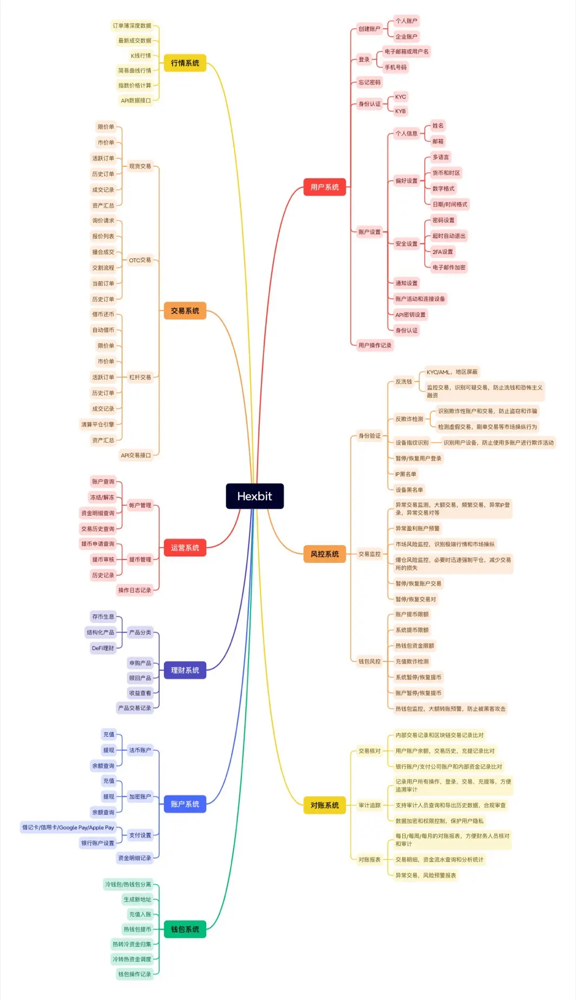

# NexSea

## 一、业务简介

这是我们要做的系统功能，交易系统和钱包资管等专业部分有专业的团队，我们厦门team更专注用户/客户系统、风控、运营模块、系统集成等




嗯嗯，可以准备下go和交易平台的知识哦，虽然不是技术面，但态度会加分

## 二、谈Offer前的清单

### 1、基础信息
- [x] **职位信息**：Golang服务端开发，和willams（二面面试管）和 窦小姐一起工作
- [ ] 合同信息

- 劳动合同签署主体（是否是子公司或第三方）：瓴银(厦门)智能科技有限公司？
- 合同年限（如3年/5年）、试用期时长（法定≤6个月）及薪资（通常≥80%）：
- 竞业协议/保密协议等特殊条款：

### 2.薪资

**年收入**

月薪和1个月的年终奖：绩效占多大的比重

```
问题不大，可能需要敲定下薪酬，Jack是整个项目的CEO我们是13薪，根据公司业绩发展，年终奖也有空间
```

**福利**

年假天数（是否按司龄计算）


- 劳动合同的主体，合同的年限，试用期多长以及试用期薪资
- 五险一金基数：是否按全额工资缴纳？公积金比例（5%-12%） 
- 薪资调整：年度普调机制？晋升调薪幅度？
- 工作强度：季度性加班高峰期在何时？是否有加班费/调休？
- 入职培训：是否有mentor制度？试用期考核标准？

## 三、其他信息

```
做金融业务人品第一，其次是兴趣+务实

这个行业离💰太近了
```

## 四、和beita的对话

```
能做，公司不了解，10k不多，
规模，用户量，应届生没了，
出国，你担心诈骗
平台，公司活了多少年，golang，web3，行业窄，

裁员身份，一年身份，不行，

主要问题是职业发展，hexbit我去查一下

社保

开发：行业窄
（1）golang开发

web3  ----->  互联网

行业

（1）不知名的创业，小厂
（2）

Q：平台多少年了，交易量是多少，用户规模是多少，背后有没有资本？
A：平台刚刚一两年前开始做，平台都没搭建好，更别谈交易量和用户规模
并且背后的hexbit公司是否真的是这个研发团队的金主，有待验证


Q：这个行业可不可以做？
A：可以做，，但是有一个问题，web3是一个比较窄的行业（风控业务确实不错，交易平台的会更严格，但即使是风控业务，也是web3的风控，比不了互联网的风控），并且是一个灰色地带，被认为是互联网行业发展以来，行业的一个污点。所以，从职业发展的角度来说，不利于跳槽，HR通常比较避讳（政治敏感、行业窄），一般来说基本上是互联网公司发展到一定程度去往web3发展，但我这种情况完全是反着来。

Q：社保听说都是不可以缴纳的吗？
A：这都是小问题，一般会通过代理公司去进行缴纳的

总结：
去这个公司，最大的问题还是职业发展的问题，作为一个小公司，并且做的是灰色且狭窄的行业，不利于跳槽，10k的薪资也不算高，并且，如果是币安或者老虎这些币圈大厂，你去做还算有认可度，所以不要光觉得这是一个golang研发岗、还有10k，就去做了，但是你这其实起点不算好，不利于后面的发展。假设一个极端的情况，一年就被裁员了，你靠这个经历不仅仅失去了应届生身份，还很比较难跳槽。

注意：说要出国的，都要注意
```


