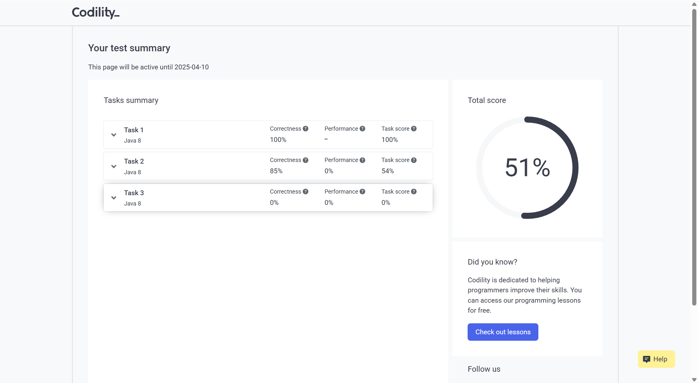

# Orderly

## 一、JD
Orderly - JAVA Backend 20-40k
```
What will you be working on?
Develop the core functions of the Internet financial platform, and build the technology infrastructure that supports digital asset trading on the Internet. Implement RestFul and WebSocket API interfaces to support customers to receive market data and execute orders.
Establish a robust, efficient and concurrent trading system to ensure 7*24 hours uninterrupted operation.
Who will you be working with?
Actively conduct efficient communication with product team to collect requirements and participate in product planning and system design.
What challenges will you face?
Fast-paced working environment.Propose practical and feasible solutions and produce technical documents independently.
System analyzing, abstract thinking, and system designing.
What tech stacks/skills will you be using?
Java programming - frequently
Large -scale, multithreading, and high-performance disturbed system - frequently
Data structures, design patterns, multi-threaded programming, and JVM principles - frequently
Java Web, microservice development, and frameworks like SpringBoot, Spring Cloud, and MyBatis - frequently
Caching, message queuing, and searching tools like Redis, Kafka, and Elasticsearch -frequently 
Linux - frequently
Performance tuning, jmetrics, and grafana - sometimes
```

```
你将负责什么工作？

开发互联网金融平台的核心功能，构建支撑数字资产交易的技术基础设施
实现RestFul和WebSocket API接口，支持客户接收市场数据并执行交易订单
搭建稳健、高效、高并发的交易系统，保障7×24小时不间断运行
你将与谁协作？

积极与产品团队高效沟通，收集需求并参与产品规划与系统设计
你将面临哪些挑战？

快节奏的工作环境，需独立提出切实可行的解决方案并输出技术文档
系统分析、抽象建模及系统设计能力
需要哪些技术栈/技能？

Java编程 （高频使用）
大规模、多线程、高性能分布式系统 （高频使用）
数据结构、设计模式、多线程编程、JVM原理 （高频使用）
Java Web、微服务开发（SpringBoot/Spring Cloud/MyBatis等框架） （高频使用）
缓存、消息队列及搜索工具（Redis/Kafka/Elasticsearch等） （高频使用）
Linux系统 （高频使用）
性能调优、Jmetrics/Grafana监控 （偶尔使用）
```

## 二、HR首次接触

```
这篇是我们CEO的采访稿，官网网址请查看https://orderly.network/
https://www.finoa.io/resources/interview-ran-yi-orderly-network/

你好！我看完了这个采访稿。我谈谈我的理解。
这篇采访有两个主体，一个是Fiona，一个是orderly。这篇采访主要讲的的orderly。两者可能是合作关系
（1）orderly是做什么的？
和币安这些不太一样，他不是做加密货币的交易平台，只是做基础的组件，比如后端的支付组件、风控组件。这样所有公司都可以直接调用，不用自己开发，只需要关注前端的个性化开发
（2）为什么选择做基础组件？
因为DeFi是未来趋势，不断有人涌入做交易平台，市场很大，而且门槛较高，因此如果可以提供人人可以用的基础组件，实际上非常有未来
（3）odrerly如何构建的？
这里讲了一些技术路线，挑战、和选择的动机
（4）未来的规划
这里说目前进展不错，未来可能像更多方向进行拓展，类似于NFT、DEX 
```

## 三、beita以及xinxin的建议

- 你对web3 业务熟悉嘛？或者你炒股？如果能了解一些，肯定是加分项的？

  ```
  web3从定义上来说，就是一个基于区块链技术的去中心化网路，主要和web2的区别，就在于去中心化和用户持有资产。web2.0我们有银行、我们有微信支付宝，我们的资产，有这些大的机构或者说国家来进行保障和中转，但是去中心化很大程度上去掉了银行和机构的中介，允许用户直接进行点对点交易，并且资产的控制权从银行、国家专业到每个人的手中，这个主要是用加密钱包实现的。这个是web3的最核心的特点，当然还有其他的，比如智能合约，Token经济等等，比如智能合约就是代码的自动执行，减少人为的干预，Token经济比如通过挖矿来获取收益等等。
  ```

  ```
  我身边的人有炒币的，我想炒的话完全可以炒，但是我比较谨慎，因为确实我见过人亏了很多钱。但是有了解基础交易的方式和原理，比如说币币交易，用USDT买入或者卖出这种加密货币，里面的话我有了解到两种方式，第一种的话就是现价委托，就是设置加密货币在一定的价格的时候，触发交易，比如，我有10000USDT，想买入比特币，这个时候比特币的价格是37000，我希望在降低到36000，买入5000USDT的比特币，第二种的话就是市价委托，就是立马以当前的价格购买或者卖出加密货币。而炒币的的底层原理就是通过，买入和卖出的价差，来取赚取差额，这个和炒股其实是一样的。
  ```

- 如果她问要多少钱的话，先问下这个岗位的薪资范围，再报出期望薪资。

- 为什么想投递我们的岗位的呢？有了解过吗

  ```
  我是一名应届毕业生，毕业后主要在找Java后端开发这一个方向的工作。目前有几个Offer，但是方向都不是很满意。问了之前在B站实习的mentor，恰好有这个岗位，就来咨询一下。我看了这个岗位的JD，也是JAVA后端开发，觉得比较匹配。
  其次，公司的业务主要是做Web3这一块的，我个人非常感兴趣，第一次了解也是当时在B站，国内联盟链比较火，有了解过，b站也有推出自己的高能链，很多人都通过这个高能链有了自己的数字藏品，用做了自己的头像。因此在后续找工作的时候，也关注过web3，拿到过相关的Offer，自己主动也去了解web3这一开的业务，对web3的前景也是比较看好，想长期在这个web3领域去发展和深耕，然后web3使用群体大多在海外，而我英语也还行，这点比较契合。
  ```

- 为什么做测开经历，然后转研发了

```
确实我在B站和美团都有过测试开发的经历，并且在美团有转正的机会。但是在这八个月的过程中，我发现我还是对后端开发更感兴趣，更有成就感一点，在美团，做工具类后端开发工作这个项目也印证了这一点。测试开发主要是对业务进行质量保证，难点在于全链路、同时需要一定的代码能力去构建测试平台和工具来保障环境稳定、自动化测试、效能提升。但是后端开发主要是直接对业务或者基础组件开发。两种并无好坏，我只是更喜欢后者。
```

- 为什么从传媒/广播电视编导专业转码

```
最早的转码想法，源于几年前“小镇做题家”的话题，他指的是，出身于农村或小城镇，通过埋头苦读和应试教育进入一流高校，但缺乏视野和社会资源，进入大学后发现与大城市的学生在思维、眼界、家境和社交能力等方面存在差距。
我当时学广播电视编导，发现大家什么都会，聊电影可以扯到存在主义、组织社团活动张口就是人脉资源、拍纪录片，老师总说要有“导演思维”，但是我连指挥团队都费劲，写策划案都在纠结，这个创意到底符不符合老师的标准，我都不知道。
后来发现计算机这行反而比较适合我这种做题家。

（1）和机器打交道更自在，就像数学题，给定输入就有预期输出，错了还能dubug找原因，又让我很安心的确定性，不用像做创业和人际一样担心别人“喜不喜欢我的风格”
（2）学习路径非常清晰，刷LeetCode代码题，就和刷五年高考三年模拟一样，今天学数据结构，明天学排序算法，每次都能验证自己有没有进步，还能看见自己的排名
（3）这个行业，有非常多弯道超车的机会，网课和开源项目特别多，大家都可以一台电脑获取所有资源，我可以半夜三点，学习facebool的开源项目，做出自己的第一个博客，让所有人可以访问，我觉得这个比拼爹拼资源的影视圈公平很多。


```

## 四、笔试

```
Hi Zhiwen Zhao,

Thank you for your interest in Orderly Network!

As part of the hiring process, please complete the assessment linked below to showcase your technical skills by solving job-related problems. You will be asked to prepare code, answer technical questions, or both. Once submitted, your responses will be automatically scored and the results will be sent to Orderly Network's hiring team. You will also be able to see your score for each task.

For the best experience, please review the Codility Candidate FAQ before you begin. You can also try a practice problem to familiarize yourself with the testing environment.

When you're ready, please use the link below to begin the assessment. Further instructions will be provided.

https://app.codility.com/test/D68YDW-Z8G/

If you have any questions about the test or the hiring process, please reach out to your point of contact at Orderly Network.

We know your time is valuable so thank you for spending some of it to show us what you can do! Thanks again for your interest in a role at Orderly Network.
```

笔试的平台：Codility





