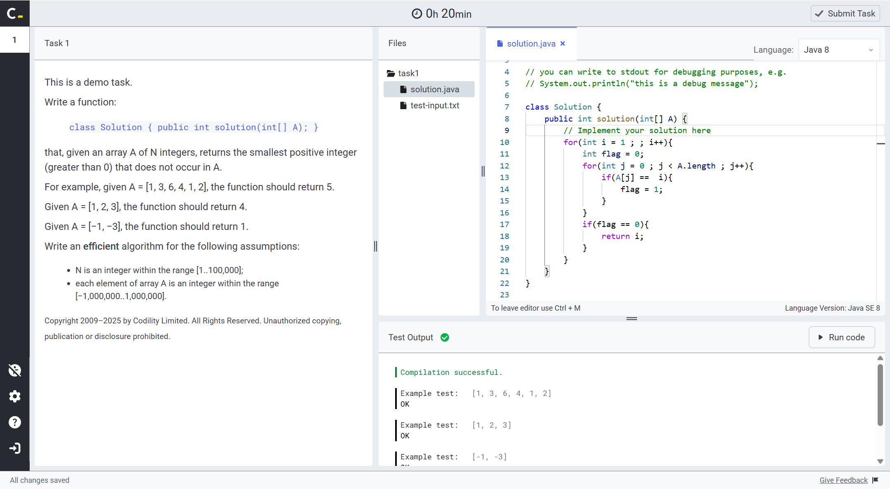
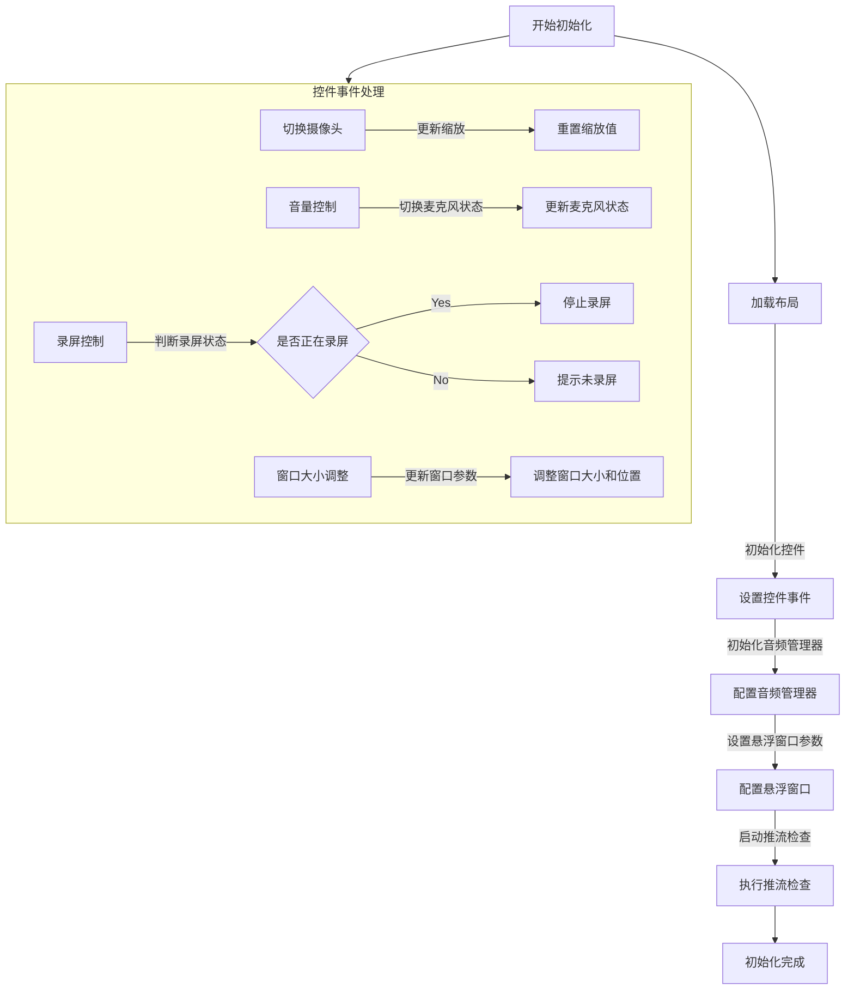

# 测试

# 一、CodeBlock

```html

```

# 二、图片(居中)


<center>
  
</center>


# 三、特殊文字（颜色）

<font color="red">这是红色的文字</font>

# 四、特殊符号

、< > 


# 五、mermid


# 六、其他

`加粗` 速度**哈佛**

```java
public static void main(String[] args){
    System.out.prinln("hello world")
}
```

