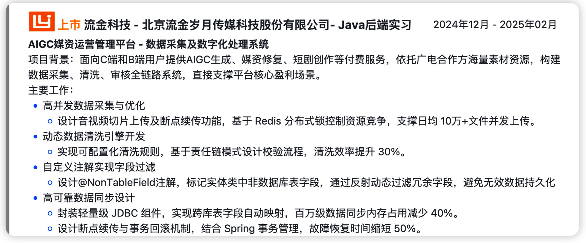

## 简历

```
---
name: 赵志文
header:
  - text: <span class="iconify" data-icon="tabler:phone"></span> (+86) 185-5613-5826
  - text: <span class="iconify" data-icon="tabler:mail"></span> cnjszzw@qq.com
    link: mailto:cnjszzw@qq.com
  - text: <span class="iconify" data-icon="tabler:brand-github"></span> cnjszzw
    link: https://github.com/cnjszzw
  - text: <span class="iconify" data-icon="charm:person"></span> zhaozhiwen.site
    link: https://zhaozhiwen.site
  - text:  籍贯：江苏扬州
    newLine: true
  - text:  现居城市：北京
  - text:  年龄：26(1999/10/27)
---

## <span style="background-color: #377BB5; color: white; padding: 2px 10px; border-radius: 0px;">教育经历</span>
**山东师范大学-本科** 
  ~ 广播电视编导-新闻与传媒学院-山东济南

  ~ 2018/09 - 2022/06

  - 雅思IELTS（6.5分）、英语六级CET-6（593分）、计算机二级证书（MS OFFICE）

**西京学院-硕士**
~ 计算机技术-计算机学院-陕西西安
~ 2022/09 - 2025/01

- 2022年度西京学院一等奖学金（前20%）、2022传智杯程序设计赛区域赛二等奖(前20%)

## <span style="background-color: #377BB5; color: white; padding: 2px 10px; border-radius: 0px;">实习经历</span>


**后端开发实习生**
  ~ 北京流金岁月科技有限公司
  ~ 2024/02 - 至今

- 负责开发数据采集及数字化处理系统，实现结构化管理、数据清洗、数据审核、数字化监控和预警功能

**测试开发实习生**
  ~ 美团（上海）
  ~ 2024/02 - 2024/05

- 参与美团内部测试工具的开发工作，包括需求分析、开发文档编写、编码与测试、漏洞排查和修复、跨部门沟通等。
- 负责在线点餐上单流程接口自动化测试，包括业务/接口梳理、方案设计、数据构造、交互流程校验、用例维护等。


## <span style="background-color: #377BB5; color: white; padding: 2px 10px; border-radius: 0px;">项目经历</span>

<span style="color: #377BB5;">**1️⃣数据采集及数字化处理系统**</span>
  ~ 北京流金岁月科技有限公司
  ~ 2024/02 - 至今

**技术栈**：SpringBoot、Maven、Oracle、JDBC、Git

**项目描述**：数字化采集系统是一个基于规则引擎的数据同步系统，核心目标是高效、准确地实现不同数据库表项之间的数据同步。系统通过四个主要阶段（同步映射管理、数据清洗、数据审核、数据同步）确保数据的完整性、安全性和可用性。

**我的职责**：负责多个数据同步阶段中的数据管理功能的开发，包括同步过程中的预警机制、异常处理和监控看板的开发。

**项目亮点**：

- 优化监控看板性能：针对监控看板中数据量大且实时性要求高的挑战，采用定时任务与缓存技术，提升了接口响应速度。
- 架构优化：通过反射与JDK动态代理技术，优化了系统架构，实现了功能模块的解耦，提高了系统的可扩展性与维护性。
- 冗余字段自动处理：通过自定义注解与AOP切面编程，实现了自动化处理，简化了代码，提高了系统的效率和可维护性。

<span style="color: #377BB5;">**2️⃣仿"B站"弹幕视频网站**</span>
  ~ 个人开源项目
  ~ 2024/05 - 2024/11

**项目开源地址**：[https://github.com/Cnjszzw/imooc-bilibili](https://github.com/Cnjszzw/imooc-bilibili)  **线上地址**：[www.citywork.icu](http://www.citywork.icu)

**技术栈**：SpringBoot、Mybatis、Redis、RocketMQ、Nginx、FastDFS、WebSocket

**项目描述**：实现B站核心功能，包括“用户功能”、“视频功能”、“弹幕功能”。具体实现了用户注册登录、用户关注、用户动态发布、用户视频上传和观看、弹幕推送等逻辑，并进行了系统性能提升和用户体验优化。

**我的职责**：

- 使用JWT实现基于双Token机制的用户无感登录和注册功能，利用RSA进行加解密、MD5进行加密存储和比对保证安全

- 使用RBAC模型实现权限控制，通过提供接口实现前端元素、页面权限控制，利用AOP切面编程实现部分接口权限控制

- 使用RocketMQ、Redis基于订阅发布模式推方式实现动态发布推送订阅功能，减少DB压力、解决大量动态实时发布问题

- 使用FastDFS实现视频上传、下载和在线观看功能，通过断点续传以及秒传提升用户体验，通过Nginx实现外部Http访问
- 使用WebSocket协议构建高并发下的弹幕系统，使用Redis、MQ实现弹幕异步化推送以及数据库的削峰和异步化存储

项目亮点：

- 设计模式：利用工厂策略模式对登录进行了优化，实现了代码解耦，符合了代码开闭原则，提高了拓展性
- 调优(线程池)：利用线程池技术进行数据汇总，优化原接口响应速度，从150ms降低到50ms，提升67%

<span style="color: #377BB5;">**3️⃣JBOX环境治理工具**</span>
  ~ 美团（上海）
  ~ 2024/05 - 2024/11

**项目背景**：主干环境每日拉取最新服务代码构建部署，且直连团队采用JBOX插件容器技术对接不同商家，存在“平台”和“插件”概念，不同部署方式和特定部署顺序。当前内部平台无法：按序部署插件、感知插件、及时同步线上下插件。

**项目任务**：新技术和平台的不兼容引发了：插件部署失败、插件记录缺失、新插件不同步等一系列现象，并最终导致环境的不稳定以及大量自动化用例无效失败，针对这些现象进行了JBOX环境治理工具的开发以解决问题。

**工作成果**：

- 独立负责并完成线上下插件同步工具开发，解决线上下插件及时同步问题
- 参与插件监控修复工具开发，重新设计原问题方案并完成开发和测试，日均修复20+问题插件
- 对工具进行日常持续维护、反馈收集，共计解决一个线下告警并修复相关代码Bug

**项目亮点**：
- 利用Redis和分布式锁解决分布式架构下同平台插件只能串行部署的问题- 利用多线程技术并发部署不同平台的插件，提高插件的部署速度和效率
## <span style="background-color: #377BB5; color: white; padding: 2px 10px; border-radius: 0px;">专业经历</span>

1.具备扎实编程基础，熟悉Java语言、JVM、内存模型、并发编程；熟悉SpringBoot、SpringCloud、Mybatis等开发技术

2.熟悉关系型数据库MySQL，有一定SQL优化经验；熟悉Redis等非关系型数据库；熟悉RocketMQ等主流消息中间件

3.可以灵活使用设计模式，如：单例、工厂、策略、责任链等设计模式进行开发；熟练运用git、Linux操作系统等基本命令

4.熟悉分布式常见解决方案：分布式事务、分布式一致性、分布式锁；有高并发、高性能系统架构设计实践，有性能调优经验

5.熟悉计算机网络、熟悉HTTP、TCP/IP和WebSocket协议，熟悉数据结构，了解栈、堆、树等基本结构


```

## 经历库

```
美团
测试开发实习生
2024-02 至 2024-05
-----------------项目1-------------------
技术栈：Java、Mario 框架（基于 TestNG）、TestX
业务介绍：直连平台的主要工作是将供应商的住宿、餐饮、门票等产品通过系统对接的方式转化为美团点评平台可售卖的产品。需要对部分存量的微服务进行自动化用例补充和业务沉淀。（上单商品同步服务）
我的职责及成果：沉淀业务，设计自动化方案，完成 5 个主要流程 24 个接口自动化用例，代码覆盖率提升至 77％，发现一个问题。
项目难点及收获：（1）处于业务中间层，校验链路点多，包括网关入参合法性校验、直连调用美团内部服务的入参校验、数据库落库校验、业务层映射转发逻辑校验等（2）数据构造复杂、小流量接口日志缺失、接口文档缺失，参数模型依赖代码确定

哔哩哔哩	
测试开发实习生
2023-09 至 2024-02
全流程参与 B 站粉 APP 的产品测试，包括需求评审与分析、测试用例设计与执行、缺陷定位与跟踪，协助研发解决问题
完整参与 UGC 播放页接口自动化专项测试，包括测试脚本编写、数据构造、Mock 等，对业务进行质量保障和稳定性维护
与其他测试开发工程师合作执行集成测试、回归测试、缺陷排查等并持续性提出产品改进优化意见
-----------------项目1-------------------
业务介绍：
UGC 播放页即用户自己投稿的视频界面，主要包含播放弹幕量、标题简介、点赞收藏投币、推荐视频等功能，其中客户端日活
1500w，接口 QPS 过万，属于用户核心体验场景。UGC 和 OGV 独立维护着两套播放体系，带来了用户体验不一致、重复造轮子、兼容成本高多种痛点。针对此，2023 整年对 UGC 和 OGV 的播放器播放页进行了多场景融合改造，即播放一致性相关需求。
我的职责：
（1）执行优化总包 case，对业务及其数据链路、字段映射进行系统沉淀
（2）全流程参与播单一致性相关需求以及其他相关需求的移动端测试和服务端测试
（3）参与接口自动化专项测试从 0 到 1，包括 case 梳理、环境治理以数据构造、用例编写与维护、流水线接入
业务挑战和难点：
（1）初来乍到，业务差别大，节奏快、流程工具环境复杂、团队人数多、恰逢一致性大需求时间敏感，业务沉淀少
（2）一致性涉及架构修改和逻辑重写，影响功能多、业务方涉及多、业务融合模块多、新老播单共存回归量多
（3）参与全流程测试，流程把控力要求高、执行与思考能力要求高、独立解决问题能力要求高
（4）接口数据庞杂，涉及大量 Python 脚本编写以及服务端 Golang 业务代码阅读，高覆盖率、兼容性、精准断言难
工作及成果：
（1）执行 220＋总包 case，优化 15＋case，沉淀 23＋业务文档，针对一致性需求进行系统回归测试和 UI／UX DIFF，排查 40＋bug
（2）梳理编写 57 条接口自动化 P0case，构造 UAT、PRE 双环境数据，从 0 到 1 落地自动化，发现 1 例线上 bug
（3）累计完成移动端和服务端共计 17＋需求测试，编写 6＋测试用例，发现 86＋bug，编写 100＋python 自动化脚本

丁香园
测试开发实习生
2023-04 至 2023-08
参与项目测试全流程，根据产品需求、设计稿编写测试用例以及在 PC、H5、小程序、APP 四端进行功能测试负责需求的安全风险打标，与研发进行沟通，对存在风险的需求进行安全测试／接口测试
参与＂丁香人才＂小程序的 UI 自动化测试脚本的编写，累计输出两个页面共计 10＋自动化测试脚本
-----------------项目1-------------------
“丁香人才”小程序ui自动化测试
技术栈：Python、minium 框架、Git
背景：“丁香人才”小程序是一个医疗招聘平台。包含简历、聊天、职位、招聘公告等模块。目前项目存在比较多的回归测试，耗费较多人力，缺少成熟的自动化测试平台。因此基于微信官方 minium 框架搭建了 UI 自动化测试平台并开始编写和维护测试用例。
我的职责：参与“丁香人才”小程序 UI 自动化脚本的编写，使用 Python 和 minium 框架与他人进行协作开发。独立设计与编写了企业屏蔽详情页、招聘公告页面共计两个页面的回归测试用例以及 10＋个相关自动化脚本。且进一步对代码进行了优化和代码逻辑完善，降低了代码冗余度、耦合度，提高了代码的可拓展性。经过了代码走查以及实际运行检验，代码获得认可并被
merge 到主分支。
```




